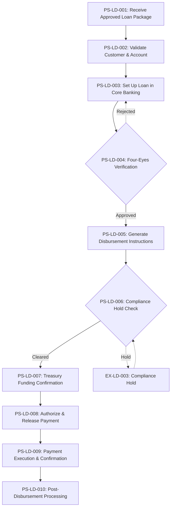
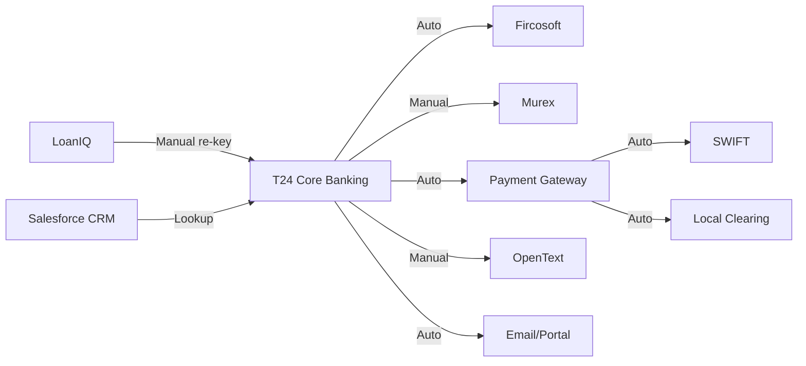

# As-Is Process Documentation: Loan Disbursement

**Document Type:** Current State Process Analysis
**Status:** DRAFT
**Business Unit:** All segments (BizBanking, MidCap, LargeCap)
**Region:** [To be expanded]
**Document Owner:** Head of Lending Operations
**Last Updated:** 2026-02-06
**Version:** 1.0
**Reviewed By:** — | **Review Date:** —
**Approved By:** — | **Approval Date:** —

---

## Executive Summary

The Loan Disbursement process manages the release of approved loan funds to borrowers across all business segments — BizBanking, MidCap, and LargeCap. The process spans 10 steps from receipt of an approved loan package through post-disbursement processing and documentation archiving. It involves 9 systems, 5 control points, and handles approximately 45–60 disbursements per day.

Key findings from initial documentation reveal 5 significant pain points, including manual re-keying between LoanIQ and T24, a four-eyes verification bottleneck, and a high compliance false-positive rate (~15%). Five regulatory and operational controls govern the process, with maker-checker, sanctions screening, and dual authorization as critical checkpoints. Standard disbursements target same-day completion, though large and complex transactions may require T+1 processing.

### Key Metrics at a Glance

| Metric | Value |
|--------|-------|
| Process Steps | 10 |
| Exceptions Identified | 4 |
| Pain Points Captured | 5 |
| Control Points Mapped | 5 |
| Systems Involved | 10 |
| Overall Confidence | LOW (55%) |

---

## How to Read This Document

> This document captures the **current state (AS-IS)** of the Loan Disbursement process. It provides a comprehensive overview with summary tables. For detailed analysis, see the linked companion documents.
>
> **Companion Documents:**
> - [Exception Details](./exceptions-detail.md) - Full exception analysis with root causes
> - [Pain Point Details](./pain-points-detail.md) - Detailed pain point analysis with improvement ideas
> - [Control Point Details](./control-points-detail.md) - Complete control mapping with compliance analysis
> - [Client Touchpoint Details](./client-touchpoints-detail.md) - Client interaction analysis with CES scoring
>
> **Confidence Indicators:** Each section includes an AI-assessed completeness confidence:
> - **[HIGH]** (≥90%) - Comprehensive coverage, validated by multiple sources
> - **[MEDIUM]** (≥70%) - Good coverage, some details may need validation
> - **[LOW]** (≥40%) - Preliminary capture, requires additional SME input
> - **[STUB]** (<40%) - Section placeholder only, no substantive content captured yet
>
> **Versioning:** Documents follow semantic versioning (MAJOR.MINOR):
> - MAJOR: Significant process change or complete re-documentation
> - MINOR: Incremental additions, corrections, or confidence improvements
> - Example: v1.0 (initial), v1.1 (added 3 pain points), v2.0 (process redesigned)

---

## 1. Process Overview

> **About this section:** Foundational context - what this process is, who owns it, and what business need it serves.

### 1.1 Process Identification

| Attribute | Value |
|-----------|-------|
| **Process Name** | Loan Disbursement |
| **Process ID** | 004 |
| **Process Category** | Lending Operations |
| **Scope** | All segments (BizBanking, MidCap, LargeCap) |
| **Process Owner** | Head of Lending Operations |

### 1.2 Purpose and Trigger

The Loan Disbursement process handles the release of approved loan funds to borrowers. It ensures that all conditions precedent are satisfied, regulatory checks are passed, and funds are correctly routed to the borrower's designated account.

**Trigger:** Final credit approval received from Credit Committee or automated approval engine, with signed loan agreement and all conditions precedent satisfied.

### 1.3 Operational Characteristics

**Frequency:** Daily — approximately 45–60 disbursements per day across all segments.

**Volume:** Varies by segment. Standard disbursements (<$1M) represent the majority. Large ($1M–$5M) and complex (>$5M) disbursements require additional treasury and authorization steps.

**Average End-to-End Time:** 2–4 hours (standard), up to 2 business days (complex/large cap).

**Regulatory Framework:** Central Bank Lending Regulations, AML/CFT Act, Consumer Credit Directive.

### 1.4 Key Stakeholders

- **Disbursement Officers** — Primary process executors (Steps 1–3, 5, 10)
- **Senior Disbursement Officers / Team Leads** — Four-eyes verification (Step 4)
- **Legal** — Loan documentation review before disbursement (Step 1)
- **Compliance Officers** — AML/sanctions screening (Step 6)
- **Treasury Desk** — Funding confirmation and FX (Step 7)
- **Head of Disbursements / Authorized Signatories** — Final payment authorization (Step 8)
- **Payment Operations** — Payment execution (Step 9)
- **Credit Committee** — Upstream loan approval (pre-process trigger)
- **Borrowers** — Recipients of disbursed funds

### 1.5 Service Levels & Performance Benchmarks

| SLA# | Metric | Current SLA | Actual Performance | Source | Regulatory? |
|------|--------|-------------|-------------------|--------|-------------|
| SLA-LD-001 | Standard disbursement (<$1M) | Same day | 92% same day | Internal | No |
| SLA-LD-002 | Large disbursement ($1M–$5M) | Same day | 78% same day | Internal | No |
| SLA-LD-003 | Complex disbursement (>$5M) | T+1 | 85% within T+1 | Internal | No |
| SLA-LD-004 | Customer notification after disbursement | Within 1 hour | 95% within 1 hour | Internal | No |

### 1.6 Cost & Resource Allocation

| Metric | Value |
|--------|-------|
| **FTE Allocation** | ~8–10 FTE (Disbursement Officers, Senior Officers, Head of Disbursements) [To be expanded] |
| **Cost per Transaction** | [To be expanded] |
| **Annual Operating Cost** | [To be expanded] |
| **Resource Utilization** | Peak utilization 11am–2pm due to verification bottleneck [To be expanded] |

*Estimated based on process steps and team structure. Requires finance team input for accurate cost data.*

### 1.7 Process Variants

| Variant | Scope | Key Differences | Shared Steps |
|---------|-------|-----------------|--------------|
| Standard (<$1M) | All segments | EFT routing, single authorization | PS-LD-001 to PS-LD-010 |
| Large ($1M–$5M) | MidCap, LargeCap | RTGS routing, treasury pre-confirmation | PS-LD-001 to PS-LD-010 |
| Complex (>$5M) | LargeCap | Dual authorization, extended treasury, possible FX | PS-LD-001 to PS-LD-010 |
| Syndicated | LargeCap | Multiple payment instructions per tranche | PS-LD-001 to PS-LD-010 |

> **Section Confidence:** MEDIUM (70%) | **Basis:** Good overview coverage from source document; cost/resource data missing
> **Evidence Sources:** LD-PROC-2025-R3

---

## 2. Process Steps

> **About this section:** The step-by-step flow of this process from start to finish.

### 2.1 Process Step Summary

| PS# | Step Name | Owner | System(s) | Duration | Wait Time | Rationale |
|-----|-----------|-------|-----------|----------|-----------|-----------|
| PS-LD-001 | Receive Approved Loan Package | Disbursement Officer | LoanIQ | 15–20 min | 0–2 hrs | Verify approval conditions and CPs |
| PS-LD-002 | Validate Customer & Account Details | Disbursement Officer | T24, Salesforce CRM | 10–15 min | — | Confirm identity, KYC, sanctions |
| PS-LD-003 | Set Up Loan in Core Banking | Disbursement Officer | T24, LoanIQ | 20–30 min | — | Create loan account, repayment schedule |
| PS-LD-004 | Four-Eyes Verification | Senior Disbursement Officer | T24, LoanIQ | 10–15 min | Variable | Independent review of loan setup |
| PS-LD-005 | Generate Disbursement Instructions | Disbursement Officer | T24, Payment Gateway (SYS-LD-010) | 5–10 min | — | Create payment instruction |
| PS-LD-006 | Compliance Hold Check | Compliance Officer | Fircosoft | 2–5 min / up to 4 hrs | — | Sanctions/AML screening |
| PS-LD-007 | Treasury Funding Confirmation | Treasury Desk | Murex, T24 | 5–15 min / up to 1 day | — | Confirm funding availability, FX |
| PS-LD-008 | Authorize & Release Payment | Head of Disbursements | T24, Payment Gateway (SYS-LD-010) | 5–10 min | — | Final authorization and release |
| PS-LD-009 | Payment Execution & Confirmation | Payment Operations | Payment Gateway (SYS-LD-010), SWIFT, Clearing House | 0–30 min / 1–4 hrs | — | Execute and confirm payment |
| PS-LD-010 | Post-Disbursement Processing | Disbursement Officer | T24, LoanIQ, OpenText, Salesforce CRM | 15–20 min | — | Archive, notify, update records |

### 2.2 Process Flow Diagrams

#### 2.2.1 High-Level Process Flow (L1)

> Overview showing major phases and key decision points

#### 2.2.2 Detailed Process Flow (L2)

> [To be expanded — requires additional detail on sub-steps and system interactions]

#### 2.2.3 Swim Lane Diagram

> [To be expanded — requires organizational mapping completion]

### 2.3 Step Details

#### PS-LD-001: Receive Approved Loan Package

**Performer:** Disbursement Officer
**System(s):** LoanIQ
**Input:** Approved credit memo, signed loan agreement, CP checklist
**Output:** Verified loan package ready for setup
**Business Rules:** All conditions precedent must be satisfied
**Duration:** 15–20 minutes
**Wait Time:** 0–2 hours (depending on queue)
**Channel:** Internal (system queue)
**Document Count:** 3 (credit memo, loan agreement, CP checklist)
**Interaction Count:** 1

Receives the approved loan package from Credit Committee or automated approval engine. Verifies all approval conditions are met. Checks that loan agreement is signed and all conditions precedent (CPs) are satisfied.

#### PS-LD-002: Validate Customer & Account Details

**Performer:** Disbursement Officer
**System(s):** T24, Salesforce CRM
**Input:** Customer ID, account details from loan agreement
**Output:** Validated customer record, confirmed destination account
**Business Rules:** KYC must be refreshed if older than 12 months. Sanctions screening mandatory for every disbursement.
**Duration:** 10–15 minutes
**Wait Time:** —
**Channel:** Internal (system)
**Document Count:** [To be expanded]
**Interaction Count:** [To be expanded]

Confirms borrower identity, validates destination account details, checks KYC status is current, and verifies no sanctions hits. Cross-checks customer data between LoanIQ and T24.

#### PS-LD-003: Set Up Loan in Core Banking

**Performer:** Disbursement Officer
**System(s):** T24, LoanIQ
**Input:** Approved loan terms, repayment schedule
**Output:** Active loan account in T24, repayment schedule configured
**Business Rules:** [To be expanded]
**Duration:** 20–30 minutes
**Wait Time:** —
**Channel:** Internal (system)
**Document Count:** [To be expanded]
**Interaction Count:** [To be expanded]

Creates the loan account in T24, enters repayment schedule, interest rate, fees, and tenor. Links to the customer's main account. Sets up automated debit orders for repayments.

#### PS-LD-004: Four-Eyes Verification

**Performer:** Senior Disbursement Officer / Team Lead
**System(s):** T24, LoanIQ
**Input:** Loan setup in T24, original credit memo
**Output:** Verified and approved loan setup
**Business Rules:** Maker-checker principle — verifier must be different from setup person
**Duration:** 10–15 minutes
**Wait Time:** Variable (bottleneck during peak hours)
**Channel:** Internal (system)
**Document Count:** [To be expanded]
**Interaction Count:** 1

Independent review of loan setup. Verifies all fields match the approved credit memo: amount, rate, tenor, fees, repayment schedule, destination account. Checks for any override flags.

#### PS-LD-005: Generate Disbursement Instructions

**Performer:** Disbursement Officer
**System(s):** T24, Payment Gateway
**Input:** Verified loan account, destination account details
**Output:** Payment instruction ready for release
**Business Rules:** Disbursements >$1M require RTGS. International disbursements use SWIFT. All others use local EFT.
**Duration:** 5–10 minutes
**Wait Time:** —
**Channel:** Internal (system)
**Document Count:** 1 (payment instruction)
**Interaction Count:** 1

Generates the payment instruction based on disbursement type: internal transfer, RTGS, EFT, or SWIFT. Applies correct value dating. For syndicated loans, generates multiple payment instructions.

#### PS-LD-006: Compliance Hold Check

**Performer:** Compliance Officer (automated + manual)
**System(s):** Fircosoft (includes AML screening module)
**Input:** Payment instruction, customer details
**Output:** Compliance clearance or hold flag
**Business Rules:** Transactions above $500K require manual compliance officer review
**Duration:** 2–5 minutes (automated), up to 4 hours (manual review)
**Wait Time:** —
**Channel:** Internal (system + manual escalation)
**Document Count:** [To be expanded]
**Interaction Count:** [To be expanded]

Automated screening of payment against sanctions lists, PEP databases, and adverse media. Transactions above threshold ($500K) require manual compliance officer review.

#### PS-LD-007: Treasury Funding Confirmation

**Performer:** Treasury Desk
**System(s):** Murex, T24
**Input:** Disbursement amount, currency, value date
**Output:** Funding confirmation, FX rate lock (if applicable)
**Business Rules:** Large disbursements (>$5M) may require overnight funding arrangement
**Duration:** 5–15 minutes (standard), up to 1 day (large/FX)
**Wait Time:** —
**Channel:** Phone/Email (manual)
**Document Count:** [To be expanded]
**Interaction Count:** 1

Confirms that funds are available in the lending pool. For large disbursements (>$5M), treasury may need to arrange funding. Confirms FX rate if disbursement is in foreign currency.

#### PS-LD-008: Authorize & Release Payment

**Performer:** Head of Disbursements / Authorized Signatory
**System(s):** T24, Payment Gateway
**Input:** Compliance-cleared, treasury-confirmed payment instruction
**Output:** Released payment
**Business Rules:** Dual authorization for amounts >$5M
**Duration:** 5–10 minutes
**Wait Time:** —
**Channel:** Internal (system)
**Document Count:** 1 (authorization record)
**Interaction Count:** 1

Final authorization of the payment. For amounts >$5M, dual authorization required. Releases the payment instruction to the payment gateway/SWIFT network.

#### PS-LD-009: Payment Execution & Confirmation

**Performer:** Payment Operations (automated)
**System(s):** Payment Gateway, SWIFT, Local Clearing House
**Input:** Released payment instruction
**Output:** Payment confirmation, transaction reference number
**Business Rules:** MT103 for SWIFT, local clearing instruction for domestic
**Duration:** Immediate to 30 minutes (domestic), 1–4 hours (international)
**Wait Time:** —
**Channel:** SWIFT / Local Clearing
**Document Count:** 1 (confirmation)
**Interaction Count:** 0 (automated)

Payment is executed through the appropriate channel. System sends MT103 (SWIFT) or local clearing instruction. Waits for confirmation/acknowledgment from receiving bank.

#### PS-LD-010: Post-Disbursement Processing

**Performer:** Disbursement Officer
**System(s):** T24, LoanIQ, OpenText
**Input:** Payment confirmation
**Output:** Updated loan records, archived documents, customer notification
**Business Rules:** [To be expanded]
**Duration:** 15–20 minutes
**Wait Time:** —
**Channel:** Internal (system) + Email/Portal (customer notification)
**Document Count:** Multiple (all loan documents archived)
**Interaction Count:** 1 (customer notification)

Updates loan status to "Active/Disbursed". Archives all documentation in DMS. Sends disbursement confirmation to borrower via email/portal. Updates CRM with disbursement details. Generates fee invoices if applicable.

### 2.4 Handoff Points

| HO# | From (Role/Team) | To (Role/Team) | Trigger | Method | Avg Wait |
|-----|------------------|----------------|---------|--------|----------|
| HO-LD-001 | Credit Committee | Disbursement Officer | Loan approval | System queue (LoanIQ) | 0–2 hrs |
| HO-LD-002 | Disbursement Officer | Senior Disbursement Officer | Loan setup complete | System notification (T24) | Variable |
| HO-LD-003 | Disbursement Officer | Compliance Officer | Payment instruction created | Automated trigger (Fircosoft) | Immediate |
| HO-LD-004 | Disbursement Officer | Treasury Desk | Funding request | Phone/Email (manual) | 5–15 min |
| HO-LD-005 | Treasury Desk | Head of Disbursements | Funding confirmed | System/manual | Variable |
| HO-LD-006 | Head of Disbursements | Payment Operations | Payment authorized | System trigger | Immediate |

### 2.5 Business Rules

| BR# | Rule | Condition | Action | Source |
|-----|------|-----------|--------|--------|
| BR-LD-001 | KYC Refresh Requirement | KYC older than 12 months | Refresh KYC before proceeding | Regulatory |
| BR-LD-002 | Mandatory Sanctions Screening | Every disbursement | Run sanctions check | AML/CFT Act |
| BR-LD-003 | Payment Routing — RTGS | Amount > $1M | Route via RTGS | Internal policy |
| BR-LD-004 | Payment Routing — SWIFT | International disbursement | Route via SWIFT | Internal policy |
| BR-LD-005 | Payment Routing — EFT | Domestic, ≤ $1M | Route via local EFT | Internal policy |
| BR-LD-006 | Manual Compliance Review | Transaction > $500K | Manual compliance officer review required | Internal policy |
| BR-LD-007 | Dual Authorization | Amount > $5M | Two authorized signatories required | Internal policy |

### 2.6 Decision Points

| DP# | Decision | At Step | Criteria | Yes Path | No Path |
|-----|----------|---------|----------|----------|---------|
| DP-LD-001 | Are all CPs satisfied? | PS-LD-001 | CP checklist complete | Proceed to PS-LD-002 | Return to origination |
| DP-LD-002 | Is KYC current? | PS-LD-002 | KYC < 12 months old | Proceed to PS-LD-003 | Trigger KYC refresh |
| DP-LD-003 | Does loan setup match credit memo? | PS-LD-004 | All fields verified | Proceed to PS-LD-005 | Return to PS-LD-003 |
| DP-LD-004 | Payment routing type? | PS-LD-005 | Amount + destination | RTGS / SWIFT / EFT path | — |
| DP-LD-005 | Compliance cleared? | PS-LD-006 | No sanctions/AML flags | Proceed to PS-LD-007 | Hold for investigation |
| DP-LD-006 | Funds available? | PS-LD-007 | Lending pool sufficient | Proceed to PS-LD-008 | Arrange overnight funding |

> **Section Confidence:** MEDIUM (72%) | **Basis:** 10 steps well-documented with owners, systems, durations; some detail fields incomplete
> **Evidence Sources:** LD-PROC-2025-R3

---

## 3. Exception Paths and Variations

> **About this section:** Summary of exceptions. For full details including root cause analysis and handling procedures, see [Exception Details](./exceptions-detail.md).

### 3.1 Exception Summary

Four key exceptions have been identified in the Loan Disbursement process, ranging from operational issues (partial disbursement, rejected payments) to compliance and funding constraints. The most operationally impactful are compliance holds, which can delay disbursement by several hours due to a ~15% false positive rate.

### 3.2 Exception Summary Table

| EX# | Exception | Trigger | Affected Steps | Frequency | Impact | Handling Owner |
|-----|-----------|---------|----------------|-----------|--------|----------------|
| EX-LD-001 | Partial Disbursement | Construction/project finance tranche drawdown | PS-LD-001, PS-LD-005 | Occasional | Medium | Disbursement Officer |
| EX-LD-002 | Rejected Payment | Incorrect account details | PS-LD-009 | Occasional | High | Payment Operations |
| EX-LD-003 | Compliance Hold | Sanctions/AML screening flag | PS-LD-006 | Common | High | Compliance Officer |
| EX-LD-004 | Insufficient Funding Pool | Large disbursement, pool depleted | PS-LD-007 | Rare | Medium | Treasury Desk |

### 3.3 Exception Statistics

| Metric | Value |
|--------|-------|
| Total Exceptions | 4 |
| High-Impact Exceptions | 2 |
| Frequently Occurring | 1 (Compliance Hold) |

> **Full Analysis:** [View Exception Details](./exceptions-detail.md)
>
> **Section Confidence:** MEDIUM (65%) | **Basis:** 4 exceptions identified with triggers and impact; root cause analysis and detailed handling procedures not yet captured
> **Evidence Sources:** LD-PROC-2025-R3

---

## 4. Control Points and Compliance

> **About this section:** Summary of controls. For full regulatory mapping and effectiveness analysis, see [Control Point Details](./control-points-detail.md).

### 4.1 Control Summary

Five control points govern the Loan Disbursement process, spanning preventive and detective controls. Two are driven by regulatory requirements (KYC/sanctions screening and compliance screening), while three are internal operational controls. The maker-checker principle at Step 4 and dual authorization at Step 8 provide critical segregation of duties.

### 4.2 Control Point Summary Table

| CP# | Control Name | Type | Regulation | Process Step | Effectiveness | Risk Level |
|-----|--------------|------|------------|--------------|---------------|------------|
| CP-LD-001 | Conditions Precedent Check | Preventive | Internal Policy | PS-LD-001 | Effective — manual checklist with sign-off | Medium |
| CP-LD-002 | KYC/Sanctions Screening | Preventive | AML/CFT Act | PS-LD-002 | Effective — system-enforced, cannot proceed without clear screen | High |
| CP-LD-003 | Four-Eyes Verification | Detective | Internal Policy | PS-LD-004 | Partially effective — bottleneck limits throughput (PP-LD-002) | High |
| CP-LD-004 | Compliance Screening | Detective | AML/CFT Act, Central Bank Regs | PS-LD-006 | Effective but noisy — ~15% false positive rate (PP-LD-005) | High |
| CP-LD-005 | Dual Authorization | Preventive | Internal Policy | PS-LD-008 | Effective — system-enforced dual signature with audit trail | High |

### 4.3 Regulatory Coverage

| Regulation | Controls Mapped | Coverage Status |
|------------|-----------------|-----------------|
| AML/CFT Act | CP-LD-002, CP-LD-004 | Covered |
| Central Bank Lending Regulations | CP-LD-004 | Partial |
| Consumer Credit Directive | [To be expanded] | [To be expanded] |

### 4.4 Control Statistics

| Metric | Value |
|--------|-------|
| Total Control Points | 5 |
| Regulatory Controls | 2 |
| Internal Controls | 3 |
| Automated Controls | [To be expanded] |

> **Full Analysis:** [View Control Point Details](./control-points-detail.md)
>
> **Section Confidence:** MEDIUM (65%) | **Basis:** 5 controls identified with types and step references; effectiveness assessments and full regulatory mapping pending
> **Evidence Sources:** LD-PROC-2025-R3

---

## 5. System Dependencies

> **About this section:** What technology supports this process?

### 5.1 System Summary

| SYS# | System Name | Purpose | Integration Points |
|------|-------------|---------|-------------------|
| SYS-LD-001 | LoanIQ | Loan management & origination | T24 (manual re-key) |
| SYS-LD-002 | T24 (Temenos) | Core banking & account management | LoanIQ, Payment Gateway, Murex |
| SYS-LD-003 | Salesforce CRM | Customer relationship management | T24 |
| SYS-LD-004 | Fircosoft | Compliance & sanctions screening (incl. AML module) | T24 |
| SYS-LD-005 | Murex | Treasury management & FX | T24 |
| SYS-LD-006 | SWIFT Network | International payments | Payment Gateway |
| SYS-LD-007 | Local Clearing House | Domestic payments (EFT/RTGS) | Payment Gateway |
| SYS-LD-008 | OpenText | Document management & archiving | T24 |
| SYS-LD-009 | Email/Portal | Customer notifications | T24 |
| SYS-LD-010 | Payment Gateway | Payment routing & execution (RTGS, EFT, SWIFT) | T24, SWIFT, Local Clearing |

### 5.2 Integration Matrix

| INT# | Source System | Target System | Method | Frequency | Data Exchanged | Error Handling |
|------|--------------|---------------|--------|-----------|----------------|----------------|
| INT-LD-001 | LoanIQ | T24 | Manual re-key | Per disbursement | Loan terms, repayment schedule | Manual verification |
| INT-LD-002 | T24 | Payment Gateway | System interface | Per disbursement | Payment instructions | [To be expanded] |
| INT-LD-003 | T24 | Fircosoft | Automated trigger | Per disbursement | Customer & transaction data | [To be expanded] |
| INT-LD-004 | T24 | Murex | Manual (phone/email) | As needed | Funding request, FX rate | [To be expanded] |
| INT-LD-005 | Payment Gateway | SWIFT | Automated | Per international payment | MT103 messages | [To be expanded] |
| INT-LD-006 | Payment Gateway | Local Clearing | Automated | Per domestic payment | Clearing instructions | [To be expanded] |
| INT-LD-007 | T24 | OpenText | Manual upload | Per disbursement | Loan documents | [To be expanded] |

### 5.3 System Interaction Diagram

### 5.4 Data & Document Inventory

| DOC# | Document/Data Artifact | Source | Format | Retention | Regulatory Req |
|------|------------------------|--------|--------|-----------|----------------|
| DOC-LD-001 | Approved Credit Memo | Credit Committee | PDF | [To be expanded] | Yes |
| DOC-LD-002 | Signed Loan Agreement | Customer | PDF/Physical | [To be expanded] | Yes |
| DOC-LD-003 | CP Checklist | Disbursement Officer | System form | [To be expanded] | Yes |
| DOC-LD-004 | Payment Instruction | System-generated | Electronic | [To be expanded] | Yes |
| DOC-LD-005 | Disbursement Confirmation | System-generated | Email/PDF | [To be expanded] | No |

> **Section Confidence:** MEDIUM (68%) | **Basis:** 9 systems identified with integration points; error handling and retention details sparse
> **Evidence Sources:** LD-PROC-2025-R3

---

## 6. Organizational Mapping

> **About this section:** Who does what? Roles and responsibilities.

### 6.1 RACI Matrix

| Activity | Disbursement Officer | Senior Officer | Legal | Compliance | Treasury | Head of Disbursements | Payment Ops |
|----------|---------------------|----------------|-------|------------|----------|----------------------|-------------|
| PS-LD-001: Receive Loan Package | R | I | C | — | — | I | — |
| PS-LD-002: Validate Customer | R | — | — | I | — | — | — |
| PS-LD-003: Set Up Loan | R | — | — | — | — | I | — |
| PS-LD-004: Four-Eyes Verification | I | R | — | — | — | A | — |
| PS-LD-005: Generate Instructions | R | — | — | — | — | I | — |
| PS-LD-006: Compliance Check | I | — | — | R | — | A | — |
| PS-LD-007: Treasury Funding | I | — | — | — | R | A | — |
| PS-LD-008: Authorize & Release | — | — | — | — | — | R | I |
| PS-LD-009: Payment Execution | — | — | — | — | — | I | R |
| PS-LD-010: Post-Disbursement | R | — | — | — | — | I | — |

*R = Responsible, A = Accountable, C = Consulted, I = Informed*

### 6.2 Team Responsibilities

- **Disbursement Team** (~6–8 FTE) — Handles end-to-end disbursement processing (Steps 1–3, 5, 10). Reports to Head of Disbursements.
- **Senior Disbursement Officers** (~2 FTE) — Four-eyes verification. Authorized verifiers for loan setup review.
- **Legal** — Reviews loan documentation for completeness and enforceability before disbursement.
- **Compliance Team** — Sanctions/AML screening. Handles manual reviews for transactions >$500K.
- **Treasury Desk** — Funding confirmation, FX rate management. Engaged for all disbursements, critical for >$5M.
- **Head of Disbursements** — Final authorization authority. Dual signatory for >$5M.
- **Payment Operations** — Automated payment execution and confirmation monitoring.

> **Section Confidence:** LOW (45%) | **Basis:** RACI derived from process steps; team sizes estimated — requires HR/management validation
> **Evidence Sources:** LD-PROC-2025-R3 (partial)

---

## 7. Existing Documentation References

> **About this section:** Related documents and metrics.

### 7.1 Related Documents

- **LD-PROC-2025-R3** — Loan Disbursement Process Chart (Internal Reference), last reviewed December 2025

### 7.2 KPIs and Metrics

[To be expanded]

### 7.3 DTPs (Detailed Task Procedures)

[To be expanded]

> **Section Confidence:** STUB (15%) | **Basis:** Source document reference captured; KPIs, DTPs, and broader document landscape not yet mapped
> **Evidence Sources:** LD-PROC-2025-R3

---

## 8. Process Gaps and Issues

> **About this section:** Known gaps, inconsistencies, and their impact on analysis confidence.
>
> **Gap Resolution Tracking:** [View Gap Resolution Log](./gap-resolution-log.md)

### 8.1 Identified Gaps

| PGAP# | Gap Description | Category | Section Affected | Severity | Impact on Analysis | Resolution Owner | Status |
|-------|-----------------|----------|------------------|----------|-------------------|-----------------|--------|
| PGAP-LD-001 | Cost & resource allocation data missing | Data Gap | Process Overview (1.6) | MEDIUM | Cannot assess process efficiency | Head of Lending Operations | open |
| PGAP-LD-002 | RACI matrix and team structure not documented | Documentation Gap | Organizational Mapping (6) | HIGH | Cannot map accountability | Head of Lending Operations | open |
| PGAP-LD-003 | Control effectiveness assessments not performed | Knowledge Gap | Control Points (4) | HIGH | Cannot assess control adequacy | Compliance | open |
| PGAP-LD-004 | ~~AML System listed as separate system in Step 6 but not in systems table~~ | Documentation Gap | Systems (5) | LOW | Resolved — AML is a Fircosoft module | — | resolved |
| PGAP-LD-005 | KPIs and DTPs not documented | Documentation Gap | Existing Documentation (7) | MEDIUM | Cannot benchmark performance | Head of Lending Operations | open |

**Gap Categories:** Documentation Gap · Knowledge Gap · Data Gap · System Gap · Compliance Gap

### 8.2 Documentation Assessment

| DOC# | Document | Status | Last Updated | Issue | Impact |
|------|----------|--------|--------------|-------|--------|
| DOC-LD-001 | LD-PROC-2025-R3 | Active | Dec 2025 | Single source — no corroboration | Confidence limited to single-source basis |

### 8.3 Inconsistencies

| PGAP# | Inconsistency | Sources | Impact | Resolution |
|-------|---------------|---------|--------|------------|
| PGAP-LD-004 | ~~AML System mentioned in Step 6 — confirmed as Fircosoft module~~ | — | — | Resolved |

### 8.4 Gap-to-Confidence Impact

| PGAP# | Affected Section | Current Confidence | Confidence if Resolved |
|-------|------------------|--------------------|----------------------|
| PGAP-LD-001 | 1. Process Overview | 70% | 80% |
| PGAP-LD-002 | 6. Organizational Mapping | 10% | 60% |
| PGAP-LD-003 | 4. Control Points | 65% | 80% |
| PGAP-LD-005 | 7. Existing Documentation | 15% | 50% |

> **Section Confidence:** LOW (50%) | **Basis:** Initial gap identification from single source; requires SME validation
> **Evidence Sources:** Extraction analysis

---

## 9. Pain Points and Improvement Opportunities

> **About this section:** Summary of pain points. For full analysis including root causes and improvement ideas, see [Pain Point Details](./pain-points-detail.md).

### 9.1 Pain Points Summary

Five pain points have been identified across the Loan Disbursement process, concentrated in manual handoffs and system integration gaps. The most impactful are the manual re-keying between LoanIQ and T24 (affecting every disbursement) and the four-eyes verification bottleneck (causing daily delays during peak hours). Three of the five pain points relate to lack of automation.

### 9.2 Pain Point Summary Table

| PP# | Pain Point | Category | Affected Steps | Impact | Frequency | Priority | Quick Win? |
|-----|------------|----------|----------------|--------|-----------|----------|------------|
| PP-LD-001 | Manual re-keying LoanIQ → T24 | System Integration | PS-LD-003 | High | Always | High | No |
| PP-LD-002 | Four-eyes verification bottleneck | Resource Constraint | PS-LD-004 | High | Often | High | Yes |
| PP-LD-003 | No automated treasury notification | Process Design | PS-LD-007 | Medium | Often | Medium | Yes |
| PP-LD-004 | Manual document archiving | Manual Process | PS-LD-010 | Medium | Always | Medium | No |
| PP-LD-005 | Compliance false positives (~15%) | System Quality | PS-LD-006 | High | Often | High | No |

### 9.3 Pain Point Statistics

| Metric | Value |
|--------|-------|
| Total Pain Points | 5 |
| High-Impact | 3 |
| Client-Facing | [To be expanded] |
| Quick Win Opportunities | 2 |

### 9.4 Top Improvement Opportunities

1. **PP-LD-001:** Implement automated interface between LoanIQ and T24 to eliminate manual re-keying — requires system integration project
2. **PP-LD-002:** Expand authorized verifier pool or implement risk-based verification thresholds — quick win potential
3. **PP-LD-005:** Tune Fircosoft screening rules to reduce false positive rate — requires compliance team collaboration

> **Full Analysis:** [View Pain Point Details](./pain-points-detail.md)
>
> **Section Confidence:** MEDIUM (70%) | **Basis:** 5 pain points identified with impact and frequency; root cause analysis and improvement business cases not yet developed
> **Evidence Sources:** LD-PROC-2025-R3

---

## Document Metadata

**SME Contributors:** Markus (CEO)
**Interview Date(s):** 2026-02-06
**Documentation Method:** Document import from LD-PROC-2025-R3

### Overall Document Confidence

| Section | Confidence | Score | Key Gaps |
|---------|------------|-------|----------|
| 1. Process Overview | MEDIUM | 70% | Cost/resource data missing |
| 2. Process Steps | MEDIUM | 72% | Some detail fields incomplete |
| 3. Exceptions | MEDIUM | 65% | Root cause analysis pending |
| 4. Controls | MEDIUM | 65% | Effectiveness assessments pending |
| 5. Systems | MEDIUM | 68% | Error handling, retention details sparse |
| 6. Organization | STUB | 10% | RACI and team structure not documented |
| 7. Documentation | STUB | 15% | KPIs, DTPs not captured |
| 8. Gaps & Issues | LOW | 50% | Single-source identification |
| 9. Pain Points | MEDIUM | 70% | Root cause analysis pending |

**Overall Confidence:** LOW (55%)

### Companion Documents

| Document | Purpose | Link |
|----------|---------|------|
| Exception Details | Full exception analysis | [exceptions-detail.md](./exceptions-detail.md) |
| Pain Point Details | Full pain point analysis | [pain-points-detail.md](./pain-points-detail.md) |
| Control Point Details | Full control analysis | [control-points-detail.md](./control-points-detail.md) |
| Client Touchpoint Details | Client interaction & CES analysis | [client-touchpoints-detail.md](./client-touchpoints-detail.md) |

---

## Related Specialist Analyses

> Documents produced by downstream specialist agents that reference this AS-IS documentation.

| Document | Agent | Relationship |
|----------|-------|-------------|
| [Compliance Control Assessment](./compliance-control-assessment.md) | Control Analyst | Uses CP#, REG# from Sections 4, 5 |
| [CX Journey Documentation](./cx-journey-documentation.md) | CX Journey Analyst | Maps JT# to PS# from Section 2 |
| [Innovation Analysis](./innovation-analysis-documentation.md) | Innovation Analyst | References PP#, SYS# from Sections 5, 9 |
| [Target State Documentation](./target-state-documentation.md) | Transformation Agent | Reconciles all AS-IS IDs to TO-BE design |
| [Gap Resolution Log](./gap-resolution-log.md) | All Agents | Tracks PGAP# resolution from Section 8 |

---

## Change Log

| Version | Date | Contributor | Role | Changes |
|---------|------|-------------|------|---------|
| 1.0 | 2026-02-06 | Markus | CEO | Initial documentation — imported from LD-PROC-2025-R3 |

---

## Glossary

| Term | Definition |
|------|-----------|
| CP | Conditions Precedent — requirements that must be satisfied before disbursement |
| KYC | Know Your Customer — identity verification and due diligence |
| AML | Anti-Money Laundering |
| CFT | Counter-Financing of Terrorism |
| RTGS | Real-Time Gross Settlement — high-value payment system |
| EFT | Electronic Funds Transfer — standard domestic payment |
| SWIFT | Society for Worldwide Interbank Financial Telecommunication |
| MT103 | SWIFT message type for single customer credit transfers |
| FX | Foreign Exchange |
| DMS | Document Management System |
| PEP | Politically Exposed Person |

---

_Generated by ProcessMiner Process Documentation Analyst_
_Document ID: ASIS-004-LD_
