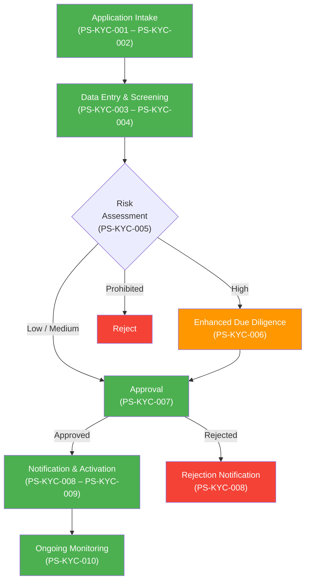
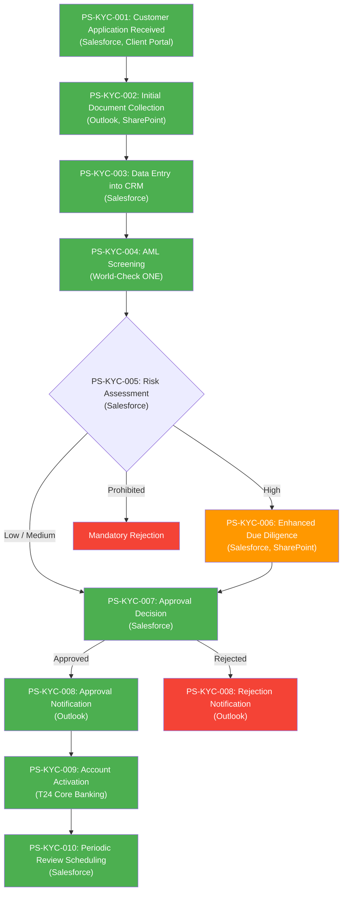
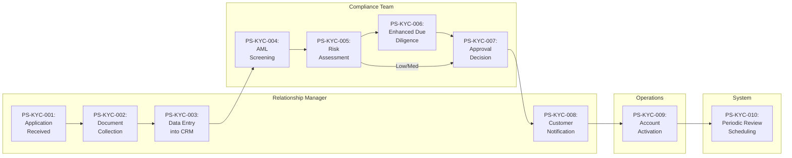
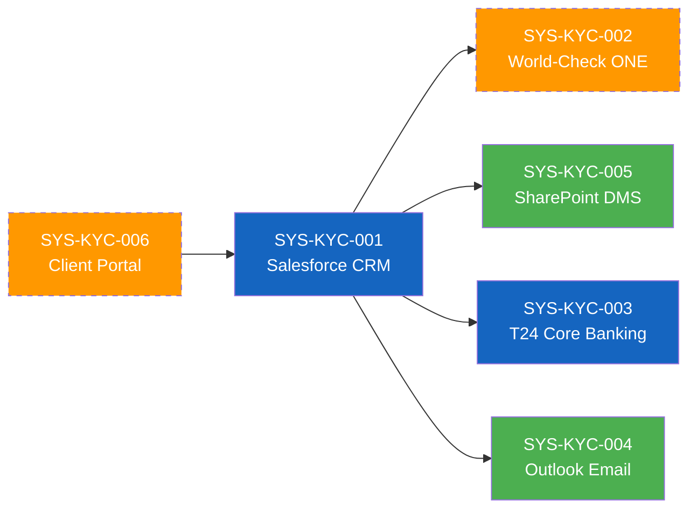

# As-Is Process Documentation: KYC (Know Your Customer)

**Document Type:** Current State Process Analysis
**Status:** Draft
**Business Unit:** Compliance / Operations
**Region:** All regions
**Document Owner:** Markus (CEO)
**Last Updated:** 2026-02-09
**Version:** 1.0
**Reviewed By:** — | **Review Date:** —
**Approved By:** — | **Approval Date:** —

---

## Executive Summary

The Know Your Customer (KYC) process is a mandatory compliance procedure that verifies customer identity and assesses risk for all business segments, including BizBanking, MidCap, and LargeCap. The process is triggered by new customer applications received via the Client Portal or email and encompasses document collection, AML/PEP screening, risk assessment, approval workflow, and ongoing monitoring setup.

The process spans 10 steps involving three primary teams: Relationship Management (customer-facing), Compliance (screening and risk assessment), and Operations (account activation). Six systems support the workflow, with Salesforce CRM serving as the central hub for data management and workflow coordination.

Key findings from this documentation effort include six pain points identified, most notably manual data re-entry between systems and intermittent World-Check ONE integration timeouts that delay processing. Five control points are mapped, including the four-eyes principle for high-risk approvals and mandatory CRM audit trails. No exceptions have been formally documented yet, representing a significant gap requiring SME follow-up. Five discrepancies were identified between the process flowchart and the Desktop Procedure (DTP-KYC-001), primarily reflecting system upgrades and policy changes implemented in 2025 that the flowchart has not been updated to reflect.

### Key Metrics at a Glance

| Metric | Value |
|--------|-------|
| Process Steps | 10 |
| Exceptions Identified | 0 |
| Pain Points Captured | 9 |
| Control Points Mapped | 5 |
| Systems Involved | 6 |
| Overall Confidence | MEDIUM (66%) |

---

## How to Read This Document

> This document captures the **current state (AS-IS)** of the KYC (Know Your Customer) process. It provides a comprehensive overview with summary tables. For detailed analysis, see the linked companion documents.
>
> **Companion Documents:**
> - [Exception Details](./exceptions-detail.md) - Full exception analysis with root causes
> - [Pain Point Details](./pain-points-detail.md) - Detailed pain point analysis with improvement ideas
> - [Control Point Details](./control-points-detail.md) - Complete control mapping with compliance analysis
> - [Client Touchpoint Details](./client-touchpoints-detail.md) - Client interaction analysis with CES scoring
>
> **Confidence Indicators:** Each section includes an AI-assessed completeness confidence:
> - **[HIGH]** (≥90%) - Comprehensive coverage, validated by multiple sources
> - **[MEDIUM]** (≥70%) - Good coverage, some details may need validation
> - **[LOW]** (≥40%) - Preliminary capture, requires additional SME input
> - **[STUB]** (<40%) - Section placeholder only, no substantive content captured yet
>
> **Versioning:** Documents follow semantic versioning (MAJOR.MINOR):
> - MAJOR: Significant process change or complete re-documentation
> - MINOR: Incremental additions, corrections, or confidence improvements
> - Example: v1.0 (initial), v1.1 (added 3 pain points), v2.0 (process redesigned)

---

## 1. Process Overview

> **About this section:** Foundational context - what this process is, who owns it, and what business need it serves.

### 1.1 Process Identification

| Attribute | Value |
|-----------|-------|
| **Process Name** | KYC (Know Your Customer) |
| **Process ID** | 005 |
| **Process Category** | Compliance / Regulatory |
| **Scope** | All business segments — new customer onboarding and periodic KYC reviews |
| **Process Owner** | Sue Smith |

### 1.2 Purpose and Trigger

The KYC process exists to verify the identity of prospective and existing customers and to assess the level of risk they present, ensuring regulatory compliance with Anti-Money Laundering (AML) and Counter-Terrorism Financing (CTF) obligations. The outcome is an approved customer with an assigned risk rating, or a documented rejection with written justification.

The process is triggered when a new customer application is received via the Client Portal or email. It is also triggered on a periodic basis for existing customers according to their assigned risk rating, to ensure ongoing compliance with regulatory requirements.

### 1.3 Operational Characteristics

The KYC process runs on a per-customer basis — each new customer application initiates one instance. Processing occurs during business hours, Monday through Friday. Volume data has not been captured yet (see PGAP-KYC-007). In addition to new customer onboarding, periodic reviews are scheduled based on risk rating: Low risk every 36 months, Medium risk every 12 months, and High risk every 6 months (confirmed by Process Owner — DTP-KYC-001 v2.3 is the authoritative source).

### 1.4 Key Stakeholders

- **Process Owner:** Sue Smith — overall accountability for KYC process design and compliance
- **Relationship Management Team:** Customer-facing; responsible for application intake, document collection, data entry, and customer communication (PS-KYC-001 through PS-KYC-003, PS-KYC-008)
- **Compliance Team:** Compliance Officers perform AML screening and risk assessment; Compliance Manager and Head of Compliance provide approval for high-risk customers (PS-KYC-004 through PS-KYC-007)
- **Operations Team:** Responsible for account activation in T24 Core Banking (PS-KYC-009)
- **Customers/Clients:** External — all segments (BizBanking, MidCap, LargeCap); provide documentation and receive outcome notifications
- **Regulators:** External — regulatory bodies requiring AML/KYC compliance

### 1.5 Service Levels & Performance Benchmarks

| SLA# | Metric | Current SLA | Actual Performance | Source | Regulatory? |
|------|--------|-------------|-------------------|--------|-------------|
| SLA-KYC-001 | Application logging time | 2 hours from receipt | — | DTP-KYC-001 | No |
| SLA-KYC-002 | Document collection window | 5 business days | — | DTP-KYC-001 | No |
| SLA-KYC-003 | CRM data entry completion | 1 business day | — | DTP-KYC-001 | No |
| SLA-KYC-004 | AML screening completion | Same day | — | DTP-KYC-001 | Yes |
| SLA-KYC-005 | EDD completion (high-risk) | 3 business days | — | DTP-KYC-001 | Yes |
| SLA-KYC-006 | Customer notification | 24 hours from decision | — | DTP-KYC-001 | No |

> **Note:** Actual performance data is not available. Logged as PGAP-KYC-009.

### 1.6 Cost & Resource Allocation

| Metric | Value |
|--------|-------|
| **FTE Allocation** | — |
| **Cost per Transaction** | — |
| **Annual Operating Cost** | — |
| **Resource Utilization** | — |

> **Note:** Cost and resource data has not been captured. Logged as PGAP-KYC-008.

### 1.7 Process Variants

| Variant | Scope | Key Differences | Shared Steps |
|---------|-------|-----------------|--------------|
| Standard (Low/Medium risk) | All segments | CO approval sufficient; no EDD required | PS-KYC-001 through PS-KYC-005, PS-KYC-007 through PS-KYC-010 |
| High-Risk Path | All segments | EDD required (PS-KYC-006); dual sign-off by CM + HoC | All steps including PS-KYC-006 |

> **Note:** The process is common across all client segments (BizBanking, MidCap, LargeCap). The primary variant is the conditional EDD path for high-risk customers, which adds PS-KYC-006 and changes the approval authority in PS-KYC-007.

> **Section Confidence:** [LOW] (55%) | **Basis:** Process identification well-documented; operational characteristics, cost/resource, and SLA actuals missing
> **Evidence Sources:** DTP-KYC-001 (v2.3, 2025-11-15), KYC Process Flowchart

---

## 2. Process Steps

> **About this section:** The step-by-step flow of this process from start to finish.

### 2.1 Process Step Summary

| PS# | Step Name | Owner | System(s) | Duration | Wait Time | Rationale |
|-----|-----------|-------|-----------|----------|-----------|-----------|
| PS-KYC-001 | Customer Application Received | Relationship Manager | SYS-KYC-001, SYS-KYC-006 | ~15 min | N/A | Intake and logging |
| PS-KYC-002 | Initial Document Collection | Relationship Manager | SYS-KYC-004, SYS-KYC-005 | ~30 min | Up to 5 business days | Identity verification requirement |
| PS-KYC-003 | Data Entry into CRM | Relationship Manager | SYS-KYC-001 | 40–50 min per client (×2–3/day) | N/A | Central record creation |
| PS-KYC-004 | AML Screening | Compliance Officer | SYS-KYC-002 | 15–30 min | N/A | Regulatory requirement (AML/CTF) |
| PS-KYC-005 | Risk Assessment | Compliance Officer | SYS-KYC-001 | 15–30 min | N/A | Risk-based approach to compliance |
| PS-KYC-006 | Enhanced Due Diligence | Compliance Officer | SYS-KYC-001, SYS-KYC-005 | 1–3 business days | Variable | Regulatory requirement (high-risk) |
| PS-KYC-007 | Approval Decision | Compliance Manager | SYS-KYC-001 | 30 min – 1 day | Queue dependent | Authorization control |
| PS-KYC-008 | Customer Notification | Relationship Manager | SYS-KYC-004 | ~15 min | N/A | Client communication |
| PS-KYC-009 | Account Activation | Operations | SYS-KYC-003 | ~15 min | Overnight (batch) | Account provisioning |
| PS-KYC-010 | Periodic Review Scheduling | System (automated) | SYS-KYC-001 | Automated | N/A | Ongoing compliance monitoring |

### 2.2 Process Flow Diagrams

<!--
DIAGRAM CONVENTIONS:
- Use flowchart TD (top-down) for process flows
- Use flowchart LR (left-right) for swim lanes
- Node IDs should match PS# (e.g., PS1["Step 1: Receive Application"])
- Decision nodes use {rhombus} notation
- Exception paths use dotted lines (-.->)
- System interactions noted in parentheses
- Color coding: Green=happy path, Orange=exception, Red=failure
-->

#### 2.2.1 High-Level Process Flow (L1)

> Overview showing major phases and key decision points

#### 2.2.2 Detailed Process Flow (L2)

> Detailed flow showing all steps, exceptions, and system interactions

#### 2.2.3 Swim Lane Diagram

> Role-based view showing handoffs between teams

### 2.3 Step Details

#### PS-KYC-001: Customer Application Received

**Performer:** Relationship Manager
**System(s):** SYS-KYC-001 (Salesforce CRM), SYS-KYC-006 (Client Portal)
**Input:** Customer application (submitted via Client Portal or email)
**Output:** Application logged in Salesforce with unique reference number
**Business Rules:** Log application within 2 hours of receipt (SLA-KYC-001)
**Duration:** ~15 min
**Wait Time:** N/A (trigger step)
**Channel:** Client Portal / Email
**Document Count:** 1 (application form)
**Interaction Count:** 1 (customer submission)

Relationship Manager receives new customer application via Client Portal or email. The application is logged in Salesforce within 2 hours and assigned a unique application reference number.

#### PS-KYC-002: Initial Document Collection

**Performer:** Relationship Manager
**System(s):** SYS-KYC-004 (Outlook Email), SYS-KYC-005 (SharePoint DMS)
**Input:** Logged application, customer contact details
**Output:** Collected KYC documents stored in SharePoint under client folder
**Business Rules:** Standard document set per client type; documents must be received within 5 business days (SLA-KYC-002)
**Duration:** ~30 min (request and follow-up)
**Wait Time:** Up to 5 business days (customer response)
**Channel:** Email
**Document Count:** 3–5 (passport/ID, proof of address, corporate docs for corporates)
**Interaction Count:** 2–3 (request, follow-up, confirmation)

RM requests identification documents: valid passport or national ID, proof of address (utility bill or bank statement), and for corporate clients: Certificate of Incorporation and Board Resolution. Documents are stored in SharePoint under the client folder.

#### PS-KYC-003: Data Entry into CRM

**Performer:** Relationship Manager
**System(s):** SYS-KYC-001 (Salesforce CRM)
**Input:** Customer documents, application details
**Output:** Complete customer record in Salesforce with all mandatory fields populated and documents attached
**Business Rules:** All mandatory fields must be completed (CP-KYC-003); scanned documents must be attached to the customer record
**Duration:** 30–60 min
**Wait Time:** N/A
**Channel:** Internal (CRM)
**Document Count:** 1 (CRM record created)
**Interaction Count:** 0

RM enters customer details into Salesforce CRM, completes all mandatory fields (marked with *), and attaches scanned documents to the customer record. SLA: Complete within 1 business day (SLA-KYC-003). DILO observation confirms 40–50 min per client, but RMs typically handle 2–3 new clients per day, making total daily CRM data entry time ~2–2.5 hours — the single largest time block for this role. Corporate and high-risk clients take longer due to additional fields and documentation.

#### PS-KYC-004: AML Screening

**Performer:** Compliance Officer
**System(s):** SYS-KYC-002 (World-Check ONE)
**Input:** Customer name, beneficial owner names (>25% shareholding)
**Output:** Screening results (clear / potential match) documented in CRM
**Business Rules:** Screen all beneficial owners with >25% shareholding (BR-KYC-002); same-day screening required (SLA-KYC-004)
**Duration:** 15–30 min
**Wait Time:** N/A
**Channel:** Internal (system-to-system)
**Document Count:** 1 (screening report)
**Interaction Count:** 0

Compliance Officer runs customer and all beneficial owners (>25% shareholding) through World-Check ONE screening tool. Screening results are documented in the CRM. Note: World-Check ONE was upgraded from World-Check (see PGAP-KYC-001).

#### PS-KYC-005: Risk Assessment

**Performer:** Compliance Officer
**System(s):** SYS-KYC-001 (Salesforce CRM)
**Input:** Screening results, customer profile
**Output:** Assigned risk rating (Low / Medium / High / Prohibited)
**Business Rules:** Apply Risk Rating Matrix (Appendix A of DTP-KYC-001); "Prohibited" category added Q3 2025 (BR-KYC-001)
**Duration:** 15–30 min
**Wait Time:** N/A
**Channel:** Internal (CRM)
**Document Count:** 1 (risk assessment record)
**Interaction Count:** 0

CO assigns risk rating based on Risk Rating Matrix. Four categories: Low, Medium, High, and Prohibited (added Q3 2025 — see PGAP-KYC-005). High-risk customers proceed to Enhanced Due Diligence (PS-KYC-006). Prohibited customers are rejected.

#### PS-KYC-006: Enhanced Due Diligence

**Performer:** Compliance Officer
**System(s):** SYS-KYC-001 (Salesforce CRM), SYS-KYC-005 (SharePoint DMS)
**Input:** High-risk customer profile, EDD checklist (Appendix B of DTP-KYC-001)
**Output:** Completed EDD with source of funds/wealth verification and dual sign-off
**Business Rules:** Source of funds/wealth must be verified; sign-off required from Compliance Manager AND Head of Compliance (CP-KYC-001)
**Duration:** 1–3 business days
**Wait Time:** Variable (dependent on customer response for additional documents)
**Channel:** Email / Internal
**Document Count:** 3–5 (additional documentation, verification records)
**Interaction Count:** 2–3 (customer requests, internal approvals)

For High-risk customers: gather additional documentation per EDD checklist, verify source of funds and wealth, and obtain sign-off from Compliance Manager AND Head of Compliance. Target completion within 3 business days (SLA-KYC-005). Note: Previous target was 5 days (see PGAP-KYC-004).

#### PS-KYC-007: Approval Decision

**Performer:** Compliance Manager (high-risk); Compliance Officer (low/medium-risk)
**System(s):** SYS-KYC-001 (Salesforce CRM)
**Input:** Risk assessment, EDD results (if applicable), screening results
**Output:** Approval or rejection decision with written justification (for rejections)
**Business Rules:** Low/Medium risk: Compliance Officer approval sufficient; High risk: Compliance Manager + Head of Compliance required (BR-KYC-003); rejected applications require written justification (BR-KYC-004)
**Duration:** 30 min – 1 day
**Wait Time:** Queue dependent
**Channel:** Internal (CRM workflow)
**Document Count:** 1 (decision record)
**Interaction Count:** 0–2 (internal discussion for borderline cases)

Approval authority varies by risk level. Low/Medium risk: Compliance Officer can approve. High risk: requires Compliance Manager AND Head of Compliance sign-off (four-eyes principle — CP-KYC-001). All rejections require written justification.

#### PS-KYC-008: Customer Notification

**Performer:** Relationship Manager
**System(s):** SYS-KYC-004 (Outlook Email)
**Input:** Approval or rejection decision
**Output:** Customer notification letter sent
**Business Rules:** Send within 24 hours of decision (SLA-KYC-006); use standard templates (Appendix C of DTP-KYC-001); do not disclose screening findings for rejections (BR-KYC-005)
**Duration:** ~15 min
**Wait Time:** N/A
**Channel:** Email
**Document Count:** 1 (notification letter)
**Interaction Count:** 1 (outbound to customer)

RM sends approval or rejection letter to the customer using standard templates stored in SharePoint. For rejections, screening findings must not be disclosed.

#### PS-KYC-009: Account Activation

**Performer:** Operations
**System(s):** SYS-KYC-003 (T24 Core Banking)
**Input:** Approved customer record from Salesforce
**Output:** Active customer account in T24
**Business Rules:** Only approved applications proceed to activation
**Duration:** ~15 min (manual entry)
**Wait Time:** Overnight (T24 batch processing — see PP-KYC-006)
**Channel:** Internal (T24)
**Document Count:** 0
**Interaction Count:** 0

Operations team activates the customer account in T24 Core Banking System. Note: T24 replaced the legacy CBS system in 2025 (see PGAP-KYC-002). Batch processing means activation may not take effect until the next business day.

#### PS-KYC-010: Periodic Review Scheduling

**Performer:** System (automated)
**System(s):** SYS-KYC-001 (Salesforce CRM)
**Input:** Active customer record with assigned risk rating
**Output:** Scheduled next review date; transaction monitoring alerts enabled
**Business Rules:** Review frequency per risk level — Low: 36 months, Medium: 12 months, High: 6 months (per DTP-KYC-001 current policy; see PGAP-KYC-003 for discrepancy with flowchart)
**Duration:** Automated
**Wait Time:** N/A
**Channel:** System
**Document Count:** 0
**Interaction Count:** 0

System automatically schedules the next KYC review based on the assigned risk rating and enables transaction monitoring alerts in the CRM.

### 2.4 Handoff Points

| HO# | From (Role/Team) | To (Role/Team) | Trigger | Method | Avg Wait |
|-----|------------------|----------------|---------|--------|----------|
| HO-KYC-001 | Relationship Manager | Compliance Officer | PS-KYC-003 complete (CRM record created) | Salesforce workflow queue | — |
| HO-KYC-002 | Compliance Officer | Compliance Manager / HoC | PS-KYC-005 complete (risk rating = High) or PS-KYC-006 complete (EDD done) | Salesforce approval workflow | — |
| HO-KYC-003 | Compliance Manager | Relationship Manager | PS-KYC-007 complete (decision made) | Salesforce notification | — |
| HO-KYC-004 | Relationship Manager | Operations | PS-KYC-008 complete (approval notification sent) | Salesforce workflow queue | — |

### 2.5 Business Rules

| BR# | Rule | Condition | Action | Source |
|-----|------|-----------|--------|--------|
| BR-KYC-001 | Risk rating determines approval pathway | Risk assessed at PS-KYC-005 | Low/Medium → PS-KYC-007 (CO approval); High → PS-KYC-006 (EDD); Prohibited → Reject | DTP-KYC-001 §5 |
| BR-KYC-002 | Beneficial owner screening threshold | Customer has beneficial owners | Screen all beneficial owners >25% shareholding | DTP-KYC-001 §4 |
| BR-KYC-003 | Dual approval for high-risk | Risk = High at PS-KYC-007 | Require Compliance Manager AND Head of Compliance sign-off | DTP-KYC-001 §7 |
| BR-KYC-004 | Rejection justification required | Application rejected at PS-KYC-007 | Written justification must be recorded in CRM | DTP-KYC-001 §7 |
| BR-KYC-005 | Screening non-disclosure on rejection | Rejection notification at PS-KYC-008 | Do not disclose screening findings to customer | DTP-KYC-001 §8 |

### 2.6 Decision Points

| DP# | Decision | At Step | Criteria | Yes Path | No Path |
|-----|----------|---------|----------|----------|---------|
| DP-KYC-001 | Is the customer high-risk or prohibited? | PS-KYC-005 | Risk Rating Matrix assessment yields High or Prohibited | High → PS-KYC-006 (EDD); Prohibited → Reject | Low/Medium → PS-KYC-007 (standard approval) |
| DP-KYC-002 | Approve or reject the application? | PS-KYC-007 | Screening clear, risk acceptable, EDD satisfactory (if applicable) | Approved → PS-KYC-008 (approval notification) | Rejected → PS-KYC-008 (rejection notification) |

> **Section Confidence:** [MEDIUM] (88%) | **Basis:** 10 steps documented from two corroborating sources; duration/wait times are estimates pending SME validation
> **Evidence Sources:** DTP-KYC-001 (v2.3, 2025-11-15), KYC Process Flowchart

---

## 3. Exception Paths and Variations

> **About this section:** Summary of exceptions. For full details including root cause analysis and handling procedures, see [Exception Details](./exceptions-detail.md).

### 3.1 Exception Summary

No exceptions have been formally documented for this process. This is a significant gap — a 10-step process with multiple handoffs and external dependencies is expected to have at least 3–5 documented exceptions. SME follow-up is required to capture exception paths (see PGAP-KYC-006).

### 3.2 Exception Summary Table

| EX# | Exception | Trigger | Affected Steps | Frequency | Impact | Handling Owner |
|-----|-----------|---------|----------------|-----------|--------|----------------|
| — | *No exceptions documented* | — | — | — | — | — |

### 3.3 Exception Statistics

| Metric | Value |
|--------|-------|
| Total Exceptions | 0 |
| High-Impact Exceptions | 0 |
| Frequently Occurring | 0 |

> **Full Analysis:** [View Exception Details](./exceptions-detail.md)
>
> **Section Confidence:** [STUB] (0%) | **Basis:** No exceptions captured; section requires complete SME input
> **Evidence Sources:** None

---

## 4. Control Points and Compliance

> **About this section:** Summary of controls. For full regulatory mapping and effectiveness analysis, see [Control Point Details](./control-points-detail.md).

### 4.1 Control Summary

Five control points have been identified across the KYC process, drawn from both the process flowchart and the Desktop Procedure (DTP-KYC-001). Controls cover approval authorization (four-eyes principle), data integrity (audit trail, mandatory fields), regulatory retention (screening archival), and process completeness (monthly reconciliation). All controls are currently documented at a summary level; effectiveness assessment and detailed regulatory mapping are pending in the companion document.

### 4.2 Control Point Summary Table

| CP# | Control Name | Type | Regulation | Process Step | Effectiveness | Risk Level |
|-----|--------------|------|------------|--------------|---------------|------------|
| CP-KYC-001 | Four-eyes principle on high-risk approvals | Preventive | AML/CTF regulations | PS-KYC-006, PS-KYC-007 | — | High |
| CP-KYC-002 | Audit trail in CRM | Detective | Internal audit policy | PS-KYC-003, PS-KYC-005, PS-KYC-007 | — | Medium |
| CP-KYC-003 | Mandatory fields validation | Preventive | Data quality policy | PS-KYC-003 | — | Medium |
| CP-KYC-004 | Screening results archival | Detective | AML regulations (7-year retention) | PS-KYC-004 | — | High |
| CP-KYC-005 | Monthly reconciliation of pending applications | Detective | Internal compliance policy | PS-KYC-007 | — | Medium |

### 4.3 Regulatory Coverage

| Regulation | Controls Mapped | Coverage Status |
|------------|-----------------|-----------------|
| AML/CTF regulations | CP-KYC-001, CP-KYC-004 | Partial — effectiveness not assessed |
| Internal audit policy | CP-KYC-002 | Partial |
| Data quality policy | CP-KYC-003 | Partial |
| Internal compliance policy | CP-KYC-005 | Partial |

### 4.4 Control Statistics

| Metric | Value |
|--------|-------|
| Total Control Points | 5 |
| Regulatory Controls | 2 (CP-KYC-001, CP-KYC-004) |
| Internal Controls | 3 (CP-KYC-002, CP-KYC-003, CP-KYC-005) |
| Automated Controls | 1 (CP-KYC-003) |

> **Full Analysis:** [View Control Point Details](./control-points-detail.md)
>
> **Section Confidence:** [MEDIUM] (78%) | **Basis:** 5 controls identified from two sources; effectiveness and detailed regulatory mapping pending
> **Evidence Sources:** DTP-KYC-001 (v2.3, 2025-11-15), KYC Process Flowchart

---

## 5. System Dependencies

> **About this section:** What technology supports this process?

### 5.1 System Summary

| SYS# | System Name | Purpose | Integration Points |
|------|-------------|---------|-------------------|
| SYS-KYC-001 | Salesforce CRM | Customer relationship management, KYC data entry, workflow coordination | 5 (all other systems) |
| SYS-KYC-002 | World-Check ONE | AML/PEP screening | 1 (Salesforce CRM) |
| SYS-KYC-003 | T24 Core Banking | Account activation and management | 1 (Salesforce CRM) |
| SYS-KYC-004 | Outlook Email | Customer and internal communication | 1 (Salesforce CRM) |
| SYS-KYC-005 | SharePoint DMS | Document storage and management | 1 (Salesforce CRM) |
| SYS-KYC-006 | Client Portal | External application intake portal | 1 (Salesforce CRM) |

### 5.2 Integration Matrix

| INT# | Source System | Target System | Method | Frequency | Data Exchanged | Error Handling |
|------|--------------|---------------|--------|-----------|----------------|----------------|
| INT-KYC-001 | SYS-KYC-006 (Client Portal) | SYS-KYC-001 (Salesforce CRM) | — | On-demand (per application) | Customer application data | — |
| INT-KYC-002 | SYS-KYC-001 (Salesforce CRM) | SYS-KYC-002 (World-Check ONE) | — | On-demand (per screening) | Customer name, beneficial owner names | Timeout/retry (see PP-KYC-002) |
| INT-KYC-003 | SYS-KYC-001 (Salesforce CRM) | SYS-KYC-005 (SharePoint DMS) | — | On-demand (per document upload) | Document metadata, file attachments | Sync delays reported (see PP-KYC-005) |
| INT-KYC-004 | SYS-KYC-001 (Salesforce CRM) | SYS-KYC-003 (T24 Core Banking) | — | On-demand (per approved customer) | Approved customer record | Batch processing overnight (see PP-KYC-006) |
| INT-KYC-005 | SYS-KYC-001 (Salesforce CRM) | SYS-KYC-004 (Outlook Email) | — | On-demand (per notification) | Notification triggers, templates | — |

> **Note:** Integration methods (API, file transfer, manual re-key) have not been confirmed with the IT team. Logged as a gap for IT Architect follow-up.

### 5.3 System Interaction Diagram

### 5.4 Data & Document Inventory

| DOC# | Document/Data Artifact | Source | Format | Retention | Regulatory Req |
|------|------------------------|--------|--------|-----------|----------------|
| DOC-KYC-001 | Customer Application Form | Client Portal / Email | Digital / Paper | Duration of relationship + 7 years | Yes |
| DOC-KYC-002 | Identity Documents (Passport/ID) | Customer | Scanned PDF | Duration of relationship + 7 years | Yes |
| DOC-KYC-003 | Proof of Address | Customer | Scanned PDF | Duration of relationship + 7 years | Yes |
| DOC-KYC-004 | Corporate Documents (Certificate of Incorporation, Board Resolution) | Customer | Scanned PDF | Duration of relationship + 7 years | Yes |
| DOC-KYC-005 | AML Screening Report | World-Check ONE | System record | 7 years (CP-KYC-004) | Yes |
| DOC-KYC-006 | Risk Assessment Record | Salesforce CRM | System record | Duration of relationship + 7 years | Yes |
| DOC-KYC-007 | EDD Checklist and Supporting Documents | CO / Customer | Digital / Scanned PDF | Duration of relationship + 7 years | Yes |
| DOC-KYC-008 | Approval/Rejection Decision Record | Salesforce CRM | System record | Duration of relationship + 7 years | Yes |
| DOC-KYC-009 | Customer Notification Letter | Outlook Email | Email / PDF | 7 years | No |
| DOC-KYC-010 | Source of Funds/Wealth Documentation (high-risk) | Customer | Scanned PDF | Duration of relationship + 7 years | Yes |

> **Section Confidence:** [MEDIUM] (85%) | **Basis:** 6 systems identified; integration methods and error handling details pending IT Architect review
> **Evidence Sources:** DTP-KYC-001 (v2.3, 2025-11-15), KYC Process Flowchart

---

## 6. Organizational Mapping

> **About this section:** Who does what? Roles and responsibilities.

### 6.1 RACI Matrix

| Step | Relationship Manager | Compliance Officer | Compliance Manager | Head of Compliance | Operations |
|------|:--------------------:|:------------------:|:------------------:|:------------------:|:----------:|
| PS-KYC-001 | R, A | | | | |
| PS-KYC-002 | R, A | | | | |
| PS-KYC-003 | R, A | I | | | |
| PS-KYC-004 | I | R, A | | | |
| PS-KYC-005 | I | R, A | | | |
| PS-KYC-006 | | R | C | A | |
| PS-KYC-007 (Low/Med) | I | R, A | | | |
| PS-KYC-007 (High) | I | C | R | A | |
| PS-KYC-008 | R, A | I | | | |
| PS-KYC-009 | I | | | | R, A |
| PS-KYC-010 | I | I | | | |

> **Note:** PS-KYC-007 has conditional accountability depending on risk level. PS-KYC-010 is automated — no human R/A assignment.

### 6.2 Team Responsibilities

**Relationship Management Team** — Customer-facing team responsible for application intake, document collection, CRM data entry, and customer communication (PS-KYC-001, PS-KYC-002, PS-KYC-003, PS-KYC-008). FTE count not confirmed. Reports to Head of Client Services.

**Compliance Team** — Compliance Officers perform AML screening and risk assessments (PS-KYC-004, PS-KYC-005, PS-KYC-006). Compliance Manager and Head of Compliance provide oversight and approval authority for high-risk customers (PS-KYC-007). FTE count not confirmed. Reports to Chief Compliance Officer.

**Operations Team** — Responsible for account activation in T24 Core Banking (PS-KYC-009). Access restricted to T24 system. FTE count not confirmed. Reports to Head of Operations.

> **Section Confidence:** [LOW] (45%) | **Basis:** RACI derived from step ownership data; team headcounts, reporting lines, and shared-service arrangements not confirmed with SMEs
> **Evidence Sources:** Inferred from process step data

---

## 7. Existing Documentation References

> **About this section:** Related documents and metrics.

### 7.1 Related Documents

| Document | Owner | Last Updated | Storage Location | Status |
|----------|-------|--------------|------------------|--------|
| KYC Process Flowchart | — | — | Uploaded to ProcessMiner (2026-02-09) | Outdated (does not reflect 2025 system migrations and policy changes) |
| KYC Desktop Procedure (DTP-KYC-001) v2.3 | Compliance Department | 2025-11-15 | — | Current |
| Risk Rating Matrix (Appendix A) | Compliance Department | — | Referenced in DTP-KYC-001 | Not reviewed |
| EDD Checklist (Appendix B) | Compliance Department | — | Referenced in DTP-KYC-001 | Not reviewed |
| Standard Letter Templates (Appendix C) | Compliance Department | — | SharePoint | Not reviewed |

### 7.2 KPIs and Metrics

No KPIs or operational metrics have been formally captured for this process. The following KPIs are recommended based on the documented process steps, SLAs, and pain points:

| KPI | Description | Linked SLA/Step | Data Source | Current Value |
|-----|-------------|-----------------|-------------|---------------|
| End-to-end onboarding time | Average days from application receipt (PS-KYC-001) to account activation (PS-KYC-009) | — | SYS-KYC-001 (Salesforce CRM) | [TBD] |
| KYC rejection rate | % of applications rejected, segmented by BizBanking / MidCap / LargeCap | PS-KYC-007 | SYS-KYC-001 (Salesforce CRM) | [TBD] |
| EDD completion time | Average days to complete Enhanced Due Diligence vs. SLA target of 3 days | SLA-KYC-005 | SYS-KYC-001 (Salesforce CRM) | [TBD] |
| AML screening false positive rate | % of World-Check ONE hits that are cleared as false positives | PS-KYC-004 | SYS-KYC-002 (World-Check ONE) | [TBD] |
| Periodic review on-time rate | % of periodic reviews completed before the scheduled due date | PS-KYC-010 | SYS-KYC-001 (Salesforce CRM) | [TBD] |
| Application logging SLA compliance | % of applications logged within 2 hours of receipt | SLA-KYC-001 | SYS-KYC-001 (Salesforce CRM) | [TBD] |

> **Note:** All current values require SME or system data extraction. Logged as PGAP-KYC-009.

### 7.3 DTPs (Detailed Task Procedures)

| DTP | Supports Steps | Version | Storage | Status |
|-----|---------------|---------|---------|--------|
| DTP-KYC-001: KYC Desktop Procedure | All (PS-KYC-001 – PS-KYC-010) | v2.3 | Compliance Department | Current (last updated 2025-11-15) |

> **Note:** DTP-KYC-001 is the sole DTP supporting this process. It is reasonably current but some appendices (Risk Rating Matrix, EDD Checklist) have not been independently reviewed.

> **Section Confidence:** [LOW] (40%) | **Basis:** Two source documents available; KPIs not captured; appendices not reviewed
> **Evidence Sources:** DTP-KYC-001 (v2.3, 2025-11-15), KYC Process Flowchart

---

## 8. Process Gaps and Issues

> **About this section:** Known gaps, inconsistencies, and their impact on analysis confidence.
>
> **Gap Resolution Tracking:** [View Gap Resolution Log](./gap-resolution-log.md)

### 8.1 Identified Gaps

| PGAP# | Gap Description | Category | Section Affected | Severity | Impact on Analysis | Resolution Owner | Status |
|-------|-----------------|----------|------------------|----------|-------------------|-----------------|--------|
| PGAP-KYC-001 | Screening tool naming inconsistency: Flowchart says "World-Check", DTP says "World-Check ONE" (upgraded version) | Documentation Gap | 5. Systems | LOW | Minor — resolved by using DTP as more current source | — | open |
| PGAP-KYC-002 | Core banking system naming inconsistency: Flowchart says "CBS", DTP says "T24" (migrated in 2025) | Documentation Gap | 5. Systems | LOW | Minor — resolved by using DTP as more current source | — | open |
| PGAP-KYC-003 | Periodic review frequencies differ: Flowchart says 12mo/6mo/3mo, DTP says 36mo/12mo/6mo (updated policy) | Documentation Gap | 2. Process Steps | HIGH | Affects PS-KYC-010 accuracy; regulatory implications | Sue Smith | resolved |
| PGAP-KYC-004 | EDD target timeframe differs: Flowchart says avg 5 days, DTP says target 3 days (improved SLA) | Documentation Gap | 2. Process Steps | MEDIUM | Affects SLA-KYC-005 and duration estimates for PS-KYC-006 | — | open |
| PGAP-KYC-005 | Risk categories differ: Flowchart shows 3 levels (Low/Medium/High), DTP shows 4 levels (added "Prohibited" in Q3 2025) | Documentation Gap | 2. Process Steps | MEDIUM | Affects DP-KYC-001 and BR-KYC-001 completeness | — | open |
| PGAP-KYC-006 | No exceptions documented for a 10-step process | Knowledge Gap | 3. Exceptions | HIGH | Section 3 has STUB confidence; downstream analyses (CX Journey, Transformation) will lack exception context | — | open |
| PGAP-KYC-007 | Process volume data not captured | Data Gap | 1. Process Overview | MEDIUM | Cannot assess capacity, throughput, or resource adequacy | — | open |
| PGAP-KYC-008 | Cost and resource allocation data not captured | Data Gap | 1. Process Overview | MEDIUM | Cannot baseline operating cost for transformation business case | — | open |
| PGAP-KYC-009 | Actual SLA performance data not available | Data Gap | 1. Process Overview | MEDIUM | SLA table incomplete; cannot identify SLA breaches | — | open |

**Gap Categories:** Documentation Gap · Knowledge Gap · Data Gap · System Gap · Compliance Gap

### 8.2 Documentation Assessment

| DOC# | Document | Status | Last Updated | Issue | Impact |
|------|----------|--------|--------------|-------|--------|
| DOC-REF-001 | KYC Process Flowchart | Outdated | Unknown | Does not reflect 2025 system migrations (T24, World-Check ONE) or policy changes (Prohibited category, review frequencies) | Source of 5 discrepancies; cannot be used as sole source of truth |
| DOC-REF-002 | DTP-KYC-001 (v2.3) | Current | 2025-11-15 | Appendices not independently reviewed | Most reliable current source; appendices may need validation |

### 8.3 Inconsistencies

| PGAP# | Inconsistency | Sources | Impact | Resolution |
|-------|---------------|---------|--------|------------|
| PGAP-KYC-001 | "World-Check" vs. "World-Check ONE" | Process Chart vs. DTP | Low — naming only; system upgrade confirmed | Used DTP value (World-Check ONE) as current |
| PGAP-KYC-002 | "CBS" vs. "T24 Core Banking" | Process Chart vs. DTP | Low — naming only; migration confirmed in 2025 | Used DTP value (T24) as current |
| PGAP-KYC-003 | Review frequencies: 12mo/6mo/3mo vs. 36mo/12mo/6mo | Process Chart vs. DTP | High — regulatory compliance implications; need process owner confirmation | Resolved — DTP values confirmed by Process Owner (36mo/12mo/6mo) |
| PGAP-KYC-004 | EDD target: "avg 5 days" vs. "target 3 days" | Process Chart vs. DTP | Medium — affects SLA and customer experience expectations | Used DTP value (3 days) as current target |
| PGAP-KYC-005 | Risk levels: 3 (L/M/H) vs. 4 (L/M/H/Prohibited) | Process Chart vs. DTP | Medium — "Prohibited" category has distinct handling (mandatory rejection) | Used DTP value (4 levels) as current |

### 8.4 Gap-to-Confidence Impact

| PGAP# | Affected Section | Current Confidence | Confidence if Resolved |
|-------|------------------|--------------------|----------------------|
| PGAP-KYC-003 | 2. Process Steps | MEDIUM (88%) | HIGH (92%) |
| PGAP-KYC-006 | 3. Exceptions | STUB (0%) | MEDIUM (70%) |
| PGAP-KYC-007 | 1. Process Overview | LOW (55%) | MEDIUM (70%) |
| PGAP-KYC-008 | 1. Process Overview | LOW (55%) | MEDIUM (70%) |
| PGAP-KYC-009 | 1. Process Overview | LOW (55%) | MEDIUM (75%) |

> **Section Confidence:** [MEDIUM] (75%) | **Basis:** Discrepancies systematically captured from source comparison; gap severity and confidence impact assessed
> **Evidence Sources:** Comparison of KYC Process Flowchart and DTP-KYC-001 (v2.3)

---

## 9. Pain Points and Improvement Opportunities

> **About this section:** Summary of pain points. For full analysis including root causes and improvement ideas, see [Pain Point Details](./pain-points-detail.md).

### 9.1 Pain Points Summary

Nine pain points have been identified across the KYC process, sourced from the process flowchart (4), the Desktop Procedure (2), and DILO observation of the Relationship Manager role (3 new). Two are rated High impact (World-Check ONE timeout and EDD delays), six are Medium (manual data re-entry, missing periodic review reminders, T24 batch delays, missing screening notifications, CRM dashboard performance, and client status self-service gap), and one is Low (SharePoint sync issues). The pain points cluster around system integration reliability, manual workarounds, and missing automation triggers, suggesting CRM enhancement, notification automation, and client self-service as key improvement themes.

### 9.2 Pain Point Summary Table

| PP# | Pain Point | Category | Affected Steps | Impact | Frequency | Priority | Quick Win? |
|-----|------------|----------|----------------|--------|-----------|----------|------------|
| PP-KYC-001 | Manual data re-entry between systems | Efficiency | PS-KYC-003 | Medium | Always | Medium | No |
| PP-KYC-002 | World-Check ONE integration sometimes times out | System Reliability | PS-KYC-004 | High | Sometimes | High | No |
| PP-KYC-003 | EDD process takes too long | Cycle Time | PS-KYC-006 | High | Always | High | No |
| PP-KYC-004 | No automated reminder for periodic reviews | Compliance Risk | PS-KYC-010 | Medium | Always | Medium | Yes |
| PP-KYC-005 | SharePoint sync delays causing duplicate uploads | Data Quality | PS-KYC-002 | Low | Sometimes | Low | No |
| PP-KYC-006 | T24 batch processing causes overnight activation delays | Customer Experience | PS-KYC-009 | Medium | Always | Medium | No |
| PP-KYC-007 | No automated notification to RM when screening/approval completes | Efficiency | PS-KYC-004, PS-KYC-007 | Medium | Always | High | Yes |
| PP-KYC-008 | CRM pipeline dashboard too slow, driving Excel shadow tracker | System Reliability | PS-KYC-003 | Medium | Always | Medium | No |
| PP-KYC-009 | No self-service application status for clients, creating RM call overhead | Customer Experience | PS-KYC-001 | Medium | Always | Medium | No |
| PP-KYC-010 | Borderline risk rating cases require informal CO→CM escalation with no documented criteria | Process Gap | PS-KYC-005 | Medium | Sometimes | Medium | Yes |

### 9.3 Pain Point Statistics

| Metric | Value |
|--------|-------|
| Total Pain Points | 10 |
| High-Impact | 2 (PP-KYC-002, PP-KYC-003) |
| Client-Facing | 3 (PP-KYC-003, PP-KYC-006, PP-KYC-009) |
| DILO-Discovered | 3 (PP-KYC-007, PP-KYC-008, PP-KYC-009) |
| Quick Win Opportunities | 3 (PP-KYC-004, PP-KYC-007, PP-KYC-010) |

### 9.4 Top Improvement Opportunities

1. **PP-KYC-002 — World-Check ONE integration timeout:** High impact, affects AML screening throughput. Investigate integration stability with vendor; consider async/queue-based screening.
2. **PP-KYC-003 — EDD processing time:** High impact, directly affects customer onboarding experience. Explore parallel document collection, pre-populated checklists, or tiered EDD requirements.
3. **PP-KYC-004 — Periodic review reminders:** Quick win — implement automated CRM reminders/alerts for upcoming review deadlines to mitigate compliance risk.
4. **PP-KYC-007 — Screening/approval notification:** Quick win — add automated CRM notification to RM when screening completes or approval decision is made, eliminating ~20 min/day of informal coordination.
5. **PP-KYC-009 — Client self-service status:** Add application status tracking to Client Portal to reduce 3-4 daily RM status enquiry calls.

> **Full Analysis:** [View Pain Point Details](./pain-points-detail.md)
>
> **Section Confidence:** [MEDIUM] (80%) | **Basis:** 6 pain points from two corroborating sources; root cause analysis and quantified impact pending
> **Evidence Sources:** KYC Process Flowchart, DTP-KYC-001 (v2.3, 2025-11-15)

---

## Document Metadata

**SME Contributors:** Markus (CEO)
**Interview Date(s):** 2026-02-09
**Documentation Method:** Document import (process flowchart + desktop procedure); SME session pending

### Overall Document Confidence

| Section | Confidence | Score | Key Gaps |
|---------|------------|-------|----------|
| 1. Process Overview | LOW | 55% | Volume data, cost/resource, SLA actuals missing |
| 2. Process Steps | MEDIUM | 88% | Duration/wait times are estimates; 5 source discrepancies |
| 3. Exceptions | STUB | 0% | No exceptions documented (PGAP-KYC-006) |
| 4. Controls | MEDIUM | 78% | Effectiveness not assessed; regulatory mapping incomplete |
| 5. Systems | MEDIUM | 85% | Integration methods not confirmed with IT |
| 6. Organization | LOW | 45% | RACI inferred; headcounts and reporting lines unconfirmed |
| 7. Documentation | LOW | 40% | KPIs not captured; appendices not reviewed |
| 8. Gaps & Issues | MEDIUM | 75% | Discrepancies captured; resolution pending |
| 9. Pain Points | MEDIUM | 80% | Root cause analysis and quantified impact pending |

**Overall Confidence:** MEDIUM (66%)

### Companion Documents

| Document | Purpose | Link |
|----------|---------|------|
| Exception Details | Full exception analysis | [exceptions-detail.md](./exceptions-detail.md) |
| Pain Point Details | Full pain point analysis | [pain-points-detail.md](./pain-points-detail.md) |
| Control Point Details | Full control analysis | [control-points-detail.md](./control-points-detail.md) |
| Client Touchpoint Details | Client interaction & CES analysis | [client-touchpoints-detail.md](./client-touchpoints-detail.md) |

---

## Related Specialist Analyses

> Documents produced by downstream specialist agents that reference this AS-IS documentation.

| Document | Agent | Relationship |
|----------|-------|-------------|
| [Compliance Control Assessment](./compliance-control-assessment.md) | Control Analyst | Uses CP#, REG# from Sections 4, 5 |
| [CX Journey Documentation](./cx-journey-documentation.md) | CX Journey Analyst | Maps JT# to PS# from Section 2 |
| [Innovation Analysis](./innovation-analysis-documentation.md) | Innovation Analyst | References PP#, SYS# from Sections 5, 9 |
| [Target State Documentation](./target-state-documentation.md) | Transformation Agent | Reconciles all AS-IS IDs to TO-BE design |
| [Gap Resolution Log](./gap-resolution-log.md) | All Agents | Tracks PGAP# resolution from Section 8 |

---

## Change Log

| Version | Date | Contributor | Role | Changes |
|---------|------|-------------|------|---------|
| 0.1 | 2026-02-09 | Markus | CEO | Initial import from process flowchart |
| 0.2 | 2026-02-09 | Markus | CEO | Added DTP-KYC-001 data; identified 5 discrepancies; added 2 pain points and 2 controls from DTP |
| 1.0 | 2026-02-09 | ProcessMiner PDA | Agent | Full schema-compliant regeneration: all 9 sections populated, handoff/business rule/decision point tables added, RACI derived, 9 process gaps documented, Mermaid diagrams created |

---

## Glossary

| Term | Definition |
|------|-----------|
| AML | Anti-Money Laundering — regulations to prevent money laundering |
| CO | Compliance Officer |
| CM | Compliance Manager |
| CTF | Counter-Terrorism Financing |
| DTP | Detailed Task Procedure — step-by-step work instruction |
| EDD | Enhanced Due Diligence — additional checks for high-risk customers |
| HoC | Head of Compliance |
| KYC | Know Your Customer — identity verification and risk assessment process |
| PEP | Politically Exposed Person |
| RACI | Responsible, Accountable, Consulted, Informed — accountability matrix |
| RM | Relationship Manager |
| SLA | Service Level Agreement |

---

_Generated by ProcessMiner Process Documentation Analyst_
_Document ID: ASIS-005-KYC-v1.0_
