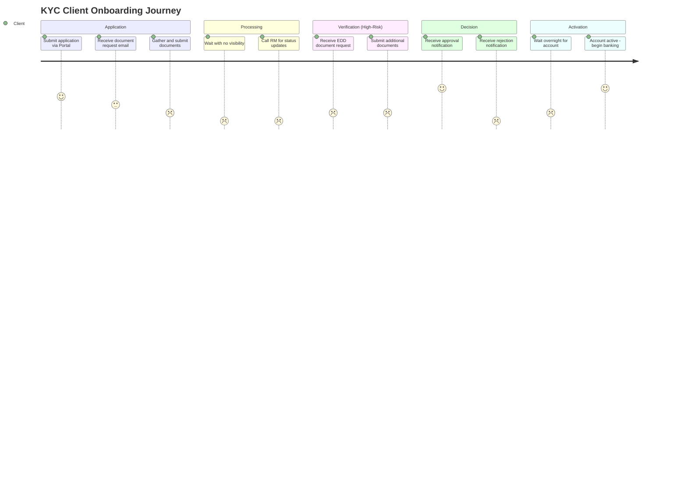

# Client Experience Journey: KYC (Know Your Customer)

**Document Type:** Client Experience AS-IS Analysis
**Process ID:** 005
**Business Unit:** Compliance / Operations
**Client Segment:** All segments (BizBanking, MidCap, LargeCap)
**Analyst:** ProcessMiner CX Journey Analyst
**Last Updated:** 2026-02-09
**Version:** 0.1

---

## Executive Summary

The KYC client onboarding journey requires customers to navigate 10 touchpoints across 4 channels over 7–10 business days (standard) or 10–13 days (high-risk). The Client Effort Score of **61.5** places this journey firmly in the "poor experience" category (>40 threshold), driven primarily by client active time (58% of total CES), document burden, and forced channel switches.

Seven friction points have been identified, with three rated High severity: no real-time application status visibility, prolonged EDD wait times with no progress updates, and forced multi-channel switching. Clients call their Relationship Manager 3–4 times daily to ask about application status — a friction point that is entirely avoidable with self-service tracking. The overnight batch activation delay means a client approved at 9am doesn't get an active account until the next business day.

Six enhancement ideas have been captured, with an estimated total CES reduction potential of 40–50%. The three highest-impact opportunities are: self-service status tracking on the Client Portal, proactive stage-transition notifications, and real-time account activation.

### Key Metrics at a Glance

| Metric | Value |
|--------|-------|
| Journey Touchpoints | 10 |
| Friction Points Identified | 7 |
| Enhancement Ideas Captured | 6 |
| Client Effort Score (CES) | 61.5 |
| Moments That Matter | 4 |
| Channels Used | 4 |
| Overall Confidence | MEDIUM (72%) |

### CES Baseline Summary

| Metric | Count | Weight | Weighted Score |
|--------|-------|--------|----------------|
| Client Actions | 8 | 1.0 | 8.0 |
| Documents Required | 4 | 1.5 | 6.0 |
| Information Requests | 3 | 1.0 | 3.0 |
| Follow-ups Required | 2 | 2.0 | 4.0 |
| Channel Switches | 3 | 1.5 | 4.5 |
| Active Time (minutes) | 72 | 0.5 | 36.0 |
| **TOTAL CES** | | | **61.5** |

---

## How to Read This Document

> This document captures the **client experience perspective (AS-IS)** of the KYC (Know Your Customer) process. It maps the journey through client eyes, measuring effort and identifying friction.
>
> **Companion Documents:**
> - [Client Touchpoints Detail](./client-touchpoints-detail.md) - Full touchpoint analysis with CES contribution
> - [Friction Points Detail](./friction-points-detail.md) - Detailed friction analysis with enhancement ideas
> - [AS-IS Process Documentation](./as-is-process-documentation.md) - Operational process view
>
> **CES Interpretation:**
> - **Low CES (< 20)** - Excellent client experience, minimal effort
> - **Medium CES (20-40)** - Acceptable experience, improvement opportunities exist
> - **High CES (> 40)** - Poor experience, significant transformation required

---

## 1. Journey Overview

> **About this section:** What is this journey from the client's perspective? What outcome are they trying to achieve?

### 1.1 Journey Identification

| Attribute | Value |
|-----------|-------|
| **Journey Name** | KYC Client Onboarding Journey |
| **Process ID** | 005 |
| **Client Goal** | To successfully complete the Know Your Customer (KYC) verification process and gain access to banking services. |
| **Journey Trigger** | New client application or periodic review of existing client. |
| **Success Outcome** | Client's identity is verified, regulatory requirements are met, and banking services are provisioned. |
| **Typical Duration** | 7–10 business days (standard path); 10–13 business days (high-risk with EDD) |

### 1.2 Client Persona

| Attribute | Value |
|-----------|-------|
| **Segment** | All business segments: BizBanking (small business), MidCap (mid-market corporates), LargeCap (large corporates) |
| **Typical Profile** | Business owner or corporate representative applying for banking services. May be an individual (BizBanking) or a corporate officer acting on behalf of a legal entity (MidCap/LargeCap). Submits identity documents, corporate filings, and beneficial ownership declarations. |
| **Key Motivations** | Gain access to banking services; meet regulatory requirements efficiently; minimise time spent on administrative paperwork; receive clear communication on application status and next steps. |
| **Expected Experience** | A secure, efficient, and transparent process with minimal manual intervention. Clear upfront communication of required documents, predictable timelines, proactive status updates, and no need to chase the bank for progress. |

### 1.3 Journey Context

The KYC onboarding journey is a regulatory-mandated process that every prospective banking client must complete before accessing services. From the client's perspective, this is a compliance gate — necessary but not valuable in itself. The client's primary goal is access to banking services; KYC is an obstacle to that goal, not a benefit.

The market context is significant: digital-first competitors offer onboarding in hours, not weeks. Clients arriving from fintechs or digital banks expect real-time status visibility, minimal document handling, and proactive communication. The current 7–10 day timeline with no self-service tracking and 3–4 daily status calls to the Relationship Manager falls well below these expectations.

Three client segments (BizBanking, MidCap, LargeCap) share a common KYC journey but differ in document complexity. Corporate clients (MidCap/LargeCap) face a heavier document burden — Certificate of Incorporation, Board Resolution, beneficial ownership declarations — which extends the collection phase. High-risk clients face additional friction through the Enhanced Due Diligence path, adding 1–3 business days with limited visibility into progress.

> **Section Confidence:** [MEDIUM] (75%) | **Basis:** Journey identification complete; client persona seeded from AS-IS stakeholder data; journey context derived from process analysis and DILO observation
> **Evidence Sources:** AS-IS documentation (ASIS-005-KYC-v1.0), DILO Observation (Relationship Manager)

---

## 2. Client Touchpoints

> **About this section:** Every interaction point where the client engages with the bank. For full details including CES contribution and emotional analysis, see [Client Touchpoints Detail](./client-touchpoints-detail.md).

### 2.1 Touchpoint Summary

The KYC client journey comprises 10 touchpoints across 4 channels (Client Portal, Email, Phone, In-Person). The journey begins digitally with application submission via the Client Portal, then shifts to email for document exchange, and degrades to phone for status enquiries — a pattern of forced channel switching that increases client effort. Four touchpoints are digital (portal/email), three are human-assisted (phone/in-person), and three are wait points where the client has no visibility or control. The most effort-intensive touchpoints are document submission (gathering 3–5 documents) and the status enquiry loop (3–4 calls daily due to lack of self-service tracking).

### 2.2 Touchpoint Summary Table

| JT# | Touchpoint Name | Stage | Channel | What Client SEES | What Client DOES | CES Contribution |
|-----|-----------------|-------|---------|------------------|------------------|------------------|
| JT-KYC-001 | Application Submission | Application | CH-KYC-001 (Portal) | Application form on Client Portal | Fills in application details, submits | 3.0 |
| JT-KYC-002 | Document Request Received | Application | CH-KYC-002 (Email) | Email listing required documents | Reads requirements, plans document gathering | 1.0 |
| JT-KYC-003 | Document Submission | Application | CH-KYC-002 (Email) | Confirmation of receipt (if any) | Gathers 3–5 documents, scans, emails to RM | 12.0 |
| JT-KYC-004 | Processing Wait (Black Box) | Processing | None | Nothing — no visibility into status | Waits; no action possible | 4.0 |
| JT-KYC-005 | Status Enquiry Calls | Processing | CH-KYC-003 (Phone) | RM provides verbal update | Calls RM 3–4 times to check status | 10.5 |
| JT-KYC-006 | EDD Additional Document Request | Verification | CH-KYC-002 (Email) | Email requesting source of funds/wealth documentation | Gathers additional documents, responds | 9.0 |
| JT-KYC-007 | Approval Notification | Decision | CH-KYC-002 (Email) | Approval letter via email | Reads notification, expects account access | 1.0 |
| JT-KYC-008 | Rejection Notification | Decision | CH-KYC-002 (Email) | Rejection letter — no screening details disclosed | Reads rejection; no recourse information provided | 2.0 |
| JT-KYC-009 | Account Activation Confirmation | Activation | CH-KYC-002 (Email) | Confirmation that account is active (next business day) | Waits overnight for batch processing; then begins banking | 5.0 |
| JT-KYC-010 | Periodic Review Notification | Ongoing | CH-KYC-002 (Email) | Notification of upcoming KYC review | Prepares updated documents for review cycle | 2.0 |

### 2.3 Journey Flow Diagram

### 2.4 Touchpoint Statistics

| Metric | Value |
|--------|-------|
| Total Touchpoints | 10 |
| Digital Touchpoints | 4 (JT-KYC-001, JT-KYC-002, JT-KYC-003, JT-KYC-009) |
| Human-Assisted Touchpoints | 2 (JT-KYC-005, JT-KYC-006) |
| Self-Service Touchpoints | 1 (JT-KYC-001) |
| Wait Points | 3 (JT-KYC-004, JT-KYC-009, JT-KYC-010) |

> **Full Analysis:** [View Client Touchpoints Detail](./client-touchpoints-detail.md)
>
> **Section Confidence:** [MEDIUM] (78%) | **Basis:** Touchpoints derived from 10 AS-IS process steps and DILO observation; CES contributions are estimates pending client validation
> **Evidence Sources:** AS-IS documentation (PS-KYC-001 through PS-KYC-010), DILO Observation (RM)

---

## 3. Moments That Matter

> **About this section:** Critical touchpoints that disproportionately define client perception. These must be protected or enhanced in any transformation.

### 3.1 Identified Moments

**1. First Impression — Application Submission** (JT-KYC-001)

| Attribute | Value |
|-----------|-------|
| **Stage** | Application |
| **Why Critical** | The client's first interaction with the bank sets the tone for the entire relationship. A clunky, confusing, or slow portal experience creates immediate doubt about the bank's competence. |
| **Current Experience** | Client Portal allows digital submission — a positive start. However, no upfront document checklist means clients often submit incomplete applications, triggering follow-up cycles. |
| **Emotional Impact** | Neutral to mildly frustrated (depends on portal quality) |
| **Risk if Degraded** | Client abandonment before completing the application; negative word-of-mouth to peers in the same business segment. |

**2. The Black Box — Processing Wait** (JT-KYC-004)

| Attribute | Value |
|-----------|-------|
| **Stage** | Processing |
| **Why Critical** | After submitting documents, the client enters a period of zero visibility. They don't know where their application is, who is reviewing it, or when they'll hear back. This uncertainty drives the 3–4 daily status calls (JT-KYC-005). |
| **Current Experience** | No status tracking, no proactive updates. Client must call RM to get any information. The RM often doesn't have real-time info either (CRM pipeline dashboard is too slow — PP-KYC-008). |
| **Emotional Impact** | Frustrated to Angry |
| **Risk if Degraded** | This is already the worst point in the journey. Any further reduction in communication (e.g., RM unavailable) would likely cause application withdrawal or formal complaint. |

**3. The Verdict — Approval or Rejection Notification** (JT-KYC-007 / JT-KYC-008)

| Attribute | Value |
|-----------|-------|
| **Stage** | Decision |
| **Why Critical** | The client has invested days of effort (documents, calls, waiting). This is the moment they learn whether it was worth it. Approval creates relief and readiness; rejection creates frustration, especially since screening findings cannot be disclosed (BR-KYC-005). |
| **Current Experience** | Standard template letter via email. For approvals: adequate but not celebratory. For rejections: no explanation of reasons, no guidance on what (if anything) can be done. |
| **Emotional Impact** | Approval: Satisfied to Delighted. Rejection: Frustrated to Angry. |
| **Risk if Degraded** | Delayed notification (beyond 24h SLA) amplifies anxiety. For rejections, lack of any guidance creates reputational risk and potential regulatory complaints. |

**4. The Last Mile — Account Activation** (JT-KYC-009)

| Attribute | Value |
|-----------|-------|
| **Stage** | Activation |
| **Why Critical** | The client has been approved but cannot use their account until the overnight T24 batch processes. A client approved at 9am on Monday cannot bank until Tuesday. This "last mile" delay undermines the positive moment of approval. |
| **Current Experience** | Overnight wait due to T24 batch processing (PP-KYC-006). Client receives activation confirmation the next business day. |
| **Emotional Impact** | Frustrated (after positive approval, forced to wait again) |
| **Risk if Degraded** | If batch processing fails or is delayed beyond overnight, client may believe the approval was rescinded. No communication during this gap. |

### 3.2 Moments Summary

| Moment | Touchpoint | Current State | Enhancement Priority |
|--------|-----------|---------------|---------------------|
| First Impression | JT-KYC-001 | Neutral — portal works but no document checklist | Medium |
| The Black Box | JT-KYC-004 / JT-KYC-005 | Frustrated/Angry — zero visibility, client must chase | Critical |
| The Verdict | JT-KYC-007 / JT-KYC-008 | Satisfied (approval) / Angry (rejection) — template letters, no rejection guidance | High |
| The Last Mile | JT-KYC-009 | Frustrated — overnight batch delay after approval | High |

> **Section Confidence:** [MEDIUM] (75%) | **Basis:** Moments identified from touchpoint analysis and DILO observation; emotional states inferred from process data, not validated with clients
> **Evidence Sources:** Touchpoint analysis (Section 2), DILO Observation (RM), AS-IS pain points (PP-KYC-003, PP-KYC-006, PP-KYC-009)

---

## 4. Friction Point Analysis

> **About this section:** Summary of friction points. For full details including root cause analysis and enhancement ideas, see [Friction Points Detail](./friction-points-detail.md).

### 4.1 Friction Summary

Seven friction points have been identified across the KYC client journey, sourced from cross-referencing 10 AS-IS pain points against client touchpoints. Three are rated High severity, three Medium, and one Low. The friction concentrates in two areas: the Processing stage (lack of visibility and proactive communication) and the Application stage (document burden and channel switching). Three friction points directly map to AS-IS pain points (PP-KYC-009, PP-KYC-003, PP-KYC-006), confirming that internal operational issues translate directly into client experience degradation. The combined CES impact of all friction points is 34.0 — representing 55% of the total CES score, meaning more than half of client effort is attributable to avoidable friction.

### 4.2 Friction Point Summary Table

| FP# | Friction Point | Stage | Touchpoint | Severity | CES Impact | Client Emotion |
|-----|----------------|-------|------------|----------|------------|----------------|
| FP-KYC-001 | No real-time application status visibility | Processing | JT-KYC-004, JT-KYC-005 | High | 10.5 | Frustrated |
| FP-KYC-002 | Heavy document collection burden | Application | JT-KYC-003 | Medium | 6.0 | Frustrated |
| FP-KYC-003 | Prolonged EDD wait with no progress updates | Verification | JT-KYC-006 | High | 5.0 | Frustrated |
| FP-KYC-004 | Overnight batch activation delay | Activation | JT-KYC-009 | High | 5.0 | Frustrated |
| FP-KYC-005 | Rejection notification lacks explanation | Decision | JT-KYC-008 | Medium | 2.0 | Angry |
| FP-KYC-006 | Forced multi-channel switching (Portal → Email → Phone → Email) | Cross-journey | JT-KYC-001 through JT-KYC-005 | Medium | 4.5 | Frustrated |
| FP-KYC-007 | No proactive communication during processing | Processing | JT-KYC-004 | Low | 1.0 | Neutral |

### 4.3 Friction by Type

| Friction Type | Count | Combined CES Impact | Priority Items |
|---------------|-------|---------------------|----------------|
| Visibility / Communication | 3 | 16.5 | FP-KYC-001, FP-KYC-003, FP-KYC-007 |
| Process Delay | 1 | 5.0 | FP-KYC-004 |
| Document Burden | 1 | 6.0 | FP-KYC-002 |
| Channel Experience | 1 | 4.5 | FP-KYC-006 |
| Communication Quality | 1 | 2.0 | FP-KYC-005 |

### 4.4 Friction Statistics

| Metric | Value |
|--------|-------|
| Total Friction Points | 7 |
| High-Severity (P1) | 3 (FP-KYC-001, FP-KYC-003, FP-KYC-004) |
| Medium-Severity (P2) | 3 (FP-KYC-002, FP-KYC-005, FP-KYC-006) |
| Low-Severity (P3) | 1 (FP-KYC-007) |
| Quick Win Opportunities | 2 (FP-KYC-001, FP-KYC-007 — solvable with CRM notifications and portal enhancement) |

> **Full Analysis:** [View Friction Points Detail](./friction-points-detail.md)
>
> **Section Confidence:** [MEDIUM] (75%) | **Basis:** Friction points derived from AS-IS pain points mapped to client touchpoints; CES impact estimated, not measured; severity based on process analysis
> **Evidence Sources:** AS-IS pain points (PP-KYC-002, PP-KYC-003, PP-KYC-006, PP-KYC-009), DILO Observation (RM)

---

## 5. Client Effort Score (CES) Analysis

> **About this section:** Quantified measurement of client effort across the journey. This is the baseline for transformation target comparison.

### 5.1 CES Breakdown by Stage

| Journey Stage | Actions | Documents | Info Requests | Follow-ups | Channel Switches | Wait Time (min) | Stage CES |
|---------------|---------|-----------|---------------|------------|------------------|-----------------|-----------|
| Application | 3 | 4 | 0 | 1 | 1 | 25 | 22.0 |
| Processing | 1 | 0 | 3 | 1 | 1 | 15 | 14.5 |
| Verification (EDD) | 2 | 2 | 0 | 1 | 0 | 15 | 12.5 |
| Decision | 1 | 0 | 0 | 0 | 0 | 2 | 2.0 |
| Activation | 1 | 0 | 0 | 0 | 1 | 15 | 10.5 |
| **TOTAL** | **8** | **6** | **3** | **3** | **3** | **72** | **61.5** |

### 5.2 CES Breakdown by Touchpoint

| Touchpoint | CES Contribution | % of Total | Reduction Priority |
|------------|------------------|------------|-------------------|
| JT-KYC-003 Document Submission | 12.0 | 19.5% | High |
| JT-KYC-005 Status Enquiry Calls | 10.5 | 17.1% | Critical |
| JT-KYC-006 EDD Document Request | 9.0 | 14.6% | High |
| JT-KYC-009 Account Activation | 5.0 | 8.1% | High |
| JT-KYC-004 Processing Wait | 4.0 | 6.5% | Medium |
| JT-KYC-001 Application Submission | 3.0 | 4.9% | Low |
| JT-KYC-008 Rejection Notification | 2.0 | 3.3% | Medium |
| JT-KYC-010 Periodic Review | 2.0 | 3.3% | Low |
| JT-KYC-002 Document Request | 1.0 | 1.6% | Low |
| JT-KYC-007 Approval Notification | 1.0 | 1.6% | Low |

### 5.3 Benchmark Comparison

| Benchmark | Score | Our Gap |
|-----------|-------|---------|
| Industry Average (KYC onboarding) | 35–45 | +16.5 to +26.5 above average |
| Best-in-Class (digital-first banks) | 15–20 | +41.5 to +46.5 above best |
| Internal Target (30% reduction) | 43.1 | 18.4 points to close |

### 5.4 CES Baseline Statement

> **CES BASELINE FOR TO-BE COMPARISON**
>
> This AS-IS CES score (**61.5**) establishes the baseline for transformation.
> During TO-BE design, this score will be compared against the target state to measure
> improvement. Industry standard for transformation projects is **30-40% CES reduction**.
>
> A 30% reduction target would bring CES to **43.1** — at the upper end of industry average.
> A 40% reduction target would bring CES to **36.9** — at the lower end of industry average.
> Reaching best-in-class (15-20) would require a **67-76% reduction**, likely requiring
> fundamental process redesign including digital identity verification and real-time processing.
>
> After the Transformation Agent designs the TO-BE state, the Client Journey Analyst
> will recalculate CES in **Flow 2 (Target Validation)** to verify improvements.

> **Section Confidence:** [MEDIUM] (70%) | **Basis:** CES calculated from process data and DILO observation; weights per schema definition; benchmarks are industry estimates, not validated
> **Evidence Sources:** AS-IS process steps, DILO Observation, CES scoring configuration (schema)

---

## 6. Channel Analysis

> **About this section:** How clients interact across different channels throughout the journey.

### 6.1 Channel Usage

| CH# | Channel | Touchpoints Using | Primary Purpose | Client Preference |
|-----|---------|-------------------|-----------------|-------------------|
| CH-KYC-001 | Client Portal | JT-KYC-001 | Application submission | Preferred — digital self-service |
| CH-KYC-002 | Email | JT-KYC-002, JT-KYC-003, JT-KYC-006, JT-KYC-007, JT-KYC-008, JT-KYC-009, JT-KYC-010 | Document exchange, notifications | Acceptable — but overused for status |
| CH-KYC-003 | Phone | JT-KYC-005 | Status enquiries | Not preferred — forced by lack of alternatives |
| CH-KYC-004 | In-Person | (optional — some document submissions) | Document verification | Not preferred — convenience barrier |

### 6.2 Channel Switching Analysis

The client journey forces **3 channel switches** across 10 touchpoints:

1. **Portal → Email** (JT-KYC-001 → JT-KYC-002): The client starts on the Client Portal but immediately switches to Email for document requests. The portal does not support document upload or status tracking beyond initial submission.
2. **Email → Phone** (JT-KYC-003 → JT-KYC-005): After submitting documents via email, the client has no digital visibility into processing status. They are forced to phone their RM for updates — a regression from digital to human-assisted.
3. **Phone → Email** (JT-KYC-005 → JT-KYC-007): After the phone-based status enquiry phase, the client returns to email for the decision notification.

All three switches are **forced**, not voluntary. The client would prefer to stay in a single digital channel (portal) but the portal lacks document upload, status tracking, and notification capabilities. Each forced switch adds friction (CES weight 1.5 per switch) and breaks the client's sense of journey continuity.

### 6.3 Channel Gaps

**Gap 1: Client Portal is entry-only.** The portal accepts the initial application but offers nothing after that — no document upload, no status tracking, no notifications. The client is immediately pushed to email and phone. This is the single largest channel gap.

**Gap 2: No self-service status channel.** There is no channel where a client can check application status without human assistance. This forces phone calls (JT-KYC-005) and is the root cause of 3–4 daily RM interruptions per DILO observation.

**Gap 3: No real-time notification channel.** All notifications are email-based and triggered manually by the RM (PS-KYC-008). There are no automated SMS, push, or in-app notifications at stage transitions. Clients learn about progress only when the RM sends an email or when they call to ask.

> **Section Confidence:** [MEDIUM] (72%) | **Basis:** Channels identified from AS-IS system and touchpoint analysis; switching patterns confirmed by DILO; client preference inferred, not surveyed
> **Evidence Sources:** AS-IS systems (SYS-KYC-001, SYS-KYC-004, SYS-KYC-006), DILO Observation (RM)

---

## 7. Enhancement Ideas

> **About this section:** Captured enhancement ideas for TO-BE consideration. Prioritization will occur during transformation design.

### 7.1 Enhancement Catalog

| EI# | Target Friction | Enhancement Idea | Est. CES Reduction | Complexity | Priority |
|-----|-----------------|------------------|-------------------|------------|----------|
| EI-KYC-001 | FP-KYC-001 | Self-service application status tracker on Client Portal — real-time stage visibility | -10.5 | Medium | Critical |
| EI-KYC-002 | FP-KYC-007 | Proactive automated notifications (email/SMS) at each stage transition | -3.0 | Low | High |
| EI-KYC-003 | FP-KYC-002 | Digital document upload via Client Portal with type-specific checklist | -4.0 | Medium | High |
| EI-KYC-004 | FP-KYC-004 | Real-time account activation (replace overnight batch with API-based provisioning) | -5.0 | High | High |
| EI-KYC-005 | FP-KYC-006 | Unified portal experience — keep client in single channel from application to activation | -4.5 | High | Medium |
| EI-KYC-006 | FP-KYC-002 | Document checklist generator based on client type and segment (BizBanking vs Corporate) | -2.0 | Low | Medium |

### 7.2 Enhancement Statistics

| Metric | Value |
|--------|-------|
| Total Enhancement Ideas | 6 |
| Quick Wins (Low Effort) | 2 (EI-KYC-002, EI-KYC-006) |
| Strategic (High Effort) | 2 (EI-KYC-004, EI-KYC-005) |
| Automation Opportunities | 3 (EI-KYC-001, EI-KYC-002, EI-KYC-004) |
| Total Est. CES Reduction | -29.0 (47% reduction potential) |

> **Section Confidence:** [MEDIUM] (70%) | **Basis:** Enhancement ideas derived from friction point analysis; CES reduction estimates are directional, not validated; complexity assessed against current system architecture
> **Evidence Sources:** Friction analysis (Section 4), AS-IS systems (Section 5 of AS-IS), DILO Observation

---

## 8. Industry Research & Benchmarks

> **About this section:** How does this journey compare to industry standards and emerging trends?

### 8.1 Industry Benchmarks

| Metric | Industry Average | Best-in-Class | Our AS-IS | Gap |
|--------|-----------------|---------------|-----------|-----|
| KYC onboarding time | 5–7 business days | 1–2 business days (digital) | 7–10 business days | +2–5 days above average |
| Client touchpoints | 5–7 | 3–4 (fully digital) | 10 | +3–5 above average |
| Channel switches | 1–2 | 0 (single channel) | 3 | +1–2 above average |
| Self-service status | Available (70% of banks) | Real-time with push notifications | Not available | Full gap |
| Digital document submission | Standard (80% of banks) | AI-assisted with OCR validation | Email-based only | Partial gap |
| CES Score (estimated) | 35–45 | 15–20 | 61.5 | +16.5–26.5 above average |

### 8.2 Relevant Trends

| Trend | Relevance | Assessment | Enhancement Alignment |
|-------|-----------|------------|----------------------|
| Digital identity verification (eKYC) | High | Would eliminate document collection phase for individuals; regulatory frameworks exist | EI-KYC-003, EI-KYC-005 |
| Perpetual KYC (pKYC) | Medium | Continuous monitoring replaces periodic reviews; reduces ongoing client friction | JT-KYC-010 |
| AI-powered document processing | High | OCR + ML for automatic data extraction from submitted documents; reduces processing time | EI-KYC-003 |
| Open Banking data sharing | Medium | Client can authorize data sharing instead of document submission; reduces document burden | FP-KYC-002 |
| Real-time core banking APIs | High | Would enable instant account activation; eliminates batch processing delay | EI-KYC-004 |
| Client journey orchestration platforms | Medium | Unified client communication across channels with stage-aware messaging | EI-KYC-001, EI-KYC-002 |

### 8.3 Competitive Landscape

Digital-first challenger banks have set new expectations for KYC onboarding. Neo-banks typically complete identity verification in under 24 hours using eKYC (digital identity verification with biometric selfie matching), offer real-time application tracking via mobile app, and activate accounts immediately upon approval. Traditional banks that have invested in digital transformation achieve 3–5 day onboarding with portal-based document upload and automated status notifications.

Our current journey (7–10 days, email-based document exchange, no self-service tracking, overnight batch activation) positions us at the lower end of the traditional banking segment. The gap to industry average is manageable with CRM and portal enhancements (EI-KYC-001 through EI-KYC-003). Closing the gap to best-in-class would require fundamental technology investment in eKYC, real-time core banking integration, and AI-assisted processing — a longer-term transformation objective.

> **Section Confidence:** [LOW] (60%) | **Basis:** Benchmarks based on general industry knowledge; specific competitor data not available; trends are directionally correct but not validated against local market
> **Evidence Sources:** Industry knowledge, process analysis

---

## 9. Inputs for TO-BE Design

> **About this section:** Consolidated inputs for the Transformation Agent.

### 9.1 CES Baseline Summary

The Transformation Agent should use these metrics as the baseline:

| Metric | AS-IS Value | Target (30% Reduction) |
|--------|-------------|------------------------|
| Overall CES Score | 61.5 | 43.1 |
| Client Actions | 8 | 6 |
| Documents Required | 4 | 3 |
| Channel Switches | 3 | 1 |
| Active Time (minutes) | 72 | 50 |
| Touchpoints | 10 | 7 |
| Journey Duration | 7–10 days | 5–7 days |

### 9.2 Critical Success Factors

For a successful TO-BE from a CX perspective:

- **Self-service visibility is non-negotiable:** Clients must be able to check application status without calling anyone. This is the #1 friction driver (FP-KYC-001) and the highest CES-reduction opportunity (EI-KYC-001).
- **Proactive communication at every stage transition:** Clients should never have to ask "What's happening?" Automated notifications at screening complete, approval decision, and activation must be implemented (EI-KYC-002).
- **Single-channel aspiration:** The target state should minimise channel switches. Ideally, a client completes the entire journey within the Client Portal (EI-KYC-005).
- **Document burden reduction:** Digital upload with smart checklists and pre-validation reduces the most effort-intensive touchpoint (JT-KYC-003).
- **Same-day activation:** Overnight batch processing is unacceptable in the target state. Real-time or near-real-time activation must be a design goal (EI-KYC-004).

### 9.3 Experience Degradation Risks

**DO NOT** make these changes in TO-BE (would worsen CX):

- **Do not remove human RM contact entirely:** While reducing unnecessary calls is good, some clients (especially LargeCap) value personal relationship. Provide self-service AND human option.
- **Do not add more document requirements:** Any new compliance requirements must be offset by digital verification alternatives (eKYC, Open Banking).
- **Do not introduce new channel switches:** If adding a mobile app, ensure it replaces (not adds to) existing channels.
- **Do not extend processing SLAs:** Even if internal processes change, client-facing timelines must improve, not worsen.
- **Do not remove rejection notification within 24h SLA:** Even though screening findings cannot be disclosed, timely communication of the decision is critical.

### 9.4 Enhancement Ideas Available

The Transformation Agent has **6** enhancement ideas to consider (see Section 7). Key themes:
- **Self-service and visibility** (EI-KYC-001, EI-KYC-002): Highest CES reduction potential (-13.5 combined)
- **Digital document handling** (EI-KYC-003, EI-KYC-006): Reduces the most effort-intensive touchpoint (-6.0 combined)
- **Architecture modernisation** (EI-KYC-004, EI-KYC-005): Enables step-change improvement but requires significant IT investment (-9.5 combined)

---

## 10. Discovery Logging Summary

> **About this section:** New items discovered during CX analysis that should be added to the AS-IS process documentation.

### 10.1 New Items Logged

| Type | Count | Files Updated |
|------|-------|---------------|
| Pain Points | 0 | — (all client-facing pain points already captured in AS-IS: PP-KYC-003, PP-KYC-006, PP-KYC-009) |
| Exceptions | 0 | — (exception documentation still pending — PGAP-KYC-006) |
| Controls | 0 | — |
| Friction Points (new to CX) | 7 | cx-journey-documentation.md |
| Enhancement Ideas (new to CX) | 6 | cx-journey-documentation.md |
| Channels (new to CX) | 4 | cx-journey-documentation.md |

### 10.2 Cross-References

- [pain-points-detail.md](./pain-points-detail.md) - Full pain point documentation (3 client-facing PPs referenced: PP-KYC-003, PP-KYC-006, PP-KYC-009)
- [exceptions-detail.md](./exceptions-detail.md) - Full exception documentation (pending — 0 exceptions documented)
- [control-points-detail.md](./control-points-detail.md) - Full control documentation
- [as-is-process-documentation.md](./as-is-process-documentation.md) - Master AS-IS document (upstream source for this analysis)

---

## Document Metadata

**SME Contributors:** Markus (CEO)
**Analysis Date(s):** 2026-02-09
**Documentation Method:** Derived from AS-IS process documentation and DILO observation; no direct client interviews conducted

### Overall Document Confidence

| Section | Confidence | Key Gaps |
|---------|------------|----------|
| 1. Journey Overview | MEDIUM (75%) | Client persona not validated with clients |
| 2. Client Touchpoints | MEDIUM (78%) | CES contributions are estimates |
| 3. Moments That Matter | MEDIUM (75%) | Emotional states inferred, not surveyed |
| 4. Friction Points | MEDIUM (75%) | Severity based on process analysis, not client feedback |
| 5. CES Analysis | MEDIUM (70%) | Benchmarks are industry estimates |
| 6. Channel Analysis | MEDIUM (72%) | Client preference inferred, not surveyed |
| 7. Enhancement Ideas | MEDIUM (70%) | CES reduction estimates are directional |
| 8. Industry Research | LOW (60%) | Specific competitor data not available |
| 9. TO-BE Inputs | MEDIUM (72%) | Targets are standard percentages |
| 10. Discovery Logging | HIGH (90%) | Complete for current analysis scope |

**Overall Confidence:** MEDIUM (72%)

### Companion Documents

| Document | Purpose | Link |
|----------|---------|------|
| Client Touchpoints Detail | Full touchpoint analysis | [client-touchpoints-detail.md](./client-touchpoints-detail.md) |
| Friction Points Detail | Full friction analysis | [friction-points-detail.md](./friction-points-detail.md) |
| AS-IS Process Documentation | Operational view | [as-is-process-documentation.md](./as-is-process-documentation.md) |

---

## Change Log

| Date | Contributor | Role | Changes |
|------|-------------|------|---------|
| 2026-02-09 | Markus | CEO | Initial CX journey analysis — all 10 sections generated from AS-IS data |

---

## Glossary

| Term | Definition |
|------|-----------|
| CES | Client Effort Score — quantified measure of effort required from the client across the journey |
| CX | Client/Customer Experience |
| EDD | Enhanced Due Diligence — additional verification for high-risk customers |
| eKYC | Electronic KYC — digital identity verification using biometrics and digital documents |
| FP | Friction Point — a point of difficulty or frustration for the client |
| JT | Journey Touchpoint — an interaction point where the client engages |
| KYC | Know Your Customer — identity verification and risk assessment process |
| pKYC | Perpetual KYC — continuous monitoring replacing periodic reviews |
| RM | Relationship Manager |

---

_Generated by ProcessMiner Client Journey Analyst_
_Document ID: CX-005-KYC-v0.1_
