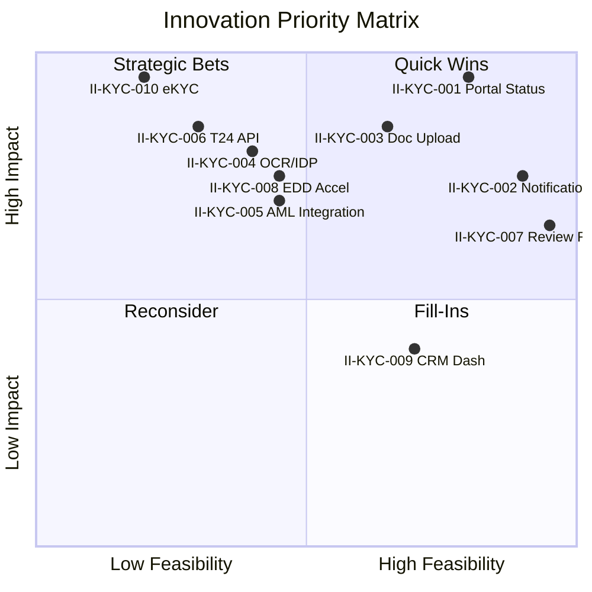
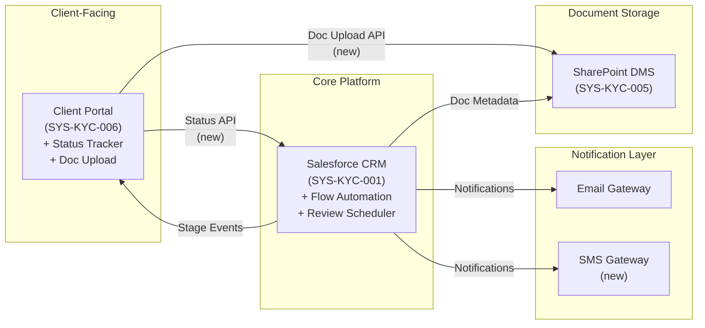

# KYC - Innovation Analysis

**Document Type:** Innovation Analysis
**Process ID:** 005
**Analysis ID:** INNO-005-KYC
**Version:** 0.1
**Last Updated:** 2026-02-10
**Author:** Markus (CEO)
**Status:** Draft
**Reviewed By:** — | **Review Date:** —
**Approved By:** — | **Approval Date:** —

---

## 1. Executive Summary

This innovation analysis identifies 10 technology and process improvement opportunities for the KYC (Know Your Customer) process, derived from 10 documented pain points, 7 CX friction points, and 6 enhancement ideas captured in the upstream AS-IS and CX Journey documentation.

The analysis is structured around five innovation objectives: reducing manual effort in data entry and document handling, improving system integration reliability, reducing client effort (CES baseline: 61.5 — "poor experience"), strengthening compliance through automation, and compressing the 7–10 business day end-to-end cycle time where only 6% represents active work.

Seven market trends were assessed, with three having immediate applicability: AI-powered document processing (mature, high impact on RM data entry), digital identity verification/eKYC (growth phase, transformative for individual client onboarding), and real-time core banking APIs (mature, eliminates overnight account activation delay). Competitive benchmarking places the bank in Tier 3 (traditional), with a manageable gap to Tier 2 (digitally transformed) through targeted technology investments.

Ten innovation ideas (II-KYC-001 through II-KYC-010) were scored across six feasibility dimensions, yielding the following MoSCoW prioritisation:

- **MUST HAVE (4):** Client Portal self-service status tracking (II-KYC-001), automated workflow notifications (II-KYC-002), automated periodic review reminders (II-KYC-007), and digital document upload with smart checklists (II-KYC-003). These four leverage the existing Salesforce and Client Portal stack, require no new core systems, and collectively deliver an estimated CES reduction of 28–32%.
- **SHOULD HAVE (4):** AI-powered document processing/OCR (II-KYC-004), resilient AML screening integration (II-KYC-005), EDD process acceleration (II-KYC-008), and CRM dashboard optimisation (II-KYC-009). These require vendor engagement or integration architecture changes.
- **COULD HAVE (1):** Real-time T24 account activation (II-KYC-006) — high client impact but technical feasibility dependent on IT Architect assessment of T24 API capability.
- **DEFER (1):** eKYC digital identity verification (II-KYC-010) — highest transformation potential but requires regulatory assessment, new technology infrastructure, and dedicated programme funding.

A four-phase implementation roadmap is recommended: Phase 1 (weeks 1–6) deploys Salesforce-native quick wins (notifications, review reminders); Phase 2 (weeks 4–12) delivers Client Portal enhancement (status tracking, document upload); Phase 3 (months 4–9) introduces OCR/IDP, async AML screening, and EDD acceleration; Phase 4 (months 9–18) evaluates eKYC feasibility. Seven innovation risks are documented with phased mitigation actions.

Target outcomes: CES reduction to 43.1 (30%) after Phase 2 and 36.9 (40%) after Phase 3, end-to-end cycle time reduction to 3–5 business days, and elimination of RM status enquiry calls and manual periodic review tracking.

### Key Metrics at a Glance

| Metric | Value |
|--------|-------|
| Innovation Ideas | 10 |
| Market Trends Assessed | 7 |
| Innovation Risks | 7 |
| MUST HAVE Innovations | 4 |
| CES Reduction Target (Phase 2) | 30% (61.5 → 43.1) |
| CES Reduction Target (Phase 3) | 40% (61.5 → 36.9) |
| Cycle Time Target | 3–5 business days (from 7–10) |
| Quick Win Delivery | 6 weeks |
| Overall Document Confidence | MEDIUM (67%) |

> **Section Confidence:** [MEDIUM] (72%) | **Basis:** Composed from 10 reviewed sections; all data points traceable to upstream documentation
> **Evidence Sources:** Full innovation analysis document (Sections 2–11)

---

## 2. Innovation Overview

### 2.1 Analysis Scope

This innovation analysis covers the end-to-end KYC (Know Your Customer) process as documented in ASIS-005-KYC-v1.0, spanning all 10 process steps from customer application intake (PS-KYC-001) through periodic review scheduling (PS-KYC-010). The analysis boundary encompasses all three participating teams (Relationship Management, Compliance, Operations) and all six supporting systems (SYS-KYC-001 through SYS-KYC-006).

**In Scope:**

- Automation opportunities across all 10 process steps and 4 handoff points
- Technology solutions addressing 10 documented pain points (PP-KYC-001 through PP-KYC-010)
- System integration improvements for the 5 integration points (INT-KYC-001 through INT-KYC-005)
- Client experience innovation informed by 7 CX friction points (FP-KYC-001 through FP-KYC-007) and 6 enhancement ideas (EI-KYC-001 through EI-KYC-006)
- Compliance technology to strengthen 5 control points (CP-KYC-001 through CP-KYC-005)
- Market trends and competitive benchmarking for KYC/AML technology

**Out of Scope:**

- Upstream processes (credit assessment, product origination)
- Downstream processes (account servicing, transaction monitoring beyond periodic review scheduling)
- Organisational restructuring or headcount changes
- Regulatory policy changes (analysis assumes current AML/CTF regulatory framework)

**Upstream Dependencies:**

This analysis draws from two validated upstream documents:
1. **AS-IS Process Documentation** (ASIS-005-KYC-v1.0) — 66% overall confidence, providing process steps, pain points, systems, and control points
2. **CX Journey Documentation** (v0.1) — 72% overall confidence, providing touchpoints, friction points, CES baseline (61.5), and enhancement ideas

### 2.2 Innovation Objectives

The following objectives drive this innovation analysis, derived from the documented pain points, CX friction, and process performance data:

**Objective 1: Reduce Manual Effort in Data Entry and Document Handling**
The largest single time consumer is CRM data entry (PS-KYC-003: 40–50 min per client, ~2–2.5 hours daily per RM). Combined with manual document collection via email (PS-KYC-002) and manual re-entry between systems (PP-KYC-001), this represents the primary automation target. Innovation goal: identify technologies that can eliminate or substantially reduce manual data entry and document handling.

**Objective 2: Improve System Integration Reliability**
World-Check ONE screening timeouts (PP-KYC-002), SharePoint sync delays (PP-KYC-005), and T24 overnight batch processing (PP-KYC-006) create friction for both staff and clients. Innovation goal: identify integration patterns and technologies that deliver real-time, reliable system-to-system communication.

**Objective 3: Reduce Client Effort and Improve Experience**
The CES baseline of 61.5 places the KYC journey in the "poor experience" category, driven by no status visibility (FP-KYC-001), heavy document burden (FP-KYC-002), and forced channel switching (FP-KYC-006). Innovation goal: identify client-facing technologies that reduce CES by at least 30% (target: 43.1 or below).

**Objective 4: Strengthen Compliance Through Automation**
Five control points rely on manual enforcement, including the four-eyes principle (CP-KYC-001) and periodic review scheduling (PP-KYC-004 — no automated reminders). Innovation goal: identify compliance technology that automates control enforcement, audit trails, and regulatory monitoring without weakening the control framework.

**Objective 5: Reduce End-to-End Cycle Time**
The current 7–10 business day cycle (standard path) has only ~6% active work time — 94% is wait time. Innovation goal: identify technologies that compress the cycle by reducing wait times at document collection, processing queues, and batch activation.

### 2.3 Strategic Alignment

The innovation objectives align with three strategic imperatives:

**Client Experience Competitiveness:** Digital-first challenger banks complete KYC onboarding in under 24 hours with real-time status tracking and instant account activation. The current 7–10 day cycle with no self-service tracking positions the bank at the lower end of the traditional banking segment. Innovation in client-facing technology (Objectives 3, 5) is necessary to defend market position and meet rising client expectations, particularly in the BizBanking segment where fintech competition is most acute.

**Operational Efficiency:** Relationship Managers spend ~2–2.5 hours daily on manual CRM data entry alone (PS-KYC-003), with additional time lost to informal status coordination (PP-KYC-007) and workaround tracking in Excel (PP-KYC-008). Automation of manual steps (Objective 1) and integration improvements (Objective 2) directly increase RM capacity without additional headcount — a critical consideration given that FTE allocation data has not been captured (PGAP-KYC-008).

**Regulatory Resilience:** The regulatory landscape for AML/KYC is tightening, with increasing scrutiny on control effectiveness and audit trails. Four of five control points currently rely on manual enforcement. Automating compliance controls (Objective 4) reduces human error risk, strengthens audit defensibility, and positions the bank to absorb future regulatory changes (e.g., expanded beneficial ownership requirements, shorter screening SLAs) with minimal additional manual effort.

> **Section Confidence:** [MEDIUM] (68%) | **Basis:** Strategic alignment inferred from process data, competitive benchmarks, and regulatory context; not validated against formal corporate strategy documents
> **Evidence Sources:** AS-IS documentation, CX Journey benchmarks (Section 8), pain point analysis

---

## 3. Market Trends

### 3.1 Trend Summary

| TR ID | Trend Name | Category | Maturity | Relevance | Impact Potential | Source |
|-------|-----------|----------|----------|-----------|------------------|--------|
| TR-KYC-001 | Digital Identity Verification (eKYC) | Technology | Growth | High | High — could eliminate document collection phase for individuals | Industry research, CX Journey §8 |
| TR-KYC-002 | AI-Powered Document Processing (OCR/IDP) | Technology | Mature | High | High — automates data extraction from submitted documents | Industry research |
| TR-KYC-003 | Perpetual KYC (pKYC) | Process | Emerging | Medium | Medium — continuous monitoring replaces periodic reviews | Industry research, CX Journey §8 |
| TR-KYC-004 | Open Banking Data Sharing | Regulatory/Technology | Growth | Medium | Medium — client-authorised data sharing reduces document burden | Industry research, CX Journey §8 |
| TR-KYC-005 | Real-Time Core Banking APIs | Technology | Mature | High | High — enables instant account activation, eliminates batch delay | Industry research, CX Journey §8 |
| TR-KYC-006 | Client Journey Orchestration | Technology | Growth | Medium | Medium — unified cross-channel communication with stage-aware messaging | Industry research, CX Journey §8 |
| TR-KYC-007 | RegTech & Compliance Automation | Technology | Growth | High | High — automated screening, risk scoring, and audit trail generation | Industry research |

### 3.2 Trend Analysis

The KYC technology landscape is undergoing rapid transformation driven by regulatory pressure, client expectations, and maturing AI capabilities. Three trends have immediate applicability to the documented pain points:

**eKYC and Digital Identity (TR-KYC-001)** represents the most transformative opportunity. Biometric identity verification with liveness detection can replace the entire document collection phase (PS-KYC-002) for individual customers, reducing the highest-friction touchpoint (JT-KYC-003, CES contribution 12.0). Regulatory frameworks for eKYC exist in most jurisdictions, though adoption for corporate clients remains limited — beneficial ownership verification still requires documentary evidence. This trend directly addresses Objective 1 (manual effort reduction) and Objective 5 (cycle time).

**AI-Powered Document Processing (TR-KYC-002)** is the most immediately deployable trend. OCR combined with intelligent document processing (IDP) can extract customer data from submitted documents and pre-populate CRM fields, directly addressing PP-KYC-001 (manual data re-entry) and reducing PS-KYC-003 processing time from 40–50 minutes to an estimated 10–15 minutes per client. The technology is mature, with established vendors offering banking-specific solutions.

**Real-Time Core Banking APIs (TR-KYC-005)** directly addresses the overnight batch activation delay (PP-KYC-006, FP-KYC-004). T24 (Temenos) supports real-time API-based account provisioning, but this requires migration from the current batch integration (INT-KYC-004). The technical feasibility depends on the T24 version and existing integration architecture — this requires IT Architect validation.

### 3.3 Competitive Landscape

The competitive landscape for KYC onboarding breaks into three tiers:

**Tier 1 — Digital-First / Neo-Banks:** Complete KYC in under 24 hours using eKYC (biometric selfie matching), real-time application tracking via mobile app, and instant account activation. These banks have no legacy integration constraints and build KYC as a digital-native process. Relevant to our context: they set client expectations, particularly for BizBanking clients who may also bank with fintechs.

**Tier 2 — Digitally Transformed Traditional Banks:** Achieve 3–5 day onboarding with portal-based document upload, automated status notifications, OCR-assisted data entry, and same-day account activation via API. They retain human oversight for high-risk cases but automate the standard path. This is the realistic near-term target for our innovation roadmap.

**Tier 3 — Traditional Banks (Our Current Position):** 7–10 day onboarding with email-based document exchange, no self-service tracking, manual data entry, and overnight batch activation. Our CES of 61.5 is at the upper end of this tier. The gap to Tier 2 is manageable with targeted technology investments (II-KYC-001 through II-KYC-005); the gap to Tier 1 requires fundamental technology transformation (II-KYC-010).

### 3.4 Technology Radar

| Technology | Maturity | Applicability | Existing Initiative |
|------------|----------|---------------|---------------------|
| Salesforce Flow / Process Builder | Mature | High — workflow automation, notifications, reminders | Salesforce CRM already deployed (SYS-KYC-001) |
| OCR / Intelligent Document Processing | Mature | High — document data extraction, CRM pre-population | None identified |
| eKYC (biometric identity verification) | Growth | High for individuals, Low for corporates | None identified |
| T24 API Gateway (Temenos) | Mature | High — real-time account activation | T24 deployed (SYS-KYC-003); API capability unknown |
| World-Check ONE API (Refinitiv) | Mature | High — async screening with webhook callbacks | World-Check ONE deployed (SYS-KYC-002); current integration has timeout issues |
| Client Portal Enhancement (custom) | Mature | High — status tracking, document upload | Client Portal exists (SYS-KYC-006); currently entry-only |
| Journey Orchestration Platform | Growth | Medium — cross-channel communication | None identified |
| Open Banking APIs | Growth | Medium — data sharing for document reduction | None identified |
| Perpetual KYC platforms | Emerging | Low (near-term) — continuous monitoring | None identified |
| AI Risk Scoring | Growth | Medium — automated risk assessment augmentation | None identified |

> **Section Confidence:** [MEDIUM] (65%) | **Basis:** Trends derived from CX Journey industry research and general industry knowledge; technology radar based on known system stack; no vendor assessments conducted
> **Evidence Sources:** CX Journey documentation (Section 8), AS-IS systems inventory, industry knowledge

---

## 4. Innovation Backlog

### 4.1 Innovation Ideas Summary

| II ID | Innovation Idea | Category | Source | Status | Strategic Fit |
|-------|----------------|----------|--------|--------|---------------|
| II-KYC-001 | Client Portal Self-Service Status Tracking | Client Experience | PP-KYC-009, FP-KYC-001, EI-KYC-001 | Concept | Obj 3, Obj 5 |
| II-KYC-002 | Automated Workflow Notifications | Process Automation | PP-KYC-007, FP-KYC-007, EI-KYC-002 | Concept | Obj 1, Obj 3 |
| II-KYC-003 | Digital Document Upload Portal with Smart Checklists | Client Experience | FP-KYC-002, EI-KYC-003, EI-KYC-006 | Concept | Obj 1, Obj 3, Obj 5 |
| II-KYC-004 | AI-Powered Document Processing (OCR/IDP) | Technology | PP-KYC-001, TR-KYC-002 | Concept | Obj 1, Obj 5 |
| II-KYC-005 | Resilient AML Screening Integration | Technology | PP-KYC-002, TR-KYC-007 | Concept | Obj 2, Obj 4 |
| II-KYC-006 | Real-Time Account Activation via T24 API | Technology | PP-KYC-006, FP-KYC-004, EI-KYC-004 | Concept | Obj 2, Obj 3, Obj 5 |
| II-KYC-007 | Automated Periodic Review Reminders | Compliance Automation | PP-KYC-004 | Concept | Obj 4 |
| II-KYC-008 | EDD Process Acceleration | Process Innovation | PP-KYC-003, FP-KYC-003 | Concept | Obj 3, Obj 5 |
| II-KYC-009 | CRM Pipeline Dashboard Optimisation | Technology | PP-KYC-008 | Concept | Obj 1 |
| II-KYC-010 | eKYC — Digital Identity Verification | Technology | TR-KYC-001, FP-KYC-002 | Concept | Obj 1, Obj 3, Obj 5 |

### 4.2 Innovation Details

#### II-KYC-001: Client Portal Self-Service Status Tracking

**Problem:** Clients have zero visibility into application status after submission. This drives 3–4 daily phone calls to the RM (JT-KYC-005), contributing 10.5 to CES — the single highest-effort touchpoint after document submission. The CX Journey identified this as the critical "black box" moment that matter (FP-KYC-001).

**Proposed Solution:** Extend the existing Client Portal (SYS-KYC-006) with a real-time application status dashboard. Display current processing stage, next expected action, estimated completion timeline, and any pending client actions. Pull status data from Salesforce CRM (SYS-KYC-001) via existing integration (INT-KYC-001).

**Expected Impact:** Estimated CES reduction of -10.5 (eliminates status enquiry calls entirely). Frees RM time (~20 min/day per RM currently spent fielding status calls). Aligns with industry standard — 70% of banks offer self-service status tracking.

**Technology:** Client Portal enhancement (web development), Salesforce API for status data, webhook or polling for real-time updates.

#### II-KYC-002: Automated Workflow Notifications

**Problem:** No automated notification to RM when AML screening completes (PS-KYC-004) or when approval decision is made (PS-KYC-007). RMs rely on informal check-ins and manually polling the CRM, wasting ~20 min/day (PP-KYC-007). Clients receive no proactive updates during processing (FP-KYC-007).

**Proposed Solution:** Implement Salesforce Flow-based notifications triggered at each process stage transition. Two notification streams: (1) internal notifications to RM/CO when handoff actions are needed, and (2) client-facing notifications (email/SMS) at key milestones (application received, screening complete, decision made, account activated).

**Expected Impact:** Eliminates informal coordination overhead. Estimated CES reduction of -3.0 from proactive client updates. Quick win — Salesforce Flow is already available in the existing CRM deployment.

**Technology:** Salesforce Flow / Process Builder (native capability of SYS-KYC-001), email/SMS gateway integration.

#### II-KYC-003: Digital Document Upload Portal with Smart Checklists

**Problem:** Document collection happens via email (PS-KYC-002), requiring clients to gather 3–5 documents, scan them, and send to the RM. No upfront checklist means incomplete submissions are common (CXE-KYC-001), extending the collection phase. CES contribution: 12.0 — the highest single touchpoint.

**Proposed Solution:** Add secure document upload capability to the Client Portal with dynamic checklists tailored to client type (BizBanking: 3 documents, MidCap/LargeCap: 5 documents including corporate filings). Include file type validation, upload progress tracking, and automatic acknowledgement. Documents stored directly in SharePoint (SYS-KYC-005) via integration.

**Expected Impact:** Estimated CES reduction of -4.0 to -6.0. Eliminates email-based document exchange. Reduces incomplete submissions. Addresses forced channel switching (FP-KYC-006).

**Technology:** Client Portal enhancement, SharePoint API integration, file validation logic.

#### II-KYC-004: AI-Powered Document Processing (OCR/IDP)

**Problem:** RMs manually enter customer data from submitted documents into Salesforce CRM (PS-KYC-003), taking 40–50 minutes per client. Data is re-entered across systems (PP-KYC-001). This is the single largest daily time sink for RMs (~2–2.5 hours/day).

**Proposed Solution:** Deploy an Intelligent Document Processing (IDP) solution that uses OCR to extract data from submitted identity documents, proof of address, and corporate filings. Extracted data is automatically mapped to Salesforce CRM fields for RM review and confirmation (human-in-the-loop). Integration via Salesforce API.

**Expected Impact:** Estimated 60–80% reduction in manual data entry time (PS-KYC-003 from 40–50 min to 10–15 min per client). Reduces data entry errors. Supports Objective 1 and Objective 5.

**Technology:** OCR/IDP platform (e.g., ABBYY, Kofax, Microsoft AI Document Intelligence), Salesforce integration API.

#### II-KYC-005: Resilient AML Screening Integration

**Problem:** World-Check ONE integration intermittently times out during AML screening (PP-KYC-002, INT-KYC-002), blocking the compliance workflow and delaying same-day screening (SLA-KYC-004). Compliance Officers must manually retry.

**Proposed Solution:** Replace the synchronous screening call with an asynchronous, queue-based pattern. Submit screening requests to a message queue, receive results via webhook callback. Implement automatic retry with exponential backoff, circuit breaker pattern for sustained outages, and fallback notification to CO when manual intervention is needed.

**Expected Impact:** Eliminates screening delays from integration timeouts. Ensures SLA-KYC-004 compliance even during World-Check ONE performance degradation. Improves CO productivity.

**Technology:** Message queue (e.g., Azure Service Bus, AWS SQS), World-Check ONE API webhook capability, integration middleware.

#### II-KYC-006: Real-Time Account Activation via T24 API

**Problem:** Account activation in T24 Core Banking (PS-KYC-009) relies on overnight batch processing (PP-KYC-006, INT-KYC-004). A client approved at 9am cannot bank until the next business day. This "last mile" delay undermines the approval moment (FP-KYC-004, CES contribution 5.0).

**Proposed Solution:** Replace the batch integration (INT-KYC-004) with a real-time T24 API call for account provisioning. On approval, Salesforce triggers an API call to T24 to create the customer account immediately. Confirmation flows back to Salesforce and triggers client notification.

**Expected Impact:** Eliminates overnight activation delay. Estimated CES reduction of -5.0. Enables same-day banking after approval — a significant competitive differentiator. Supports Objectives 2, 3, and 5.

**Technology:** T24 Transact API (Temenos), Salesforce outbound integration, real-time event processing. Requires IT Architect validation of T24 API availability and version compatibility.

#### II-KYC-007: Automated Periodic Review Reminders

**Problem:** No automated reminder system for periodic KYC reviews (PP-KYC-004). Review frequencies are risk-based (Low: 36 months, Medium: 12 months, High: 6 months) but compliance relies on manual tracking. Missed reviews create regulatory risk.

**Proposed Solution:** Configure Salesforce CRM scheduled reminders that automatically generate review tasks based on the next review date field. Send escalating notifications: 30 days before due date to RM, 14 days to Compliance Officer, 7 days to Compliance Manager. Auto-create review case on the due date.

**Expected Impact:** Eliminates compliance risk from missed periodic reviews. Quick win — uses native Salesforce capabilities with no external integration needed. Supports Objective 4.

**Technology:** Salesforce Flow, scheduled triggers, task/case automation (native SYS-KYC-001 capability).

#### II-KYC-008: EDD Process Acceleration

**Problem:** Enhanced Due Diligence takes 1–3 business days (PS-KYC-006), extending the high-risk client journey to 10–13 days. The process is sequential: request additional documents, wait for client response, verify source of funds/wealth, obtain dual sign-off. Limited visibility for the client during this phase (FP-KYC-003).

**Proposed Solution:** Three-pronged acceleration: (1) Pre-populated EDD checklist with known data from initial application to reduce redundant requests, (2) parallel document collection — request all EDD documents upfront rather than sequentially, (3) digital EDD progress tracking on Client Portal so clients can see what's pending. Dual sign-off facilitated via Salesforce mobile approval for faster turnaround.

**Expected Impact:** Estimated 30–50% reduction in EDD processing time (from 1–3 days to 0.5–1.5 days). Reduced client friction during verification phase. Supports Objectives 3 and 5.

**Technology:** Salesforce dynamic forms, Client Portal enhancement, mobile approval workflow.

#### II-KYC-009: CRM Pipeline Dashboard Optimisation

**Problem:** The Salesforce CRM pipeline dashboard is too slow to be useful (PP-KYC-008), driving RMs to maintain a parallel Excel shadow tracker. This creates data quality risks and wastes time maintaining two systems.

**Proposed Solution:** Optimise the Salesforce dashboard with filtered views (by RM, by status, by segment), indexed queries, and a dedicated KYC pipeline Lightning component. Alternatively, deploy a pre-built Salesforce reporting package optimised for high-volume pipeline tracking. Goal: dashboard load time under 3 seconds.

**Expected Impact:** Eliminates need for Excel shadow tracker. Improves data quality (single source of truth). Saves RM time maintaining dual systems. Supports Objective 1.

**Technology:** Salesforce Lightning component optimisation, query indexing, report caching (native SYS-KYC-001 capability).

#### II-KYC-010: eKYC — Digital Identity Verification

**Problem:** The current identity verification process requires physical document collection (passport/ID, proof of address), scanning, emailing, and manual data entry. This creates the heaviest client friction (JT-KYC-003, CES 12.0) and the longest wait time (up to 5 business days for document collection). Digital-first competitors verify identity in minutes.

**Proposed Solution:** Implement eKYC for individual clients (BizBanking segment initially): biometric selfie matching against government-issued ID, automated document authenticity checks, and digital address verification. Integration with a certified eKYC provider. Corporate clients (MidCap/LargeCap) would continue with document-based verification due to beneficial ownership complexity.

**Expected Impact:** Potential to reduce individual client onboarding from days to hours. Eliminates document collection phase for BizBanking. Estimated CES reduction of -10.0 or more for applicable segment. Long-term strategic investment — highest transformation potential but also highest complexity. Supports Objectives 1, 3, and 5.

**Technology:** eKYC platform (e.g., Onfido, Jumio, iProov), government ID verification APIs, biometric matching. Requires regulatory assessment for local jurisdiction compliance.

### 4.3 Innovation Categories

| Category | Count | Innovation IDs |
|----------|-------|----------------|
| **Client Experience** | 2 | II-KYC-001, II-KYC-003 |
| **Process Automation** | 1 | II-KYC-002 |
| **Technology** | 4 | II-KYC-004, II-KYC-005, II-KYC-006, II-KYC-010 |
| **Compliance Automation** | 1 | II-KYC-007 |
| **Process Innovation** | 2 | II-KYC-008, II-KYC-009 |

> **Section Confidence:** [MEDIUM] (72%) | **Basis:** Innovation ideas derived systematically from 10 AS-IS pain points, 7 CX friction points, and 6 CX enhancement ideas; technology recommendations based on known system stack and industry patterns; no vendor assessments or cost estimates
> **Evidence Sources:** AS-IS pain points (PP-KYC-001 through PP-KYC-010), CX friction points (FP-KYC-001 through FP-KYC-007), CX enhancement ideas (EI-KYC-001 through EI-KYC-006), systems inventory

---

## 5. Feasibility Matrix

### 5.1 Six-Dimension Scoring

| II ID | Technical | Business | Strategic | Resource | Risk | Customer | Total Score |
|-------|-----------|----------|-----------|----------|------|----------|-------------|
| II-KYC-001 | 4 | 5 | 5 | 4 | 4 | 5 | 27 |
| II-KYC-002 | 5 | 4 | 4 | 5 | 5 | 4 | 27 |
| II-KYC-003 | 4 | 4 | 4 | 3 | 4 | 5 | 24 |
| II-KYC-004 | 3 | 4 | 4 | 2 | 3 | 4 | 20 |
| II-KYC-005 | 3 | 4 | 5 | 3 | 3 | 3 | 21 |
| II-KYC-006 | 2 | 4 | 4 | 2 | 2 | 5 | 19 |
| II-KYC-007 | 5 | 4 | 5 | 5 | 5 | 3 | 27 |
| II-KYC-008 | 3 | 4 | 4 | 3 | 3 | 4 | 21 |
| II-KYC-009 | 4 | 3 | 3 | 4 | 5 | 2 | 21 |
| II-KYC-010 | 2 | 5 | 5 | 1 | 2 | 5 | 20 |

### 5.2 Dimension Definitions

| Dimension | Weight | Scale | Definition |
|-----------|--------|-------|------------|
| **Technical Feasibility** | 1.0 | 1–5 | How achievable is this with current technology stack and skills? 5 = uses existing platform capabilities; 1 = requires new technology stack and specialist skills |
| **Business Value** | 1.5 | 1–5 | How significant is the operational or financial benefit? 5 = eliminates major pain point with measurable savings; 1 = marginal improvement |
| **Strategic Alignment** | 1.2 | 1–5 | How well does this align with strategic objectives? 5 = directly addresses competitive gap and strategic imperative; 1 = nice-to-have with no strategic urgency |
| **Resource Availability** | 1.0 | 1–5 | Can this be delivered with available resources and budget? 5 = internal team, minimal budget; 1 = requires external specialists, significant investment |
| **Risk Level** | 1.0 | 1–5 (inverted) | How much implementation and operational risk? 5 = very low risk, proven pattern; 1 = high risk, unproven approach, regulatory uncertainty |
| **Customer Impact** | 1.3 | 1–5 | How much does this improve the client experience? 5 = transformative CES reduction; 1 = no direct client impact |

### 5.3 Feasibility Analysis

The scoring reveals three distinct tiers:

**Tier 1 — Quick Wins (Score 24–27):** II-KYC-001 (Portal Status Tracking, 27), II-KYC-002 (Workflow Notifications, 27), II-KYC-007 (Review Reminders, 27), and II-KYC-003 (Document Upload Portal, 24) score highest. These share a common characteristic: they leverage existing Salesforce and Client Portal capabilities with moderate development effort and low risk. Together, they address the three most impactful pain points (status visibility, notification gaps, document handling) and deliver an estimated CES reduction of -17.5 to -19.5.

**Tier 2 — Strategic Investments (Score 19–21):** II-KYC-004 (OCR/IDP, 20), II-KYC-005 (AML Integration, 21), II-KYC-006 (Real-Time Activation, 19), II-KYC-008 (EDD Acceleration, 21), and II-KYC-009 (CRM Optimisation, 21) require more significant technology investment, external vendor engagement, or integration work. They deliver substantial value but need careful sequencing and IT Architect involvement.

**Tier 3 — Transformative Bet (Score 20):** II-KYC-010 (eKYC, 20) has the highest business value and customer impact (both scored 5) but the lowest technical feasibility and resource availability (both scored 1–2). This is a longer-term investment that requires regulatory assessment, vendor selection, and potentially new technology infrastructure. It should be pursued as a strategic initiative alongside the quick wins.

### 5.4 Priority Matrix

> **Section Confidence:** [MEDIUM] (68%) | **Basis:** Scoring based on known system architecture, pain point severity, and technology maturity assessment; no vendor quotes, resource plans, or formal business cases developed
> **Evidence Sources:** Innovation backlog (Section 4), systems inventory, technology radar (Section 3.4)

---

## 6. Innovation Deep Dives

### 6.1 Top Priority Innovations

Based on feasibility scoring, the four MUST HAVE innovations warrant deep-dive analysis:

**1. II-KYC-001: Client Portal Self-Service Status Tracking (Score: 27)**

This is the single highest-impact innovation. It addresses the #1 friction point (FP-KYC-001), the #1 CX moment that matters ("The Black Box"), and the highest CES contributor after document submission. The Client Portal (SYS-KYC-006) already exists as an application intake channel — extending it with status tracking is a natural evolution.

Key design considerations:
- **Data source:** Salesforce CRM stage field, updated at each process step transition
- **Update frequency:** Real-time or near-real-time (webhook from Salesforce on record update)
- **Status granularity:** Show 5 macro-stages (Application Received → Under Review → Verification → Decision → Account Active) rather than all 10 internal steps — clients don't need to see internal handoffs
- **Pending actions:** If the client needs to do something (submit additional documents, respond to EDD request), show it prominently
- **Estimated timeline:** Display expected completion date based on current stage and historical averages

**2. II-KYC-002: Automated Workflow Notifications (Score: 27)**

The quickest quick win — Salesforce Flow is a native capability requiring no external integration. Two notification streams:

- **Internal (RM/CO):** Triggered on: screening complete → notify RM; approval needed → notify CM; approval decision → notify RM; account activated → notify RM. Delivered via Salesforce Chatter, email, or mobile push.
- **Client-facing:** Triggered on: application logged (confirmation), documents received (acknowledgement), screening complete (no details — compliance), decision made (approval/rejection letter triggered), account activated. Delivered via email with optional SMS.

Key design consideration: Client-facing notifications must NOT disclose compliance-sensitive information (screening results, risk ratings). Template review by Compliance required.

**3. II-KYC-007: Automated Periodic Review Reminders (Score: 27)**

Pure compliance automation with zero risk. Uses native Salesforce scheduled flows:

- Calculate next review date from risk rating (Low: +36 months, Medium: +12 months, High: +6 months)
- Notification cascade: T-30 days → RM, T-14 days → CO, T-7 days → CM, T-0 → auto-create review case
- Dashboard widget showing upcoming reviews by RM portfolio
- Monthly compliance report: reviews completed on time, overdue, upcoming

**4. II-KYC-003: Digital Document Upload Portal with Smart Checklists (Score: 24)**

Eliminates the email-based document exchange that drives the highest CES touchpoint (JT-KYC-003, CES 12.0):

- Dynamic checklist based on client type: BizBanking (passport/ID, proof of address), MidCap/LargeCap (adds Certificate of Incorporation, Board Resolution, beneficial ownership declaration)
- Supported file types: PDF, JPG, PNG with size validation
- Upload progress indicator and automatic acknowledgement email
- Direct storage to SharePoint (SYS-KYC-005) via existing Salesforce-SharePoint integration (INT-KYC-003)
- Status visible on the portal status tracker (II-KYC-001): "3 of 4 documents received"

### 6.2 Technical Architecture

The four MUST HAVE innovations share a common architectural pattern centred on Salesforce CRM (SYS-KYC-001) as the orchestration hub:

**Key architectural decisions:**
- No new core systems required — extend existing Salesforce and Client Portal
- SMS gateway is the only new external integration needed
- Status API from Salesforce to Portal can use Salesforce Platform Events or REST API
- Document upload bypasses Salesforce (goes directly to SharePoint) to avoid CRM storage limits; metadata synced to Salesforce

### 6.3 Implementation Approach

**Phased rollout recommended:**

**Phase 1 (Weeks 1–6): Foundation — Notifications + Review Reminders**
- II-KYC-002: Configure Salesforce Flow notifications (internal + client-facing email)
- II-KYC-007: Configure Salesforce scheduled flows for periodic review reminders
- No external dependencies. Deliverable by internal Salesforce admin/developer.
- Quick wins demonstrating value before heavier investments.

**Phase 2 (Weeks 4–12): Portal Enhancement — Status Tracking + Document Upload**
- II-KYC-001: Build status tracking API and portal UI
- II-KYC-003: Build document upload with smart checklists
- Overlaps with Phase 1 (portal work can start while notifications are being configured)
- Requires web development and Salesforce API work
- UAT with a pilot group of clients (BizBanking segment recommended — highest volume, simplest document requirements)

**Phase 3 (Months 4–9): Technology Investments**
- II-KYC-004: OCR/IDP vendor selection and integration
- II-KYC-005: AML screening async integration redesign
- II-KYC-006: T24 real-time API activation (pending IT Architect validation)
- II-KYC-008: EDD process optimisation
- Requires vendor engagement, IT Architect involvement, and formal business case

**Phase 4 (Months 9–18): Strategic Transformation**
- II-KYC-010: eKYC platform evaluation, regulatory assessment, pilot
- II-KYC-009: CRM dashboard optimisation (can be done anytime, lower priority)
- Long-term investment requiring board-level approval for budget and regulatory engagement

> **Section Confidence:** [MEDIUM] (65%) | **Basis:** Architecture based on known system stack; phasing is logical but not validated against resource availability, budget, or IT roadmap
> **Evidence Sources:** Systems inventory, integration matrix, technology radar

---

## 7. MoSCoW Prioritization

### 7.1 MUST HAVE

| II ID | Innovation | Total Score | Rationale |
|-------|-----------|-------------|-----------|
| II-KYC-001 | Client Portal Self-Service Status Tracking | 27 | Addresses the #1 friction point, highest CES reduction potential (-10.5), competitive table stakes |
| II-KYC-002 | Automated Workflow Notifications | 27 | Quick win using native Salesforce, eliminates coordination waste, enables proactive client communication |
| II-KYC-007 | Automated Periodic Review Reminders | 27 | Zero-risk compliance automation, eliminates regulatory exposure from missed reviews |
| II-KYC-003 | Digital Document Upload Portal with Smart Checklists | 24 | Eliminates highest-effort touchpoint (CES 12.0), reduces incomplete submissions, addresses channel switching |

These four innovations are non-negotiable for achieving the minimum 30% CES reduction target. They collectively deliver an estimated CES reduction of -17.5 to -19.5 (28–32% of baseline 61.5) and address 6 of 10 pain points. All four leverage the existing technology stack (Salesforce + Client Portal) with no new core system acquisitions.

### 7.2 SHOULD HAVE

| II ID | Innovation | Total Score | Rationale |
|-------|-----------|-------------|-----------|
| II-KYC-004 | AI-Powered Document Processing (OCR/IDP) | 20 | Transforms the largest manual time sink (2–2.5 hours/day RM data entry), but requires vendor selection and integration |
| II-KYC-005 | Resilient AML Screening Integration | 21 | Eliminates screening delays and ensures SLA compliance, but requires integration architecture changes |
| II-KYC-008 | EDD Process Acceleration | 21 | Reduces high-risk client cycle time by 30–50%, but requires process redesign and compliance approval |
| II-KYC-009 | CRM Pipeline Dashboard Optimisation | 21 | Eliminates Excel shadow tracker, but internal efficiency gain with limited client impact |

These deliver significant value but require more investment, vendor engagement, or process changes. They should be pursued in Phase 3 after MUST HAVE items demonstrate value.

### 7.3 COULD HAVE

| II ID | Innovation | Total Score | Rationale |
|-------|-----------|-------------|-----------|
| II-KYC-006 | Real-Time Account Activation via T24 API | 19 | High customer impact but lowest technical feasibility (T24 API capability unconfirmed); dependent on IT Architect assessment |

Real-time activation is highly desirable (eliminates overnight delay, CES -5.0) but classified as COULD HAVE because technical feasibility is uncertain. If the IT Architect confirms T24 API availability, this should be reclassified to SHOULD HAVE.

### 7.4 DEFER

| II ID | Innovation | Total Score | Rationale |
|-------|-----------|-------------|-----------|
| II-KYC-010 | eKYC — Digital Identity Verification | 20 | Highest transformation potential but lowest resource availability and highest regulatory risk; strategic initiative requiring dedicated programme, budget approval, and regulatory engagement |

eKYC is the most transformative innovation in the backlog — it could reduce individual client onboarding from days to hours. However, it requires new technology infrastructure, eKYC vendor procurement, regulatory assessment for local jurisdiction compliance, and potentially new processes for corporate clients who cannot use biometric verification. This should be pursued as a separate strategic programme with executive sponsorship, not as part of the immediate improvement roadmap.

> **Section Confidence:** [MEDIUM] (70%) | **Basis:** Prioritisation based on feasibility scoring and implementation complexity assessment; no formal business case, budget, or resource validation
> **Evidence Sources:** Feasibility matrix (Section 5), implementation approach (Section 6.3)

---

## 8. Strategic Recommendations

### 8.1 Low Complexity / High Value

**Recommendation 1: Deploy Salesforce-native automation immediately (Phase 1)**

II-KYC-002 (Automated Notifications) and II-KYC-007 (Periodic Review Reminders) require no external procurement, no new technology, and minimal development effort. They can be delivered by an experienced Salesforce administrator in 4–6 weeks. Combined, they eliminate ~20 min/day of informal RM coordination, address a compliance risk (missed periodic reviews), and enable proactive client communication.

**Action:** Assign a Salesforce admin/developer. Target go-live within 6 weeks.

**Recommendation 2: Prioritise Client Portal enhancement as the cornerstone investment (Phase 2)**

II-KYC-001 (Status Tracking) and II-KYC-003 (Document Upload) together address the two highest-CES touchpoints (JT-KYC-005 at 10.5 and JT-KYC-003 at 12.0). They transform the Client Portal from an entry-only channel into a full self-service experience. The combined CES reduction of -14.5 to -16.5 alone achieves 24–27% of the 30% reduction target.

**Action:** Initiate portal enhancement project. Pilot with BizBanking segment. Target go-live within 12 weeks.

### 8.2 Strategic Bets

**Recommendation 3: Invest in AI-powered document processing (Phase 3)**

II-KYC-004 (OCR/IDP) has the highest operational efficiency impact — reducing RM data entry from 40–50 minutes to 10–15 minutes per client. At 2–3 clients per day per RM, this saves ~1–1.5 hours/day per RM. However, it requires vendor selection, integration development, and accuracy validation with real KYC documents. Recommend a 3-month vendor evaluation (ABBYY, Kofax, Microsoft AI Document Intelligence) followed by a controlled pilot with 50 client applications.

**Action:** Issue RFI to 3 OCR/IDP vendors. Budget for 3-month pilot. Target Phase 3 start at month 4.

**Recommendation 4: Validate T24 real-time API capability before committing**

II-KYC-006 (Real-Time Activation) is classified as COULD HAVE solely because T24 API capability is unconfirmed. The IT Architect should assess: (1) T24 version and API availability, (2) real-time provisioning vs. batch-only constraints, (3) integration effort estimate. If feasible, this should be promoted to SHOULD HAVE and included in Phase 3.

**Action:** Request IT Architect assessment of T24 API capability. Decision within 4 weeks.

### 8.3 Future Consideration

**Recommendation 5: Begin eKYC regulatory assessment as a parallel workstream**

II-KYC-010 (eKYC) is deferred from the immediate roadmap but should not be forgotten. The regulatory landscape for digital identity verification is evolving rapidly, and early assessment positions the bank to move quickly when conditions are favourable. Recommend engaging the Compliance team and legal counsel to assess: (1) local regulatory framework for eKYC, (2) acceptable biometric verification methods, (3) requirements for corporate vs. individual clients.

**Action:** Initiate regulatory assessment. No technology investment yet. Report findings within 3 months.

**Recommendation 6: Monitor perpetual KYC (pKYC) developments**

TR-KYC-003 (Perpetual KYC) is not yet mature enough for implementation but could fundamentally change the periodic review model (PS-KYC-010). Continuous monitoring instead of scheduled reviews would reduce ongoing client friction and compliance effort. Monitor industry adoption and regulatory guidance.

**Action:** No immediate action. Annual review of pKYC readiness.

> **Section Confidence:** [MEDIUM] (68%) | **Basis:** Recommendations logically derived from feasibility analysis and implementation phasing; no budget validation, resource confirmation, or executive sponsorship
> **Evidence Sources:** MoSCoW prioritisation (Section 7), implementation approach (Section 6.3)

---

## 9. Risk & Mitigation

### 9.1 Innovation Risks

| Risk ID | Risk Description | Likelihood | Impact | Mitigation Strategy |
|---------|-----------------|------------|--------|---------------------|
| IR-KYC-001 | Client Portal enhancement scope creep — feature requests expand beyond status tracking and document upload | High | Medium | Define MVP scope tightly (status + upload only). Phase additional features into later releases. Appoint product owner. |
| IR-KYC-002 | Salesforce API rate limits impacting real-time status updates to portal | Medium | Medium | Use Platform Events (push model) rather than polling. Monitor API consumption. Cache status data at portal layer. |
| IR-KYC-003 | OCR/IDP accuracy insufficient for KYC documents — poor extraction quality from scanned passports/corporate filings | Medium | High | Human-in-the-loop validation mandatory. Pilot with 50 real documents before full deployment. Set minimum accuracy threshold (95% field-level). |
| IR-KYC-004 | T24 real-time API not available in current version or requires costly upgrade | Medium | High | IT Architect assessment before committing budget. Fallback: optimise batch frequency (hourly instead of overnight). |
| IR-KYC-005 | Client-facing notifications inadvertently disclose compliance-sensitive information | Low | High | All client notification templates reviewed and approved by Compliance before deployment. Automated content checks where possible. |
| IR-KYC-006 | Change management resistance — RMs comfortable with current email-based workflow, reluctant to adopt portal-based process | Medium | Medium | Involve RMs in UAT. Demonstrate time savings. Phased rollout with champion RM group. |
| IR-KYC-007 | eKYC regulatory assessment reveals prohibition or restrictive conditions in local jurisdiction | Medium | High | Conduct regulatory assessment before any technology investment. If prohibited, defer indefinitely and focus on document-based automation. |

### 9.2 Risk Mitigation Plan

**Immediate Actions (Phase 1):**

- **IR-KYC-005:** Establish notification template review process with Compliance team before any client-facing messages go live. Create a template library with pre-approved content for each stage transition.
- **IR-KYC-006:** Include two RMs in the Phase 1 configuration as "champion users" who test and provide feedback on notifications before broader rollout.

**Pre-Phase 2 Actions:**

- **IR-KYC-001:** Define and document the Client Portal MVP scope. Create a feature backlog for future releases. Get stakeholder sign-off on MVP scope before development starts.
- **IR-KYC-002:** Conduct Salesforce API capacity assessment. Prototype the status update mechanism (Platform Events vs. REST polling) and load test with expected concurrent user volumes.

**Pre-Phase 3 Actions:**

- **IR-KYC-003:** Issue OCR/IDP pilot RFP with mandatory accuracy benchmarking against sample KYC documents (passport, proof of address, corporate filings). Require vendor to demonstrate 95%+ field-level accuracy.
- **IR-KYC-004:** Complete IT Architect T24 assessment. If real-time API is not available, define fallback plan (hourly batch or near-real-time queue).

**Ongoing:**

- **IR-KYC-007:** Monitor regulatory developments for eKYC. If regulatory assessment is positive, fast-track from DEFER to strategic programme.

> **Section Confidence:** [MEDIUM] (65%) | **Basis:** Risks identified from technology assessment and implementation experience; likelihood and impact are qualitative estimates; mitigation strategies are directional
> **Evidence Sources:** Innovation backlog (Section 4), technical architecture (Section 6.2), systems inventory

---

## 10. Success Metrics

### 10.1 KPI Framework

| KPI | Metric | Baseline (AS-IS) | Target (Phase 2) | Target (Phase 3) | Source |
|-----|--------|-------------------|-------------------|-------------------|--------|
| Client Effort Score (CES) | Composite CES score | 61.5 | 43.1 (-30%) | 36.9 (-40%) | CX Journey documentation |
| End-to-end cycle time | Average business days from application to account activation | 7–10 days | 5–7 days | 3–5 days | Salesforce CRM reporting |
| RM data entry time | Average minutes per client for CRM data entry (PS-KYC-003) | 40–50 min | 40–50 min (unchanged in Phase 2) | 10–15 min (with OCR/IDP) | DILO observation / time tracking |
| Status enquiry calls | Average daily calls per RM from clients asking about application status | 3–4 calls/day | 0 (with portal status tracker) | 0 | RM self-reporting / call logs |
| Periodic review compliance | % of periodic reviews completed on or before due date | Unknown | 95%+ | 99%+ | Salesforce reporting |
| AML screening SLA compliance | % of screenings completed same-day (SLA-KYC-004) | Unknown (timeouts reported) | 95%+ | 99%+ | World-Check ONE / Salesforce |
| Document collection time | Average business days from request to complete document set | Up to 5 days | 2–3 days (portal upload) | 1–2 days (OCR pre-validation) | Salesforce tracking |
| Account activation delay | Hours from approval to active account | Overnight (12–24 hours) | Overnight (unchanged if T24 API unavailable) | Same-day (with T24 API) | T24 / Salesforce |

### 10.2 Measurement Plan

| Phase | Measurement Activity | Frequency | Owner |
|-------|---------------------|-----------|-------|
| Phase 1 (Notifications + Reminders) | Count notification deliveries, measure RM feedback on coordination overhead reduction, track periodic review on-time rate | Weekly during first month, then monthly | Compliance / Salesforce Admin |
| Phase 2 (Portal Enhancement) | Measure portal adoption rate, status page views, document upload completion rate, CES re-assessment (CX Journey Analyst), status enquiry call reduction | Weekly during pilot, then monthly | Product Owner / CX Journey Analyst |
| Phase 3 (Technology Investments) | OCR accuracy metrics, data entry time measurements, AML screening SLA tracking, activation delay measurement | Per-transaction during pilot, then monthly | IT / Operations |
| Ongoing | Quarterly CES re-assessment, monthly KPI dashboard review, annual innovation roadmap refresh | Per schedule | Process Owner (Sue Smith) |

**Measurement Tools:**
- Salesforce Reports & Dashboards (primary — all KPIs except OCR accuracy)
- DILO Observation repeat (for RM data entry time validation — recommend re-observation 3 months after OCR deployment)
- CX Journey Analyst CES recalculation (after Phase 2 completion)

### 10.3 Target Outcomes

**After Phase 1 (6 weeks):**
- Automated notifications live for all KYC applications
- Periodic review reminder system active
- RM coordination overhead reduced (qualitative — "no more chasing screening results")
- 100% of upcoming periodic reviews tracked and alerted

**After Phase 2 (12 weeks):**
- Client Portal status tracking live (BizBanking pilot, then all segments)
- Digital document upload replacing email-based collection
- Status enquiry calls reduced to near-zero
- CES reduction of 15–20 points (to 41.5–46.5 range)
- Incomplete document submissions reduced by 50%+

**After Phase 3 (9 months):**
- OCR/IDP reducing data entry time by 60–80%
- AML screening SLA compliance at 95%+
- EDD processing time reduced by 30–50%
- Overall CES target: 36.9 or below (40% reduction)
- End-to-end cycle time: 3–5 business days (standard path)

**After Phase 4 (18 months):**
- eKYC regulatory assessment complete
- If favourable: eKYC pilot for BizBanking individual clients
- Target: individual client onboarding in under 24 hours

> **Section Confidence:** [MEDIUM] (63%) | **Basis:** KPIs derived from documented baselines and innovation expected impacts; targets are estimates, not formally committed; measurement plan requires resource allocation
> **Evidence Sources:** AS-IS cycle time analysis, CX Journey CES baseline, pain point severity assessments

---

## 11. Appendices

### 11.1 Research Sources

| Source | Type | Used In |
|--------|------|---------|
| AS-IS Process Documentation (ASIS-005-KYC-v1.0) | Internal | Sections 2, 4, 5, 6 |
| CX Journey Documentation (v0.1) | Internal | Sections 2, 3, 4, 6, 10 |
| DILO Observation — Relationship Manager | Internal | Sections 2, 4, 10 |
| DTP-KYC-001 (v2.3, 2025-11-15) | Internal | Section 4 (pain point context) |
| KYC Process Flowchart | Internal | Section 4 (pain point context) |
| CX Journey Industry Research (Section 8) | Internal / Industry | Section 3 |

> **Note:** No external vendor assessments, analyst reports, or market research subscriptions were used. Market trends and competitive landscape are based on general industry knowledge. Formal vendor evaluation recommended before Phase 3 technology procurement.

### 11.2 Market Data

| Data Point | Value | Source | Confidence |
|------------|-------|--------|------------|
| Industry average KYC onboarding time | 5–7 business days | CX Journey §8 | Medium |
| Best-in-class KYC onboarding time (digital-first) | 1–2 business days | CX Journey §8 | Medium |
| Industry average CES for KYC | 35–45 | CX Journey §8 | Low |
| Best-in-class CES for KYC | 15–20 | CX Journey §8 | Low |
| % of banks offering self-service status tracking | ~70% | Industry knowledge | Low |
| % of banks offering digital document submission | ~80% | Industry knowledge | Low |
| OCR field-level accuracy for identity documents | 95–99% | Industry knowledge | Medium |
| eKYC biometric verification accuracy | 99%+ (with liveness detection) | Industry knowledge | Medium |

### 11.3 Technical Specifications

**System Stack (Current):**

| System | Version | Vendor | Relevant API Capabilities |
|--------|---------|--------|---------------------------|
| Salesforce CRM (SYS-KYC-001) | — | Salesforce | REST API, Platform Events, Flow, Process Builder, Lightning Components |
| World-Check ONE (SYS-KYC-002) | — | Refinitiv (LSEG) | REST API, webhook callbacks (version-dependent) |
| T24 Core Banking (SYS-KYC-003) | — | Temenos | Transact API (version-dependent) |
| Outlook Email (SYS-KYC-004) | — | Microsoft | Graph API, SMTP |
| SharePoint DMS (SYS-KYC-005) | — | Microsoft | Graph API, REST API |
| Client Portal (SYS-KYC-006) | — | Custom | To be assessed |

> **Note:** System versions and specific API capabilities have not been confirmed with IT. Logged for IT Architect follow-up.

### 11.4 Change Log

| Version | Date | Author | Changes |
|---------|------|--------|---------|
| 0.1 | 2026-02-10 | Markus (CEO) | Initial document creation; all sections auto-filled from upstream AS-IS and CX Journey data |
| 0.2 | 2026-02-10 | Markus (CEO) | Executive Summary composed from full document review |

### 11.5 Glossary

| Term | Definition |
|------|-----------|
| AML | Anti-Money Laundering — regulations to prevent money laundering |
| CES | Client Effort Score — quantified measure of client effort across a journey |
| CO | Compliance Officer |
| CM | Compliance Manager |
| CTF | Counter-Terrorism Financing |
| EDD | Enhanced Due Diligence — additional verification for high-risk customers |
| eKYC | Electronic Know Your Customer — digital identity verification using biometrics |
| HoC | Head of Compliance |
| IDP | Intelligent Document Processing — AI-powered extraction from documents |
| KYC | Know Your Customer — identity verification and risk assessment process |
| MoSCoW | Must/Should/Could/Won't — prioritisation framework |
| OCR | Optical Character Recognition — technology to extract text from images/scans |
| pKYC | Perpetual KYC — continuous monitoring replacing periodic reviews |
| RPA | Robotic Process Automation — software bots automating repetitive tasks |
| RM | Relationship Manager |
| SLA | Service Level Agreement |

---

_Generated by ProcessMiner Innovation Analyst_
_Document ID: INNO-005-KYC-v0.1_
