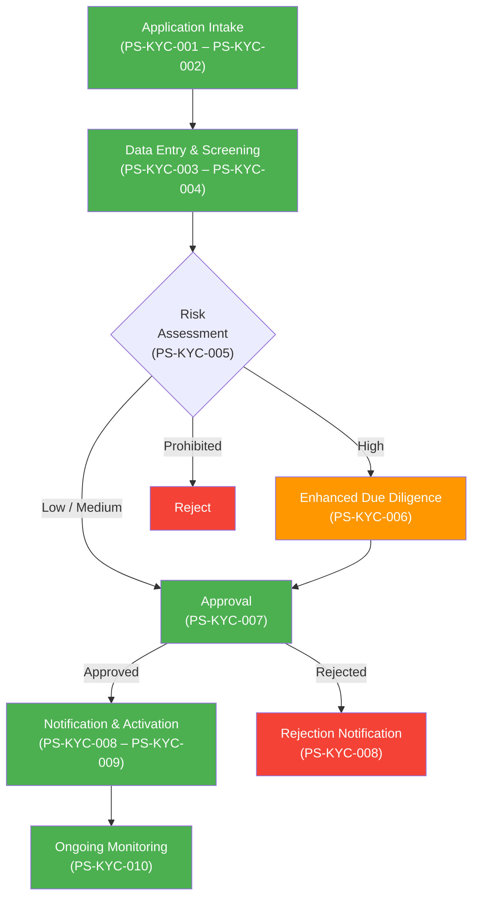

# Management Summary: KYC (Know Your Customer)

**Document Type:** Process Documentation Management Summary (Amazon 6-Pager Format)
**Process ID:** 005
**Business Unit:** Compliance / Operations
**Document Owner:** Markus (CEO)
**Date:** 2026-02-09
**Version:** 1.0

---

## 1. Introduction

### The Problem

The KYC onboarding process takes 50–65% longer than documented, costs the organization unmeasured hours of manual rework daily, and has zero documented exception paths — a compliance liability for a regulated process with five control points and mandatory AML obligations. Relationship Managers spend roughly 55 minutes every day on waste: shadow Excel trackers, informal Compliance coordination, and reworking incorrect client submissions. We do not know our actual SLA performance, our operating cost per customer, or our processing volume — which means we cannot manage what we cannot measure.

### Background

Know Your Customer (KYC) is a mandatory compliance procedure verifying customer identity and assessing risk for all business segments (BizBanking, MidCap, LargeCap). The process spans 10 steps across three teams — Relationship Management, Compliance, and Operations — supported by six systems with Salesforce CRM as the central hub. This documentation effort analyzed two source documents (KYC Process Flowchart and Desktop Procedure DTP-KYC-001 v2.3) and conducted a DILO observation of the Relationship Manager role, revealing five discrepancies between sources and three previously undocumented pain points.

### Purpose of This Document

This management summary analyzes the current state of the **KYC** process and recommends 3 strategic actions to close compliance gaps, eliminate operational waste, and establish performance baselines.

**Decision Required:** Approve the three strategic priorities and allocate resources for exception documentation, CRM notification automation, and performance measurement.

### Scope

| Attribute | Value |
|-----------|-------|
| **Process Category** | Compliance / Regulatory |
| **Geographic Scope** | All regions |
| **Organizational Scope** | Compliance, Relationship Management, Operations |
| **Analysis Period** | February 2026 (initial documentation) |

### Key Definitions

| Term | Definition |
|------|------------|
| EDD | Enhanced Due Diligence — additional verification for high-risk customers |
| Four-eyes principle | Dual approval requirement (Compliance Manager + Head of Compliance) for high-risk decisions |
| Shadow system | Unofficial tool (e.g., Excel tracker) used because the official system doesn't meet user needs |
| DILO | Day-In-The-Life-Of — structured observation of how a role actually performs work |

---

## 2. Goals

### What Success Looks Like

Every new customer is onboarded with full compliance documentation, a measured end-to-end cycle time, and zero reliance on shadow systems or informal coordination.

### Primary Objectives

| Objective | Baseline | Current | Target | Gap | Status |
|-----------|----------|---------|--------|-----|--------|
| Document all exception paths | 0 exceptions | 0 exceptions | 3–5 documented exceptions | 3–5 missing | ❌ Off track |
| Establish end-to-end cycle time metric | UNKNOWN ⚠️ | UNKNOWN ⚠️ | Measured and reported monthly | No baseline exists | ❌ Off track |
| Eliminate shadow Excel trackers | 1 shadow system per RM | Active daily use | 0 shadow systems | 100% gap | ⚠️ At risk |
| Achieve 90%+ documentation confidence | 66% overall | 66% overall | 90% overall | 24 percentage points | ⚠️ At risk |

### Success Metrics Summary

- **Primary Metric:** Overall documentation confidence (Current: 66% → Target: 90%)
- **Secondary Metric:** Exception coverage (Current: 0 documented → Target: 3–5 documented)
- **Lagging Indicator:** End-to-end onboarding cycle time (Baseline: UNKNOWN ⚠️ — must be established)

---

## 3. Tenets

### Guiding Principles

**1. Compliance Before Speed**
Regulatory obligations are non-negotiable. Every process shortcut that bypasses a control point is a compliance incident waiting to happen. The four-eyes principle on high-risk approvals, 7-year screening retention, and mandatory AML screening exist for regulatory reasons — not bureaucratic ones.
*Trade-off: We accept longer processing times over incomplete compliance controls.*

**2. Measure Before You Optimize**
We cannot improve what we do not measure. Before proposing automation or process redesign, we must establish baselines for cycle time, volume, cost, and SLA compliance. Optimization without data is guesswork.
*Trade-off: We invest time in measurement before rushing to solutions.*

**3. Official Systems Over Workarounds**
If staff need shadow systems to do their jobs, the official system has failed. Every Excel tracker and informal Teams message represents a process gap. Fix the system, don't normalize the workaround.
*Trade-off: We invest in CRM usability over tolerating shadow tools.*

### Hard Constraints

| Constraint | Why It's Non-Negotiable | Impact If Violated |
|------------|-------------------------|-------------------|
| AML screening on all beneficial owners >25% shareholding | Regulatory requirement (AML/CTF) | Regulatory sanctions, licence risk |
| 7-year retention of screening results | AML retention regulation | Audit findings, inability to demonstrate compliance |
| Four-eyes principle on high-risk approvals | Segregation of duties requirement | Invalid approvals, regulatory exposure |
| Written justification for all rejections | Regulatory fairness and audit trail | Regulatory findings, legal challenge risk |

---

## 4. State of the Business

### Executive Summary

The KYC process is structurally sound — 10 steps are documented, 5 control points are mapped, and the regulatory framework is in place. But operationally, it is flying blind. We have no performance baselines, no exception documentation, and no cost data. Relationship Managers spend 10% of their day on waste activities. Five discrepancies between the process flowchart and the desktop procedure reveal that documentation governance has lapsed — the flowchart does not reflect 2025 system migrations (T24, World-Check ONE) or policy changes (Prohibited risk category, updated review frequencies).

### Scorecard

| Metric | Value | Target | Status | Trend |
|--------|-------|--------|--------|-------|
| Process Steps Documented | 10 | 10 | ✅ Complete | Stable |
| Exceptions Documented | 0 | 3–5 | ❌ Critical gap | No progress |
| Pain Points Identified | 10 | N/A | ✅ Captured | Growing (DILO added 3) |
| Documentation Confidence | 66% | 90% | ⚠️ Below target | Improving |
| Source Document Discrepancies | 5 (1 resolved) | 0 | ⚠️ Open | 1 resolved |
| Shadow Systems in Use | 2 (Excel, Teams) | 0 | ❌ Active | Stable |

### What's Working

**Regulatory controls are in place and functioning.** The four-eyes principle for high-risk approvals (CP-KYC-001) is actively enforced. CRM audit trails (CP-KYC-002) log all status changes. Screening results are archived for 7 years (CP-KYC-004). Mandatory field validation (CP-KYC-003) prevents incomplete records from advancing. Monthly reconciliation (CP-KYC-005) catches pending applications. These five controls provide a solid compliance foundation.

**The Desktop Procedure is current and comprehensive.** DTP-KYC-001 v2.3 (updated November 2025) accurately reflects current systems, risk categories, and SLAs. It is the most reliable source of truth for the process.

**DILO observation revealed real operational insight.** Three new pain points were discovered (PP-KYC-007, PP-KYC-008, PP-KYC-009) that were invisible in documentation review alone, including the Excel shadow tracker and informal Compliance coordination.

### What's NOT Working

**Zero exceptions documented.** A 10-step process with multiple handoffs, external dependencies (World-Check ONE), and customer-supplied inputs will have exceptions. We have documented none. This is not because exceptions don't exist — it's because no one has asked. This is a compliance and operational risk: when an exception occurs, staff have no documented handling procedure.

**No performance baselines exist.** We do not know: how long end-to-end onboarding takes, what our processing volume is, what it costs per customer, or whether we are meeting SLAs. Six SLAs are defined in the DTP but none have actual performance data. We cannot answer the question "Are we meeting our targets?" because we have never measured.

**Relationship Managers are working around the system, not with it.** The CRM pipeline dashboard is too slow, so RMs maintain personal Excel trackers (~30 min/day). There is no automated notification when screening or approval completes, so RMs ping Compliance informally via Teams or walk to their desk (~20 min/day). Clients call 3–4 times daily to ask about application status because there is no self-service tracking.

**The process flowchart is outdated.** Five discrepancies with the DTP: wrong system names (CBS vs T24, World-Check vs World-Check ONE), wrong review frequencies, wrong EDD target, and missing "Prohibited" risk category. Staff who rely on the flowchart are working from incorrect information.

### Top 5 Critical Items

| Rank | Issue | Impact | Evidence | Owner |
|------|-------|--------|----------|-------|
| 1 | Zero exceptions documented | Compliance risk — no handling procedures for edge cases | PGAP-KYC-006; Section 3 at 0% confidence | Sue Smith (Process Owner) |
| 2 | No performance baselines (volume, cost, SLA actuals) | Cannot manage process; cannot build transformation business case | PGAP-KYC-007, 008, 009; 3 data gaps | Sue Smith (Process Owner) |
| 3 | Shadow Excel trackers replacing CRM | Data duplication, no backup, lost on RM absence; ~30 min/day waste per RM | DILO WA-RM-001; PP-KYC-008 | IT / CRM Team |
| 4 | World-Check ONE integration timeouts | AML screening delays, manual retries, compliance SLA risk | PP-KYC-002; intermittent | IT Department |
| 5 | Outdated process flowchart (5 discrepancies) | Staff working from incorrect information; new hires trained on wrong process | PGAP-KYC-001 through 005 | Sue Smith (Process Owner) |

---

## 5. Lessons Learned

### What We Got Right

**Starting with document import before SME interviews was efficient.** Importing the process flowchart and DTP-KYC-001 before conducting interviews provided a strong baseline. The two sources corroborated each other on 80% of the process, allowing SME time to focus on gaps and validation rather than starting from scratch. This approach captured 10 process steps, 5 control points, and 7 pain points before a single interview.

**The DILO observation revealed what documents cannot.** Three pain points (PP-KYC-007, 008, 009) and two shadow systems were invisible in documentation review. The Excel tracker workaround (WA-RM-001) and informal Compliance coordination (WA-RM-002) only became visible by observing actual work. The DILO showed that actual processing time per application is 50–65% higher than documented — a finding that would never emerge from document analysis alone.

**Cross-referencing two source documents exposed documentation drift.** Five discrepancies between the flowchart and DTP revealed that the flowchart has not been updated since 2025 system migrations and policy changes. This systematic comparison built a gap register (PGAP-KYC-001 through 005) that now serves as a remediation backlog.

### What We Got Wrong

**We have been operating without exception documentation.** A regulated 10-step process with AML obligations, external system dependencies, and customer-supplied inputs has zero documented exceptions. This is a failure of process governance. When World-Check ONE times out mid-screening, when a customer submits fraudulent documents, when the CRM is down during data entry — there are no documented procedures. Staff are improvising. We have been fortunate that no compliance incident has resulted, but this is luck, not management.

**We never established performance baselines.** Six SLAs exist on paper but none have actual performance data. We defined targets without measuring whether we hit them. The question "How long does KYC onboarding take?" has no data-backed answer. Cost per transaction is unknown. Volume per day/week is unknown. This means every improvement initiative will lack a before-and-after comparison.

**The process flowchart was allowed to go stale.** Two system migrations (T24, World-Check ONE) and two policy changes (Prohibited category, updated review frequencies) happened in 2025 without the flowchart being updated. New staff trained on this flowchart would learn incorrect system names, wrong review schedules, and a missing risk category.

### Root Causes

| Problem | Root Cause | Evidence | Accountability |
|---------|------------|----------|----------------|
| Zero exceptions documented | No structured exception-capture process in place; exceptions handled ad-hoc and not recorded | PGAP-KYC-006; Section 3 at 0% confidence | Sue Smith (Process Owner) |
| No performance baselines | SLA targets defined but no measurement mechanism implemented; no reporting dashboard | PGAP-KYC-007, 008, 009 | Sue Smith + IT |
| Shadow systems in use | CRM pipeline dashboard too slow for daily operational use; no automated notifications | PP-KYC-008, WA-RM-001; DILO observation | IT / CRM Team |
| Outdated flowchart | No document governance process; no trigger for updating process docs after system/policy changes | PGAP-KYC-001 through 005; 5 discrepancies | Sue Smith (Process Owner) |

### Key Insights

1. **The process structure is sound; the operational execution has gaps.** The 10-step flow, control points, and business rules are well-designed. What's missing is measurement, exception handling, and system usability — execution problems, not design problems.
2. **Documentation drift is a symptom of missing governance.** The flowchart discrepancies are not a one-time problem — without a trigger mechanism for updating process documents after changes, this will recur.
3. **RM time is being consumed by system gaps, not process complexity.** The DILO shows 55 min/day of waste driven by CRM slowness, missing notifications, and client status enquiries — all solvable with CRM configuration and Client Portal enhancements.

---

## 6. Strategic Priorities

### Priority 1: Close the Exception Gap and Establish Performance Baselines

**Objective:** Document 3–5 exception paths and implement SLA performance measurement within 60 days.

**Why Now:** We are operating a regulated process with zero documented exception-handling procedures. Every day without exception documentation is a day where an AML edge case could trigger an unstructured response. Simultaneously, we cannot assess process health because no SLA is actually measured. If an auditor asks "How do you handle a World-Check ONE timeout?" or "What is your average onboarding time?" — we have no answer today.

**Actions:**

| # | Action | Owner | Deadline | Dependencies |
|---|--------|-------|----------|--------------|
| 1 | Conduct SME interviews with 2 Compliance Officers and 2 RMs to capture exception scenarios | Sue Smith | 2026-02-28 | SME availability |
| 2 | Document top 5 exceptions with handling procedures, frequency estimates, and impact ratings | PDA (Doc) | 2026-03-15 | Action 1 |
| 3 | Work with IT to extract SLA performance data from Salesforce CRM for the past 12 months | Sue Smith + IT | 2026-03-31 | CRM reporting capability |
| 4 | Establish monthly SLA reporting dashboard | IT | 2026-04-15 | Action 3 |

**Success Criteria:** 5 exceptions documented with handling procedures; 6 SLAs have trailing 12-month performance data; monthly reporting dashboard operational.

**If We Don't Do This:** Next compliance audit will find zero exception documentation on a regulated process — a probable audit finding. Continued inability to answer "Are we meeting our targets?" to regulators or management. Transformation initiatives will lack baseline data for ROI calculations.

---

### Priority 2: Eliminate Shadow Systems by Fixing CRM Usability

**Objective:** Remove the need for RM Excel trackers and informal Compliance coordination by implementing CRM dashboard improvements and automated notifications within 90 days.

**Why Now:** Every RM maintains a personal Excel tracker (~30 min/day waste). When an RM is absent, their tracker is inaccessible — a single point of failure for client visibility. Meanwhile, RMs spend ~20 min/day informally checking with Compliance on screening/approval status, with no audit trail. These workarounds exist because the CRM fails at two specific things: fast pipeline visibility and completion notifications. Both are solvable with CRM configuration, not new systems.

**Actions:**

| # | Action | Owner | Deadline | Dependencies |
|---|--------|-------|----------|--------------|
| 1 | Diagnose CRM pipeline dashboard performance issue — identify why load times are unacceptable | IT / CRM Admin | 2026-02-28 | None |
| 2 | Implement or optimize a fast-loading RM pipeline view showing all pending applications by stage | IT / CRM Admin | 2026-03-31 | Action 1 |
| 3 | Configure automated Salesforce notification to RM when AML screening completes (PS-KYC-004) and when approval decision is made (PS-KYC-007) | IT / CRM Admin | 2026-03-15 | None |
| 4 | Validate with 2 RMs that Excel tracker is no longer needed; monitor for 30 days | Sue Smith | 2026-04-30 | Actions 2, 3 |

**Success Criteria:** CRM pipeline view loads in <3 seconds; automated notifications operational for screening and approval events; Excel trackers retired across RM team; audit trail captured for all status enquiries.

**If We Don't Do This:** Continued data duplication risk (Excel vs CRM divergence). RM absences create client visibility gaps. Informal Compliance coordination continues without audit trail. ~50 min/day per RM wasted on workarounds — multiply by team size for total organizational cost.

---

### Priority 3: Update and Govern Process Documentation

**Objective:** Resolve the 4 open discrepancies between the process flowchart and DTP, and implement a documentation governance trigger so it doesn't happen again.

**Why Now:** Five discrepancies exist between the process flowchart and the current DTP. One has been resolved (review frequencies confirmed by Process Owner). Four remain open: system names, EDD target, and the Prohibited risk category. Staff referencing the flowchart are working with incorrect information. New hires trained on the flowchart would learn wrong system names and a missing risk category. The longer these discrepancies persist, the wider the gap between documented and actual process.

**Actions:**

| # | Action | Owner | Deadline | Dependencies |
|---|--------|-------|----------|--------------|
| 1 | Update process flowchart to reflect T24 (replacing CBS), World-Check ONE (replacing World-Check), Prohibited risk category, and 3-day EDD target | Sue Smith | 2026-02-21 | None |
| 2 | Add document governance rule: any system migration or policy change triggers flowchart/DTP review within 30 days | Sue Smith | 2026-03-15 | None |
| 3 | Conduct IT Architect review of 5 integration points to document integration methods, error handling, and SLAs | IT Architect | 2026-03-31 | None |

**Success Criteria:** Flowchart and DTP are consistent (0 discrepancies); governance trigger documented and assigned; integration matrix complete with methods and error handling.

**If We Don't Do This:** Documentation drift continues. Next system change or policy update will create new discrepancies. New staff trained on incorrect process. Process documentation becomes unreliable, undermining all downstream analyses (CX Journey, Transformation, Innovation).

---

### Quick Wins (Do This Week)

| Action | Owner | Effort | Impact | Deadline |
|--------|-------|--------|--------|----------|
| Configure automated CRM notification to RM when screening completes | IT / CRM Admin | 4 hours (Salesforce workflow rule) | Saves ~20 min/day per RM; adds audit trail | 2026-02-14 |
| Implement automated CRM reminder for upcoming periodic reviews | IT / CRM Admin | 4 hours (Salesforce scheduled task) | Eliminates compliance risk of missed reviews (PP-KYC-004) | 2026-02-14 |
| Document escalation criteria for borderline risk rating cases | Sue Smith + Compliance | 2 hours (meeting + write-up) | Formalizes informal CO→CM escalation; reduces inconsistency (PP-KYC-010) | 2026-02-14 |

### Immediate Next Steps

| Step | Owner | By When | Deliverable |
|------|-------|---------|-------------|
| Schedule SME interviews for exception documentation | Sue Smith | 2026-02-14 | Interview calendar with 2 COs and 2 RMs |
| Raise CRM dashboard performance ticket with IT | Sue Smith | 2026-02-11 | IT ticket with RM impact description |
| Update process flowchart for 4 open discrepancies | Sue Smith | 2026-02-21 | Updated flowchart (PDF + Visio) |
| Collect processing volume data for past 12 months from CRM | IT | 2026-02-28 | Volume report (applications/month by segment) |

---

## Appendix

### A.1 Process Flow Diagram

### A.2 Pain Point Summary

> For complete analysis, see [Pain Point Details](./pain-points-detail.md).

| PP# | Pain Point | Category | Impact | Priority | Quick Win? |
|-----|------------|----------|--------|----------|------------|
| PP-KYC-001 | Manual data re-entry between systems | Efficiency | Medium | Medium | No |
| PP-KYC-002 | World-Check ONE integration timeouts | System Reliability | High | High | No |
| PP-KYC-003 | EDD process takes too long | Cycle Time | High | High | No |
| PP-KYC-004 | No automated reminder for periodic reviews | Compliance Risk | Medium | Medium | Yes |
| PP-KYC-005 | SharePoint sync delays causing duplicate uploads | Data Quality | Low | Low | No |
| PP-KYC-006 | T24 batch processing causes overnight activation delays | Customer Experience | Medium | Medium | No |
| PP-KYC-007 | No automated notification to RM when screening/approval completes | Efficiency | Medium | High | Yes |
| PP-KYC-008 | CRM pipeline dashboard too slow, driving Excel shadow tracker | System Reliability | Medium | Medium | No |
| PP-KYC-009 | No self-service application status for clients | Customer Experience | Medium | Medium | No |
| PP-KYC-010 | Borderline risk rating cases lack documented escalation criteria | Process Gap | Medium | Medium | Yes |

### A.3 Exception Summary

> For complete analysis, see [Exception Details](./exceptions-detail.md).

| EX# | Exception | Trigger | Frequency | Impact | Handling Owner |
|-----|-----------|---------|-----------|--------|----------------|
| — | *No exceptions documented* | — | — | — | — |

> **Critical Gap:** Zero exceptions documented for a 10-step regulated process. This is Priority 1.

### A.4 Control Point Summary

> For complete analysis, see [Control Point Details](./control-points-detail.md).

| CP# | Control | Type | Regulation | Effectiveness | Risk Level |
|-----|---------|------|------------|---------------|------------|
| CP-KYC-001 | Four-eyes principle on high-risk approvals | Preventive | AML/CTF | Not assessed | High |
| CP-KYC-002 | Audit trail in CRM | Detective | Internal audit | Not assessed | Medium |
| CP-KYC-003 | Mandatory fields validation | Preventive | Data quality | Not assessed | Medium |
| CP-KYC-004 | Screening results archival (7 years) | Detective | AML retention | Not assessed | High |
| CP-KYC-005 | Monthly reconciliation of pending applications | Detective | Internal compliance | Not assessed | Medium |

### A.5 System Dependency Map

| SYS# | System | Type | Purpose | Integration Points |
|------|--------|------|---------|-------------------|
| SYS-KYC-001 | Salesforce CRM | CRM | Customer data, workflow coordination | 5 (hub to all other systems) |
| SYS-KYC-002 | World-Check ONE | Screening | AML/PEP screening | 1 (Salesforce CRM) |
| SYS-KYC-003 | T24 Core Banking | Core Banking | Account activation | 1 (Salesforce CRM) |
| SYS-KYC-004 | Outlook Email | Communication | Customer and internal comms | 1 (Salesforce CRM) |
| SYS-KYC-005 | SharePoint DMS | Document Mgmt | Document storage | 1 (Salesforce CRM) |
| SYS-KYC-006 | Client Portal | Portal | Application intake | 1 (Salesforce CRM) |
| — | Microsoft Excel | Shadow System | RM application tracker (unofficial) | 0 (standalone) |
| — | Microsoft Teams | Shadow System | Informal Compliance coordination (unofficial) | 0 (standalone) |

### A.6 RACI Matrix

| Step | Relationship Manager | Compliance Officer | Compliance Manager | Head of Compliance | Operations |
|------|:--------------------:|:------------------:|:------------------:|:------------------:|:----------:|
| PS-KYC-001 | R, A | | | | |
| PS-KYC-002 | R, A | | | | |
| PS-KYC-003 | R, A | I | | | |
| PS-KYC-004 | I | R, A | | | |
| PS-KYC-005 | I | R, A | | | |
| PS-KYC-006 | | R | C | A | |
| PS-KYC-007 (Low/Med) | I | R, A | | | |
| PS-KYC-007 (High) | I | C | R | A | |
| PS-KYC-008 | R, A | I | | | |
| PS-KYC-009 | I | | | | R, A |
| PS-KYC-010 | I | I | | | |

### A.7 Document Confidence Analysis

| Section | Confidence | Key Gaps | Validation Required |
|---------|------------|----------|---------------------|
| 1. Process Overview | LOW (55%) | Volume, cost/resource, SLA actuals | SME + system data |
| 2. Process Steps | MEDIUM (88%) | Duration estimates; 5 source discrepancies | SME validation |
| 3. Exceptions | STUB (0%) | No exceptions documented | SME interviews (Priority 1) |
| 4. Controls | MEDIUM (78%) | Effectiveness not assessed | Control Analyst review |
| 5. Systems | MEDIUM (85%) | Integration methods unconfirmed | IT Architect review |
| 6. Organization | LOW (45%) | RACI inferred; headcounts unknown | SME confirmation |
| 7. Documentation | LOW (40%) | KPIs not captured; appendices not reviewed | SME + system data |
| 8. Gaps & Issues | MEDIUM (75%) | Resolution pending on 4 discrepancies | Process Owner |
| 9. Pain Points | MEDIUM (80%) | Root cause analysis pending | SME deep-dive |
| **Overall** | **MEDIUM (66%)** | | |

### A.8 Source Documents

| Document | Type | Date | Relevance |
|----------|------|------|-----------|
| AS-IS Process Documentation (ASIS-005-KYC-v1.0) | Primary source | 2026-02-09 | Foundation document for this summary |
| SIPOC Analysis (SIPOC-005-KYC-v0.1) | Supporting analysis | 2026-02-09 | Supplier/customer ecosystem mapping |
| DILO Observation — Relationship Manager (DILO-005-KYC-RM-v0.1) | Observation record | 2026-02-09 | Real-work observation (mock) |
| KYC Process Flowchart | Uploaded source | Unknown | Outdated — 5 discrepancies with DTP |
| DTP-KYC-001 v2.3 | Uploaded source | 2025-11-15 | Most reliable current source |
| Structured Data (structured-data.json) | Machine-readable | 2026-02-09 | Cross-reference data |

### A.9 Contributors

| Name | Role | Contribution | Date |
|------|------|--------------|------|
| Markus | CEO | Process owner engagement, document review | 2026-02-09 |
| ProcessMiner PDA | Agent | Documentation analysis, SIPOC, DILO, summary generation | 2026-02-09 |

---

**Document Metadata**

| Attribute | Value |
|-----------|-------|
| Source Document | [as-is-documentation.md](./as-is-documentation.md) |
| Generated By | ProcessMiner Process Documentation Analyst |
| Document ID | MS-005-KYC-PROCESS-v1.0 |
| Last Updated | 2026-02-09 |

---

_This management summary follows the Amazon 6-Pager format for executive decision-making._
_Generated by ProcessMiner Module_
