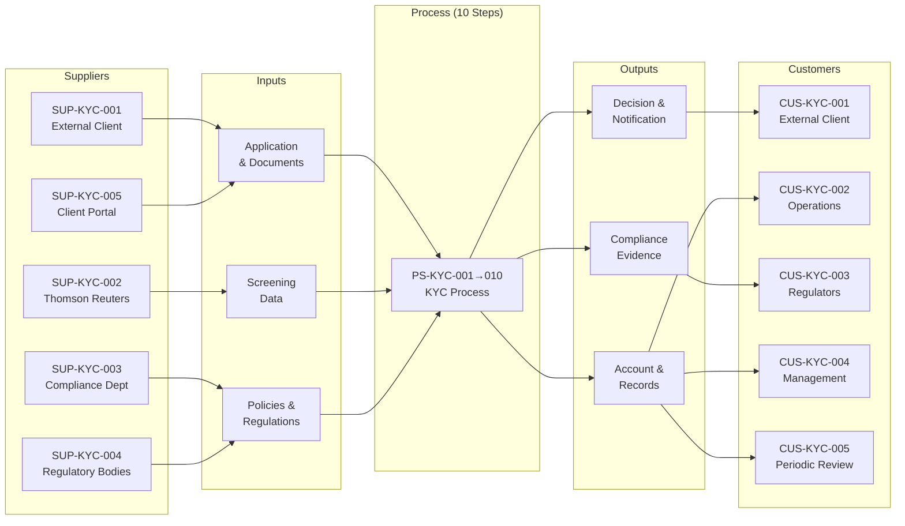

# SIPOC Analysis: KYC (Know Your Customer)

**Process ID:** 005
**Document Type:** SIPOC — Supplier-Input-Process-Output-Customer Mapping
**Related Document:** [AS-IS Process Documentation](./as-is-process-documentation.md)
**Last Updated:** 2026-02-09
**Version:** 0.1
**Status:** Draft

---

## Executive Summary

The KYC process ecosystem involves 5 supplier categories providing 8 distinct inputs, processed through 10 steps, generating 8 outputs delivered to 5 customer segments. Salesforce CRM acts as the central hub connecting all suppliers and customers. The external client is both the primary supplier (providing application and identity documents) and the primary customer (receiving approval decisions and active accounts).

Key interface risks identified through SIPOC analysis include World-Check ONE integration timeouts at the supplier-to-process boundary (PP-KYC-002), overnight T24 batch delays at the process-to-customer boundary (PP-KYC-006), and missing automated reminders for the downstream periodic review process (PP-KYC-004). The process boundary starts at customer application receipt and ends at periodic review scheduling; periodic review execution is a confirmed separate process requiring its own documentation.

SIPOC analysis also revealed 3 potential missing stakeholders not present in the AS-IS RACI: the IT Department (responsible for system integrations), Legal/Company Secretary (corporate KYC validation), and potential external document verification services.

### Key Metrics

| Metric | Value |
|--------|-------|
| Unique Suppliers | 5 |
| Input Categories | 8 |
| Core Process Steps (from AS-IS) | 10 |
| Output Categories | 8 |
| Customer Segments | 5 |
| Boundary Issues Identified | 2 |
| Interface Gaps | 3 |

---

## How to Read This Document

> This document maps the **SIPOC ecosystem** around the KYC (Know Your Customer) process.
> It extends the AS-IS documentation by looking BEYOND process boundaries — who
> feeds into this process, what they provide, what comes out, and who receives it.
>
> **Why SIPOC after AS-IS?** The AS-IS captures internal mechanics. SIPOC reveals
> the external ecosystem. Together they provide the complete picture needed for
> transformation.
>
> **Companion Documents:**
> - [AS-IS Process Documentation](./as-is-process-documentation.md) — Internal process view
> - [Pain Point Details](./pain-points-detail.md) — Issues linked to supplier/customer interfaces
>
> **Cross-Reference IDs:**
> - **SUP#** — Supplier entry
> - **INP#** — Input entry
> - **OUT#** — Output entry
> - **CUS#** — Customer entry
> - References: PS# (process steps), SYS# (systems), PP# (pain points)

---

## 1. SIPOC Overview Diagram

> **About this section:** The classic SIPOC table — one-page view of the entire ecosystem.

### 1.1 SIPOC Summary Table

| SUP# | Supplier | INP# | Input | PS# Range | OUT# | Output | CUS# | Customer |
|------|----------|------|-------|-----------|------|--------|------|----------|
| SUP-KYC-001 | External Client | INP-KYC-001 | Customer Application | PS-KYC-001 | OUT-KYC-001 | Approval/Rejection Decision | CUS-KYC-001 | External Client |
| SUP-KYC-001 | External Client | INP-KYC-002 | Identity Documents | PS-KYC-002 | OUT-KYC-002 | Customer Notification Letter | CUS-KYC-001 | External Client |
| SUP-KYC-001 | External Client | INP-KYC-003 | Proof of Address | PS-KYC-002 | OUT-KYC-003 | Active Customer Account | CUS-KYC-001 | External Client |
| SUP-KYC-001 | External Client | INP-KYC-004 | Corporate Documents | PS-KYC-002 | OUT-KYC-004 | Risk Rating Assignment | CUS-KYC-003 | Regulatory Bodies |
| SUP-KYC-002 | Thomson Reuters/LSEG | INP-KYC-005 | World-Check ONE Screening Data | PS-KYC-004 | OUT-KYC-005 | AML Screening Report | CUS-KYC-003 | Regulatory Bodies |
| SUP-KYC-003 | Compliance Department | INP-KYC-006 | Risk Rating Matrix & Policies | PS-KYC-005 – PS-KYC-007 | OUT-KYC-006 | CRM Customer Record | CUS-KYC-004 | Management/Reporting |
| SUP-KYC-004 | Regulatory Bodies | INP-KYC-007 | AML/CTF Regulations | PS-KYC-004 – PS-KYC-007 | OUT-KYC-007 | Periodic Review Schedule | CUS-KYC-005 | Periodic Review Process |
| SUP-KYC-005 | Client Portal (System) | INP-KYC-008 | Digital Application Submission | PS-KYC-001 | OUT-KYC-008 | Audit Trail & Compliance Evidence | CUS-KYC-003 | Regulatory Bodies |

### 1.2 SIPOC Visual Flow

> **Section Confidence:** [MEDIUM] (75%) | **Basis:** [PREFILLED — extracted from AS-IS process steps and systems]

---

## 2. Suppliers Detail

> **About this section:** Who or what feeds into this process? Internal teams,
> external parties, systems, regulatory bodies.

### 2.1 Supplier Registry

| SUP# | Supplier Name | Type | Category | Provides (INP#) | Interface Method | Reliability | SLA |
|------|---------------|------|----------|------------------|-----------------|-------------|-----|
| SUP-KYC-001 | External Client | Client/Self-Service | Primary | INP-KYC-001, INP-KYC-002, INP-KYC-003, INP-KYC-004 | Client Portal / Email | [PREFILLED — variable; document collection can take up to 5 days] | SLA-KYC-002 (5 business days) |
| SUP-KYC-002 | Thomson Reuters/LSEG | External Partner | Screening | INP-KYC-005 | System-to-system (SYS-KYC-002) | [PREFILLED — intermittent timeouts reported (PP-KYC-002)] | Same-day (SLA-KYC-004) |
| SUP-KYC-003 | Compliance Department | Internal Team | Policy | INP-KYC-006 | Internal (SharePoint, CRM) | [PREFILLED — assumed reliable; policies updated periodically] | N/A |
| SUP-KYC-004 | Regulatory Bodies | Regulatory Body | Compliance | INP-KYC-007 | External (published regulations) | [PREFILLED — reliable but changes require process updates] | N/A |
| SUP-KYC-005 | Client Portal | System/Automated | Intake | INP-KYC-008 | SYS-KYC-006 → SYS-KYC-001 (INT-KYC-001) | [PREFILLED — no issues reported] | N/A |

**Supplier Types:** `Internal Team` | `External Partner` | `Regulatory Body` | `System/Automated` | `Client/Self-Service`

### 2.2 Supplier Details

#### SUP-KYC-001: External Client

| Attribute | Value |
|-----------|-------|
| **Supplier ID** | SUP-KYC-001 |
| **Name** | External Client |
| **Type** | Client/Self-Service |
| **Category** | Primary |
| **Department/Entity** | BizBanking / MidCap / LargeCap segments |
| **Contact/Owner** | Relationship Manager (primary contact) |
| **Provides** | INP-KYC-001, INP-KYC-002, INP-KYC-003, INP-KYC-004 |
| **Interface Method** | Client Portal (SYS-KYC-006) / Email (SYS-KYC-004) |
| **Frequency** | Per application |
| **Reliability Rating** | [PREFILLED — variable; depends on customer responsiveness] |
| **SLA (if applicable)** | SLA-KYC-002 (5 business days for document collection) |

**What They Supply:**
Customer application form, identity documents (passport/national ID), proof of address (utility bill/bank statement), and for corporate clients: Certificate of Incorporation and Board Resolution. High-risk customers also supply source of funds/wealth documentation.

**Quality Issues:**
[PREFILLED — no specific input quality pain points captured in AS-IS, but document completeness is a common KYC challenge]

**Dependency Strength:** Critical
> How critical is this supplier? What happens if they're late/unavailable?

[PREFILLED — process cannot proceed without customer documents; 5-day window before follow-up escalation]

**Related Pain Points:** PP-KYC-003 (EDD delays often caused by customer document response time)

**Related Process Steps:** PS-KYC-001, PS-KYC-002, PS-KYC-006, PS-KYC-008

---

#### SUP-KYC-002: Thomson Reuters/LSEG

| Attribute | Value |
|-----------|-------|
| **Supplier ID** | SUP-KYC-002 |
| **Name** | Thomson Reuters/LSEG |
| **Type** | External Partner |
| **Category** | Screening |
| **Department/Entity** | Thomson Reuters / London Stock Exchange Group |
| **Contact/Owner** | [PREFILLED — not captured in AS-IS] |
| **Provides** | INP-KYC-005 |
| **Interface Method** | System-to-system (SYS-KYC-002 World-Check ONE) |
| **Frequency** | Per screening (every customer + beneficial owners) |
| **Reliability Rating** | [PREFILLED — intermittent timeouts reported (PP-KYC-002)] |
| **SLA (if applicable)** | [PREFILLED — vendor SLA not captured] |

**What They Supply:**
AML/PEP screening results via World-Check ONE platform — customer and beneficial owner name matching against sanctions lists, PEP lists, and adverse media.

**Quality Issues:**
[PREFILLED — integration sometimes times out (PP-KYC-002), requiring manual retry. No false positive rate data captured.]

**Dependency Strength:** Critical
> How critical is this supplier? What happens if they're late/unavailable?

[PREFILLED — process blocked at PS-KYC-004 without screening; regulatory requirement means no workaround]

**Related Pain Points:** PP-KYC-002 (World-Check ONE integration timeouts)

**Related Process Steps:** PS-KYC-004

---

#### SUP-KYC-003: Compliance Department

| Attribute | Value |
|-----------|-------|
| **Supplier ID** | SUP-KYC-003 |
| **Name** | Compliance Department |
| **Type** | Internal Team |
| **Category** | Policy |
| **Department/Entity** | Compliance Department |
| **Contact/Owner** | Sue Smith (Process Owner) |
| **Provides** | INP-KYC-006 |
| **Interface Method** | SharePoint (DTP-KYC-001, appendices), Salesforce CRM (risk matrix configuration) |
| **Frequency** | Periodic updates (DTP last updated 2025-11-15) |
| **Reliability Rating** | [PREFILLED — assumed reliable] |
| **SLA (if applicable)** | N/A |

**What They Supply:**
Risk Rating Matrix (Appendix A), EDD Checklist (Appendix B), Standard Letter Templates (Appendix C), and the Desktop Procedure (DTP-KYC-001 v2.3). These define the rules and procedures that govern the KYC process.

**Quality Issues:**
[PREFILLED — Process flowchart is outdated vs DTP, suggesting policy document synchronization issues (PGAP-KYC-001 through PGAP-KYC-005)]

**Dependency Strength:** High
> How critical is this supplier? What happens if they're late/unavailable?

[PREFILLED — process can continue with existing policies; risk materializes when policies are outdated or inconsistent]

**Related Pain Points:** None directly

**Related Process Steps:** PS-KYC-005, PS-KYC-006, PS-KYC-007, PS-KYC-008

---

#### SUP-KYC-004: Regulatory Bodies

| Attribute | Value |
|-----------|-------|
| **Supplier ID** | SUP-KYC-004 |
| **Name** | Regulatory Bodies |
| **Type** | Regulatory Body |
| **Category** | Compliance |
| **Department/Entity** | [PREFILLED — specific regulatory bodies not named in AS-IS] |
| **Contact/Owner** | [PREFILLED — not captured] |
| **Provides** | INP-KYC-007 |
| **Interface Method** | Published regulations, regulatory circulars |
| **Frequency** | Periodic (regulatory changes) |
| **Reliability Rating** | [PREFILLED — reliable; changes are published] |
| **SLA (if applicable)** | N/A |

**What They Supply:**
AML/CTF regulations and compliance requirements that define screening obligations, risk assessment criteria, record retention periods (7 years), and periodic review schedules.

**Quality Issues:**
[PREFILLED — no quality issues; regulatory clarity is generally high]

**Dependency Strength:** High
> How critical is this supplier? What happens if they're late/unavailable?

[PREFILLED — regulations are stable references; risk is in failing to detect regulatory changes promptly]

**Related Pain Points:** None directly

**Related Process Steps:** PS-KYC-004, PS-KYC-005, PS-KYC-006, PS-KYC-007

---

#### SUP-KYC-005: Client Portal

| Attribute | Value |
|-----------|-------|
| **Supplier ID** | SUP-KYC-005 |
| **Name** | Client Portal |
| **Type** | System/Automated |
| **Category** | Intake |
| **Department/Entity** | IT / Digital Channel |
| **Contact/Owner** | [PREFILLED — not captured in AS-IS] |
| **Provides** | INP-KYC-008 |
| **Interface Method** | SYS-KYC-006 → SYS-KYC-001 (INT-KYC-001) |
| **Frequency** | Per application |
| **Reliability Rating** | [PREFILLED — no issues reported in AS-IS] |
| **SLA (if applicable)** | N/A |

**What They Supply:**
Digital application submissions — structured customer data entered by clients through the self-service portal, fed into Salesforce CRM.

**Quality Issues:**
[PREFILLED — no issues reported; data validation at portal level not documented]

**Dependency Strength:** Medium
> How critical is this supplier? What happens if they're late/unavailable?

[PREFILLED — email fallback available; portal outage would not halt process entirely]

**Related Pain Points:** None

**Related Process Steps:** PS-KYC-001

---

### 2.3 Supplier Dependency Matrix

| SUP# | Supplier | Criticality | Substitute Available? | Failure Impact | Failure Frequency |
|------|----------|-------------|----------------------|----------------|-------------------|
| SUP-KYC-001 | External Client | Critical | No | Process cannot proceed | [PREFILLED — unknown] |
| SUP-KYC-002 | Thomson Reuters/LSEG | Critical | No | Screening blocked (regulatory) | Sometimes (PP-KYC-002) |
| SUP-KYC-003 | Compliance Department | High | No | Outdated policies risk | [PREFILLED — rare] |
| SUP-KYC-004 | Regulatory Bodies | High | No | Compliance risk | [PREFILLED — rare] |
| SUP-KYC-005 | Client Portal | Medium | Yes (email fallback) | Slower intake | [PREFILLED — unknown] |

> **Section Confidence:** [MEDIUM] (70%) | **Basis:** [PREFILLED — suppliers inferred from AS-IS steps and systems; reliability and SLAs need SME validation]

---

## 3. Inputs Detail

> **About this section:** What enters the process? Documents, data, decisions,
> triggers, materials.

### 3.1 Input Registry

| INP# | Input Name | Type | From (SUP#) | Format | Quality Req | Validation | Used By (PS#) |
|------|-----------|------|-------------|--------|-------------|------------|---------------|
| INP-KYC-001 | Customer Application | Document | SUP-KYC-001 | Digital (Portal) / Email | Complete application form | CP-KYC-003 (mandatory fields) | PS-KYC-001, PS-KYC-003 |
| INP-KYC-002 | Identity Documents | Document | SUP-KYC-001 | Scanned PDF | Valid passport or national ID | RM visual check | PS-KYC-002, PS-KYC-003 |
| INP-KYC-003 | Proof of Address | Document | SUP-KYC-001 | Scanned PDF | Utility bill or bank statement, ≤3 months | RM visual check | PS-KYC-002, PS-KYC-003 |
| INP-KYC-004 | Corporate Documents | Document | SUP-KYC-001 | Scanned PDF | Certificate of Inc., Board Resolution | RM visual check | PS-KYC-002, PS-KYC-003 |
| INP-KYC-005 | Screening Data | Data/Record | SUP-KYC-002 | System record | Clear/match result for all beneficial owners >25% | Automated screening | PS-KYC-004 |
| INP-KYC-006 | Risk Rating Matrix & Policies | Document | SUP-KYC-003 | SharePoint docs / CRM config | Current version | [PREFILLED — manual version check] | PS-KYC-005, PS-KYC-006, PS-KYC-007 |
| INP-KYC-007 | AML/CTF Regulations | Information | SUP-KYC-004 | Published regulations | Applicable jurisdiction | [PREFILLED — compliance monitoring] | PS-KYC-004, PS-KYC-005 |
| INP-KYC-008 | Digital Application Submission | Trigger/Event | SUP-KYC-005 | Structured data | Auto-validated fields | Portal validation | PS-KYC-001 |

**Input Types:** `Document` | `Data/Record` | `Decision/Approval` | `Trigger/Event` | `Material/Physical` | `Information/Verbal`

### 3.2 Input Quality Matrix

| INP# | Input | Expected Quality | Actual Quality | Gap | Impact |
|------|-------|------------------|----------------|-----|--------|
| INP-KYC-001 | Customer Application | Complete, all fields populated | [PREFILLED — unknown] | [PREFILLED — unknown] | Delays at PS-KYC-003 |
| INP-KYC-002 | Identity Documents | Valid, legible, current | [PREFILLED — unknown] | [PREFILLED — unknown] | Rework at PS-KYC-002 |
| INP-KYC-005 | Screening Data | Timely, accurate results | Intermittent timeouts (PP-KYC-002) | Reliability gap | Delays at PS-KYC-004 |
| INP-KYC-006 | Policies | Current, consistent | Flowchart outdated vs DTP | Version sync gap | PGAP-KYC-001 through 005 |

> **Section Confidence:** [MEDIUM] (70%) | **Basis:** [PREFILLED — inputs extracted from AS-IS step details and DOC inventory; quality data needs SME validation]

---

## 4. Process (Summary from AS-IS)

> **About this section:** The process column is NOT re-documented here — it
> references the AS-IS documentation. This section maps which steps consume
> which inputs and produce which outputs.

### 4.1 Step-to-Input/Output Mapping

| PS# | Step Name | Inputs Consumed (INP#) | Outputs Produced (OUT#) | Transformation |
|-----|-----------|------------------------|-------------------------|----------------|
| PS-KYC-001 | Customer Application Received | INP-KYC-001, INP-KYC-008 | — | Intake: log application in CRM |
| PS-KYC-002 | Initial Document Collection | INP-KYC-002, INP-KYC-003, INP-KYC-004 | — | Collect and store in SharePoint |
| PS-KYC-003 | Data Entry into CRM | INP-KYC-001, INP-KYC-002, INP-KYC-003, INP-KYC-004 | OUT-KYC-006 | Manual data entry into Salesforce |
| PS-KYC-004 | AML Screening | INP-KYC-005 | OUT-KYC-005 | Screen against sanctions/PEP lists |
| PS-KYC-005 | Risk Assessment | INP-KYC-006, INP-KYC-007 | OUT-KYC-004 | Apply Risk Rating Matrix |
| PS-KYC-006 | Enhanced Due Diligence | INP-KYC-002, INP-KYC-006 | OUT-KYC-008 | Verify source of funds/wealth |
| PS-KYC-007 | Approval Decision | — | OUT-KYC-001 | Approve/reject based on all evidence |
| PS-KYC-008 | Customer Notification | OUT-KYC-001 | OUT-KYC-002 | Send decision via standard template |
| PS-KYC-009 | Account Activation | OUT-KYC-001 | OUT-KYC-003 | Activate in T24 Core Banking |
| PS-KYC-010 | Periodic Review Scheduling | OUT-KYC-004 | OUT-KYC-007 | Schedule review based on risk rating |

### 4.2 Process Boundary Definition

**Process Start Trigger:** New customer application received via Client Portal (SYS-KYC-006) or Email (SYS-KYC-004)
**Process Start Condition:** Application logged in Salesforce CRM with unique reference number
**Process End Trigger:** Account activated in T24 AND periodic review scheduled in CRM
**Process End Condition:** Customer has active account and next KYC review date is set

**In Scope:**
- New customer onboarding KYC (all segments)
- Initial periodic review scheduling
- Enhanced Due Diligence for high-risk customers
- Rejection workflow with written justification

**Out of Scope:**
- [PREFILLED — needs SME confirmation] Periodic review execution (triggered but not documented)
- [PREFILLED — needs SME confirmation] Ongoing transaction monitoring
- [PREFILLED — needs SME confirmation] Customer offboarding / exit KYC
- [PREFILLED — needs SME confirmation] KYC remediation for existing customers

**Boundary Ambiguities:**
- Periodic review execution is a **separate process** (confirmed by Process Owner). PS-KYC-010 schedules the review and hands off to that process. This KYC process covers onboarding only.
- What happens when a periodic review results in a risk rating change is handled in the separate periodic review process.

> **Section Confidence:** [MEDIUM] (75%) | **Basis:** [PREFILLED — step mapping from AS-IS; boundary definitions need SME confirmation]

---

## 5. Outputs Detail

> **About this section:** What does this process produce? Documents, decisions,
> data records, notifications, physical deliverables.

### 5.1 Output Registry

| OUT# | Output Name | Type | Produced By (PS#) | Format | Delivered To (CUS#) | SLA | Quality Metric |
|------|-----------|------|-------------------|--------|---------------------|-----|----------------|
| OUT-KYC-001 | Approval/Rejection Decision | Decision/Status | PS-KYC-007 | CRM record | CUS-KYC-001 (via OUT-KYC-002) | [PREFILLED — not explicit] | [PREFILLED — unknown] |
| OUT-KYC-002 | Customer Notification Letter | Notification | PS-KYC-008 | Email (standard template) | CUS-KYC-001 | SLA-KYC-006 (24 hours) | [PREFILLED — unknown] |
| OUT-KYC-003 | Active Customer Account | Deliverable/Physical | PS-KYC-009 | T24 system record | CUS-KYC-001, CUS-KYC-002 | [PREFILLED — overnight batch] | [PREFILLED — unknown] |
| OUT-KYC-004 | Risk Rating Assignment | Data/Record | PS-KYC-005 | CRM field | CUS-KYC-003, CUS-KYC-005 | [PREFILLED — same day] | [PREFILLED — unknown] |
| OUT-KYC-005 | AML Screening Report | Data/Record | PS-KYC-004 | System record (archived 7 years) | CUS-KYC-003 | SLA-KYC-004 (same day) | [PREFILLED — unknown] |
| OUT-KYC-006 | CRM Customer Record | Data/Record | PS-KYC-003 | Salesforce record | CUS-KYC-004 | SLA-KYC-003 (1 business day) | CP-KYC-003 (mandatory fields) |
| OUT-KYC-007 | Periodic Review Schedule | Handoff/Trigger | PS-KYC-010 | CRM scheduled task | CUS-KYC-005 | Automated | [PREFILLED — unknown] |
| OUT-KYC-008 | EDD Report (high-risk only) | Document | PS-KYC-006 | CRM record + SharePoint docs | CUS-KYC-003 | SLA-KYC-005 (3 business days) | [PREFILLED — unknown] |

**Output Types:** `Document` | `Data/Record` | `Decision/Status` | `Notification` | `Deliverable/Physical` | `Handoff/Trigger`

### 5.2 Output Quality Matrix

| OUT# | Output | Quality Target | Actual Quality | Gap | Customer Impact |
|------|--------|----------------|----------------|-----|-----------------|
| OUT-KYC-002 | Notification Letter | Sent within 24 hours | [PREFILLED — unknown] | [PREFILLED — unknown] | Customer waiting for decision |
| OUT-KYC-003 | Active Account | Same-day activation | Overnight batch (PP-KYC-006) | Overnight delay | Customer cannot transact until next day |
| OUT-KYC-005 | Screening Report | Same-day completion | Intermittent timeouts (PP-KYC-002) | Reliability gap | Delays downstream processing |
| OUT-KYC-008 | EDD Report | 3 business days | [PREFILLED — avg unknown, was 5 days per flowchart] | Potential SLA breach | Delayed onboarding for high-risk |

> **Section Confidence:** [MEDIUM] (70%) | **Basis:** [PREFILLED — outputs extracted from AS-IS step details; quality metrics and SLA performance need SME validation]

---

## 6. Customers Detail

> **About this section:** Who receives the outputs? Internal teams, external
> clients, regulators, downstream processes.

### 6.1 Customer Registry

| CUS# | Customer Name | Type | Segment | Receives (OUT#) | Channel | Satisfaction | Feedback Method |
|------|---------------|------|---------|-----------------|---------|-------------|-----------------|
| CUS-KYC-001 | External Client | External Client | BizBanking / MidCap / LargeCap | OUT-KYC-001, OUT-KYC-002, OUT-KYC-003 | Email, Client Portal | [PREFILLED — unknown] | [PREFILLED — unknown] |
| CUS-KYC-002 | Operations Team | Internal Team | Operations | OUT-KYC-003 | Salesforce workflow | [PREFILLED — unknown] | [PREFILLED — unknown] |
| CUS-KYC-003 | Regulatory Bodies / Auditors | Regulatory Body | Compliance | OUT-KYC-004, OUT-KYC-005, OUT-KYC-008 | Audit trail, archived records | [PREFILLED — assumed satisfactory if compliant] | Audit findings |
| CUS-KYC-004 | Management / Reporting | Management/Reporting | Internal | OUT-KYC-006 | CRM dashboards / reports | [PREFILLED — unknown] | [PREFILLED — unknown] |
| CUS-KYC-005 | Periodic Review Process | Downstream Process | Internal | OUT-KYC-004, OUT-KYC-007 | CRM scheduled tasks | [PREFILLED — PP-KYC-004 suggests gaps] | [PREFILLED — unknown] |

**Customer Types:** `Internal Team` | `External Client` | `Regulatory Body` | `Downstream Process` | `Management/Reporting`

### 6.2 Customer Satisfaction Matrix

| CUS# | Customer | Expectation | Current Performance | Gap | Priority |
|------|----------|-------------|---------------------|-----|----------|
| CUS-KYC-001 | External Client | Fast onboarding, clear communication | Overnight activation delay (PP-KYC-006), EDD delays (PP-KYC-003) | Cycle time gap | High |
| CUS-KYC-002 | Operations Team | Clean, complete customer records | Manual re-entry required (PP-KYC-001) | Data quality gap | Medium |
| CUS-KYC-003 | Regulatory Bodies | Complete audit trail, 7-year retention | Controls in place (CP-KYC-002, CP-KYC-004) | [PREFILLED — unknown if fully met] | High |
| CUS-KYC-005 | Periodic Review Process | Automated reminders for upcoming reviews | No automated reminders (PP-KYC-004) | Automation gap | Medium |

> **Section Confidence:** [MEDIUM] (65%) | **Basis:** [PREFILLED — customers inferred from AS-IS stakeholders and outputs; satisfaction data needs SME/CX input]

---

## 7. Interface & Boundary Analysis

> **About this section:** This is the SIPOC value-add — analyzing the interfaces
> between suppliers/customers and the process reveals issues invisible in the AS-IS.

### 7.1 Interface Issues

| IF# | Interface | Type | Issue | Impact | Related PP# | Recommendation |
|-----|-----------|------|-------|--------|-------------|----------------|
| IF-KYC-001 | SUP-KYC-002 → Process (World-Check ONE) | Supplier→Process | Integration timeouts | Screening delays, manual retry | PP-KYC-002 | [PREFILLED — investigate async/queue-based screening] |
| IF-KYC-002 | Process → CUS-KYC-001 (Account Activation) | Process→Customer | T24 batch processing overnight | Customer cannot transact until next day | PP-KYC-006 | [PREFILLED — investigate real-time activation API] |
| IF-KYC-003 | Process → CUS-KYC-005 (Periodic Review) | Process→Customer | No automated review reminders | Risk of missed compliance deadlines | PP-KYC-004 | [PREFILLED — implement CRM reminder automation] |

**Interface Types:** `Supplier→Process` | `Process→Customer` | `System→System` | `Team→Team`

### 7.2 Boundary Discrepancies

> Differences between what the AS-IS documents say vs what SIPOC reveals

| BD# | Discrepancy | AS-IS Says | SIPOC Reveals | Impact | Resolution |
|-----|-------------|-----------|---------------|--------|------------|
| BD-KYC-001 | Periodic review process boundary | PS-KYC-010 schedules reviews | Periodic review execution is a separate process (confirmed by Process Owner) | Boundary now clear; separate process needs its own documentation | Resolved |
| BD-KYC-002 | Client Portal as supplier | SYS-KYC-006 listed as system | Portal is also a key supplier channel with its own quality characteristics | Supplier reliability not assessed | [PREFILLED — assess portal uptime and fallback] |

### 7.3 Missing Stakeholders

> Suppliers or customers discovered through SIPOC that aren't in the AS-IS

[PREFILLED — potential missing stakeholders to validate with SME:]
- **IT Department** — responsible for system integrations (INT-KYC-001 through 005) but not mentioned in RACI
- **Legal/Company Secretary** — may be involved in corporate KYC document validation
- **External document verification services** — are any third-party verification services used?

### 7.4 Hidden Dependencies

> Dependencies that only become visible through the SIPOC lens

[PREFILLED — potential hidden dependencies:]
- **Client Portal availability** — single digital intake channel; email is fallback but may lack structured data capture
- **SharePoint sync reliability** — PP-KYC-005 suggests sync issues that could affect document availability downstream
- **Regulatory change monitoring** — no documented mechanism for how regulatory changes (SUP-KYC-004) are detected and incorporated into policies (SUP-KYC-003)

> **Section Confidence:** [LOW] (55%) | **Basis:** [PREFILLED — boundary analysis inferred from AS-IS gaps; needs SME validation and CX Journey input]

---

## 8. Cross-Reference Reconciliation

> **About this section:** Maps SIPOC findings back to AS-IS items for traceability.

### 8.1 New Pain Points Discovered

| PP# (new) | Pain Point | Discovered Via | SIPOC Reference |
|-----------|------------|----------------|-----------------|
| [PREFILLED] | No documented mechanism for regulatory change monitoring | Supplier analysis (SUP-KYC-004) | SUP-KYC-004 → INP-KYC-007 |
| [RESOLVED] | Periodic review execution is a separate process — not a gap, needs its own documentation | Boundary analysis | BD-KYC-001, CUS-KYC-005 |
| [PREFILLED] | IT Department absent from RACI for system integrations | Missing stakeholder analysis | Section 7.3 |

### 8.2 New System Dependencies Discovered

| SYS# (new) | System | Role | SIPOC Reference |
|------------|--------|------|-----------------|
| — | No new systems discovered | — | — |

### 8.3 Enrichments to Existing Items

| Existing ID | Enrichment | Source |
|-------------|-----------|--------|
| PP-KYC-002 | Classified as Supplier→Process interface issue; vendor SLA needed | IF-KYC-001 |
| PP-KYC-004 | Classified as Process→Customer interface issue; affects CUS-KYC-005 | IF-KYC-003 |
| PP-KYC-006 | Classified as Process→Customer interface issue; affects CUS-KYC-001 | IF-KYC-002 |
| PS-KYC-010 | Boundary ambiguity: downstream periodic review process not documented | BD-KYC-001 |

---

## Input for Downstream Agents

### For Transformation Agent
Key transformation targets from SIPOC: (1) World-Check ONE integration reliability (IF-KYC-001), (2) T24 batch-to-realtime activation (IF-KYC-002), (3) Automated periodic review reminders (IF-KYC-003), (4) Regulatory change monitoring mechanism.

### For CX Journey Agent
External client (CUS-KYC-001) touchpoints: application submission (Portal/Email), document collection (Email), notification (Email). Key friction: overnight activation delay, EDD cycle time. Satisfaction data not captured.

### For IT Architect
Integration points requiring architecture review: INT-KYC-001 through 005. Methods undocumented. World-Check ONE timeout issue needs technical investigation. T24 batch processing constraint.

### For Innovation Agent
Automation opportunities: (1) portal-based document upload with OCR validation, (2) async AML screening queue, (3) CRM-based automated review reminders, (4) real-time T24 API for account activation.

---

## Change Log

| Version | Date | Contributor | Role | Changes |
|---------|------|-------------|------|---------|
| 0.1 | 2026-02-09 | ProcessMiner PDA | Agent | AI prefill from AS-IS documentation |

---

_Generated by ProcessMiner Process Documentation Analyst_
_Document ID: SIPOC-005-KYC-v0.1_
