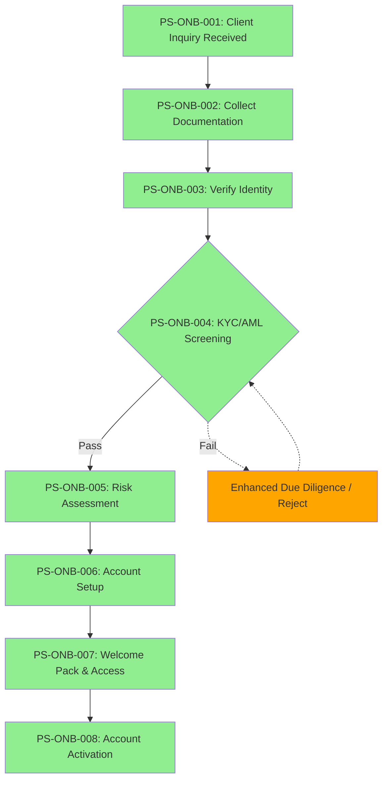
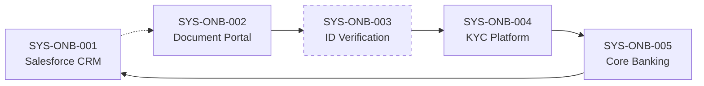

# As-Is Process Documentation: Client Onboarding

**Document Type:** Current State Process Analysis
**Status:** DRAFT
**Business Unit:** All segments
**Region:** [TBD]
**Document Owner:** Markus (CEO)
**Last Updated:** 2026-03-03
**Version:** 0.1
**Reviewed By:** — | **Review Date:** —
**Approved By:** — | **Approval Date:** —

---

## Executive Summary

[To be expanded]

### Key Metrics at a Glance

| Metric | Value |
|--------|-------|
| Process Steps | 8 |
| Exceptions Identified | 0 |
| Pain Points Captured | 0 |
| Control Points Mapped | 3 |
| Systems Involved | 5 |
| Overall Confidence | LOW (38%) |

---

## How to Read This Document

> This document captures the **current state (AS-IS)** of the Client Onboarding process. It provides a comprehensive overview with summary tables. For detailed analysis, see the linked companion documents.
>
> **Companion Documents:**
> - [Exception Details](./exceptions-detail.md) - Full exception analysis with root causes
> - [Pain Point Details](./pain-points-detail.md) - Detailed pain point analysis with improvement ideas
> - [Control Point Details](./control-points-detail.md) - Complete control mapping with compliance analysis
> - [Client Touchpoint Details](./client-touchpoints-detail.md) - Client interaction analysis with CES scoring
>
> **Confidence Indicators:** Each section includes an AI-assessed completeness confidence:
> - **[HIGH]** (≥90%) - Comprehensive coverage, validated by multiple sources
> - **[MEDIUM]** (≥70%) - Good coverage, some details may need validation
> - **[LOW]** (≥40%) - Preliminary capture, requires additional SME input
> - **[STUB]** (<40%) - Section placeholder only, no substantive content captured yet

---

## 1. Process Overview

> **About this section:** Foundational context - what this process is, who owns it, and what business need it serves.

### 1.1 Process Identification

| Attribute | Value |
|-----------|-------|
| **Process Name** | Client Onboarding |
| **Process ID** | 006 |
| **Process Category** | [TBD] |
| **Scope** | End-to-end onboarding from initial client inquiry through account activation — all business segments |
| **Process Owner** | [TBD] |

### 1.2 Purpose and Trigger

[To be expanded]

### 1.3 Operational Characteristics

[To be expanded]

### 1.4 Key Stakeholders

Identified from flowchart: Relationship Manager, Operations Analyst, Compliance Officer, IT Support. Further stakeholder detail [To be expanded].

### 1.5 Service Levels & Performance Benchmarks

| SLA# | Metric | Current SLA | Actual Performance | Source | Regulatory? |
|------|--------|-------------|-------------------|--------|-------------|
| *No SLAs captured yet* | | | | | |

### 1.6 Cost & Resource Allocation

| Metric | Value |
|--------|-------|
| **FTE Allocation** | [TBD] |
| **Cost per Transaction** | [TBD] |
| **Annual Operating Cost** | [TBD] |
| **Resource Utilization** | [TBD] |

### 1.7 Process Variants

| Variant | Scope | Key Differences | Shared Steps |
|---------|-------|-----------------|--------------|
| *No variants identified yet — flowchart shows single path* | | | |

### 1.8 Process Dependencies

| DEP# | Direction | Process | Dependency Type | Data/Trigger Exchanged |
|------|-----------|---------|-----------------|------------------------|
| *[To be expanded]* | | | | |

> **Section Confidence:** LOW (35%) | **Basis:** Basic identification extracted from flowchart; purpose, trigger, operational characteristics, SLAs, cost, and dependencies all missing
> **Evidence Sources:** Process flowchart

---

## 2. Process Steps

> **About this section:** The step-by-step flow of this process from start to finish.

### 2.1 Process Step Summary

| PS# | Step Name | Owner | System(s) | Duration | Wait Time | Rationale |
|-----|-----------|-------|-----------|----------|-----------|-----------|
| PS-ONB-001 | Client Inquiry Received | Relationship Manager | Salesforce CRM | [TBD] | [TBD] | [TBD] |
| PS-ONB-002 | Collect Client Documentation | Relationship Manager | Document Portal | [TBD] | [TBD] | [TBD] |
| PS-ONB-003 | Verify Identity Documents | Operations Analyst | Document Portal, ID Verification System | [TBD] | [TBD] | [TBD] |
| PS-ONB-004 | KYC/AML Screening | Compliance Officer | KYC Platform | [TBD] | [TBD] | [TBD] |
| PS-ONB-005 | Risk Assessment & Categorization | Compliance Officer | KYC Platform | [TBD] | [TBD] | [TBD] |
| PS-ONB-006 | Account Setup & Configuration | Operations Analyst | Core Banking System | [TBD] | [TBD] | [TBD] |
| PS-ONB-007 | Welcome Pack & Access Provisioning | IT Support, Relationship Manager | Core Banking System | [TBD] | [TBD] | [TBD] |
| PS-ONB-008 | Account Activation & Go-Live | Relationship Manager | Salesforce CRM, Core Banking System | [TBD] | [TBD] | [TBD] |

### 2.2 Process Flow Diagrams

#### 2.2.1 High-Level Process Flow (L1)

> Overview showing major phases and key decision points

#### 2.2.2 Detailed Process Flow (L2)

[To be expanded — requires timing and exception detail from SME]

#### 2.2.3 Swim Lane Diagram

[To be expanded — requires confirmation of role assignments]

### 2.3 Step Details

#### PS-ONB-001: Client Inquiry Received

**Performer:** Relationship Manager
**System(s):** Salesforce CRM (SYS-ONB-001)
**Input:** Client inquiry (email, phone, referral)
**Output:** Client record created in CRM
**Business Rules:** [TBD]
**Duration:** [TBD]
**Wait Time:** [TBD]
**Channel:** [TBD]
**Document Count:** [TBD]
**Interaction Count:** [TBD]

Initial client inquiry is received and logged in the CRM. Relationship Manager captures basic client information and intent.

#### PS-ONB-002: Collect Client Documentation

**Performer:** Relationship Manager
**System(s):** Document Portal (SYS-ONB-002)
**Input:** Document checklist
**Output:** Client documents uploaded to portal
**Business Rules:** [TBD]
**Duration:** [TBD]
**Wait Time:** [TBD]
**Channel:** [TBD]
**Document Count:** [TBD]
**Interaction Count:** [TBD]

Required onboarding documents are requested from the client and uploaded to the Document Portal.

#### PS-ONB-003: Verify Identity Documents

**Performer:** Operations Analyst
**System(s):** Document Portal (SYS-ONB-002), ID Verification System (SYS-ONB-003)
**Input:** Client identity documents
**Output:** Identity verification result (pass/fail)
**Business Rules:** [TBD]
**Duration:** [TBD]
**Wait Time:** [TBD]
**Channel:** [TBD]
**Document Count:** [TBD]
**Interaction Count:** [TBD]

Identity documents are verified against external databases using the ID Verification System. Document authenticity and validity are checked.

#### PS-ONB-004: KYC/AML Screening

**Performer:** Compliance Officer
**System(s):** KYC Platform (SYS-ONB-004)
**Input:** Verified client identity, client information
**Output:** KYC screening result, risk profile
**Business Rules:** [TBD]
**Duration:** [TBD]
**Wait Time:** [TBD]
**Channel:** [TBD]
**Document Count:** [TBD]
**Interaction Count:** [TBD]

Client is screened against sanctions lists, PEP databases, and adverse media. KYC risk profile is generated.

#### PS-ONB-005: Risk Assessment & Categorization

**Performer:** Compliance Officer
**System(s):** KYC Platform (SYS-ONB-004)
**Input:** KYC screening result
**Output:** Client risk category (Low/Medium/High)
**Business Rules:** [TBD]
**Duration:** [TBD]
**Wait Time:** [TBD]
**Channel:** [TBD]
**Document Count:** [TBD]
**Interaction Count:** [TBD]

Client risk category is assigned based on KYC screening results, business type, geography, and product complexity.

#### PS-ONB-006: Account Setup & Configuration

**Performer:** Operations Analyst
**System(s):** Core Banking System (SYS-ONB-005)
**Input:** Approved client profile, risk category
**Output:** Configured client account
**Business Rules:** [TBD]
**Duration:** [TBD]
**Wait Time:** [TBD]
**Channel:** [TBD]
**Document Count:** [TBD]
**Interaction Count:** [TBD]

Client account is created in the Core Banking System with appropriate product configuration, limits, and access rights.

#### PS-ONB-007: Welcome Pack & Access Provisioning

**Performer:** IT Support, Relationship Manager
**System(s):** Core Banking System (SYS-ONB-005)
**Input:** Configured account
**Output:** Welcome pack sent, access credentials provisioned
**Business Rules:** [TBD]
**Duration:** [TBD]
**Wait Time:** [TBD]
**Channel:** [TBD]
**Document Count:** [TBD]
**Interaction Count:** [TBD]

Client receives welcome documentation, login credentials, and access to digital banking channels is provisioned.

#### PS-ONB-008: Account Activation & Go-Live

**Performer:** Relationship Manager
**System(s):** Salesforce CRM (SYS-ONB-001), Core Banking System (SYS-ONB-005)
**Input:** Welcome pack acknowledged, credentials tested
**Output:** Active client account, onboarding complete
**Business Rules:** [TBD]
**Duration:** [TBD]
**Wait Time:** [TBD]
**Channel:** [TBD]
**Document Count:** [TBD]
**Interaction Count:** [TBD]

Relationship Manager confirms client readiness, activates the account, and logs go-live in CRM.

### 2.4 Handoff Points

| HO# | From (Role/Team) | To (Role/Team) | Trigger | Method | Avg Wait |
|-----|------------------|----------------|---------|--------|----------|
| HO-ONB-001 | Relationship Manager | Operations Analyst | PS-ONB-002 complete — documents uploaded | [TBD] | [TBD] |
| HO-ONB-002 | Operations Analyst | Compliance Officer | PS-ONB-003 complete — identity verified | [TBD] | [TBD] |
| HO-ONB-003 | Compliance Officer | Operations Analyst | PS-ONB-005 complete — risk assessed | [TBD] | [TBD] |
| HO-ONB-004 | Operations Analyst | IT Support / Relationship Manager | PS-ONB-006 complete — account configured | [TBD] | [TBD] |

### 2.5 Business Rules

| BR# | Rule | Condition | Action | Source |
|-----|------|-----------|--------|--------|
| *[To be expanded]* | | | | |

### 2.6 Decision Points

| DP# | Decision | At Step | Criteria | Yes Path | No Path |
|-----|----------|---------|----------|----------|---------|
| DP-ONB-001 | KYC/AML Screening Pass? | PS-ONB-004 | All KYC checks cleared, no sanctions hits | PS-ONB-005 (Risk Assessment) | Enhanced Due Diligence or Reject |

### 2.7 Rework Analysis

| RW# | From Step | Trigger | Returns To | Frequency | Avg Cycles | Time Cost |
|-----|-----------|---------|------------|-----------|------------|-----------|
| *[To be expanded]* | | | | | | |

### 2.8 Cycle Time Analysis

| Metric | Value |
|--------|-------|
| **Total Cycle Time (Avg)** | [TBD] |
| **Active Work Time** | [TBD] |
| **Wait/Queue Time** | [TBD] |
| **Longest Wait Step** | [TBD] |
| **Longest Work Step** | [TBD] |

> **Section Confidence:** MEDIUM (55%) | **Basis:** 8 steps extracted with owners and systems; duration, wait times, business rules, and detailed channel info missing
> **Evidence Sources:** Process flowchart

---

## 3. Exception Paths and Variations

> **About this section:** Summary of exceptions. For full details including root cause analysis and handling procedures, see [Exception Details](./exceptions-detail.md).

### 3.1 Exception Summary

The flowchart indicates a KYC fail path leading to Enhanced Due Diligence or rejection, but no exception details were provided. Exception documentation requires SME interview.

### 3.2 Exception Summary Table

| EX# | Exception | Trigger | Affected Steps | Frequency | Impact | Handling Owner |
|-----|-----------|---------|----------------|-----------|--------|----------------|
| *No exceptions captured yet* | | | | | | |

### 3.3 Exception Statistics

| Metric | Value |
|--------|-------|
| Total Exceptions | 0 |
| High-Impact Exceptions | 0 |
| Frequently Occurring | 0 |

> **Section Confidence:** STUB (5%) | **Basis:** Flowchart hints at KYC fail path but no details captured
> **Evidence Sources:** Process flowchart (indirect)

---

## 4. Control Points and Compliance

> **About this section:** Summary of controls. For full regulatory mapping and effectiveness analysis, see [Control Point Details](./control-points-detail.md).

### 4.1 Control Summary

Three control points were inferred from the flowchart: identity verification at step 3, KYC/AML screening gate at step 4, and risk categorization approval at step 5. All are preventive or detective controls in the compliance domain. Evidence and regulatory mapping require SME input.

### 4.2 Control Point Summary Table

| CP# | Control Name | Type | Regulation | Process Step | Effectiveness | Risk Level |
|-----|--------------|------|------------|--------------|---------------|------------|
| CP-ONB-001 | Identity Verification Check | Preventive | [TBD] | PS-ONB-003 | [TBD] | [TBD] |
| CP-ONB-002 | KYC/AML Screening Gate | Preventive | [TBD] | PS-ONB-004 | [TBD] | [TBD] |
| CP-ONB-003 | Risk Categorization Approval | Detective | [TBD] | PS-ONB-005 | [TBD] | [TBD] |

### 4.3 Regulatory Coverage

| Regulation | Controls Mapped | Coverage Status |
|------------|-----------------|-----------------|
| *[To be expanded]* | | |

### 4.4 Control Statistics

| Metric | Value |
|--------|-------|
| Total Control Points | 3 |
| Regulatory Controls | [TBD] |
| Internal Controls | [TBD] |
| Automated Controls | [TBD] |

> **Section Confidence:** LOW (40%) | **Basis:** 3 controls inferred from flowchart; evidence, regulations, effectiveness, and risk levels all missing
> **Evidence Sources:** Process flowchart (inferred)

---

## 5. System Dependencies

> **About this section:** What technology supports this process?

### 5.1 System Summary

| SYS# | System Name | Purpose | Integration Points |
|------|-------------|---------|-------------------|
| SYS-ONB-001 | Salesforce CRM | Client relationship management, inquiry tracking, onboarding status | [TBD] |
| SYS-ONB-002 | Document Portal | Secure document upload, storage, and retrieval | [TBD] |
| SYS-ONB-003 | ID Verification System | Third-party identity verification against government databases | [TBD] |
| SYS-ONB-004 | KYC Platform | KYC/AML screening, sanctions checking, PEP screening, risk profiling | [TBD] |
| SYS-ONB-005 | Core Banking System | Account creation, configuration, product setup, and activation | [TBD] |

### 5.2 Integration Matrix

| INT# | Source System | Target System | Method | Frequency | Data Exchanged | Error Handling |
|------|--------------|---------------|--------|-----------|----------------|----------------|
| *[To be expanded]* | | | | | | |

### 5.3 System Interaction Diagram

### 5.4 Data & Document Inventory

| DOC# | Document/Data Artifact | Source | Format | Retention | Regulatory Req |
|------|------------------------|--------|--------|-----------|----------------|
| *[To be expanded]* | | | | | |

> **Section Confidence:** LOW (45%) | **Basis:** 5 systems identified with purpose; integration details, data flows, and document inventory missing
> **Evidence Sources:** Process flowchart

---

## 6. Organizational Mapping

> **About this section:** Who does what? Roles and responsibilities.

### 6.1 RACI Matrix

[To be expanded]

### 6.2 Team Responsibilities

[To be expanded]

> **Section Confidence:** STUB (15%) | **Basis:** 4 roles identified from flowchart; no RACI or team detail captured
> **Evidence Sources:** Process flowchart

---

## 7. Existing Documentation References

> **About this section:** Related documents and metrics.

### 7.1 Related Documents

[To be expanded]

### 7.2 KPIs and Metrics

[To be expanded]

### 7.3 DTPs (Detailed Task Procedures)

[To be expanded]

> **Section Confidence:** STUB (0%) | **Basis:** No existing documentation referenced yet
> **Evidence Sources:** None

---

## 8. Process Gaps and Issues

> **About this section:** Known gaps, inconsistencies, and their impact on analysis confidence.
>
> **Gap Resolution Tracking:** [View Gap Resolution Log](./gap-resolution-log.md)

### 8.1 Identified Gaps

| PGAP# | Gap Description | Category | Section Affected | Severity | Impact on Analysis | Resolution Owner | Status |
|-------|-----------------|----------|------------------|----------|-------------------|-----------------|--------|
| PGAP-ONB-001 | No timing data (duration, wait times) for any process step | Data Gap | Section 2 | HIGH | Cannot perform cycle time analysis or identify bottlenecks | [TBD] | open |
| PGAP-ONB-002 | Exception paths visible in flowchart but no details captured | Documentation Gap | Section 3 | HIGH | Cannot assess process resilience or failure handling | [TBD] | open |
| PGAP-ONB-003 | No pain points captured | Knowledge Gap | Section 9 | MEDIUM | Cannot identify improvement opportunities | [TBD] | open |
| PGAP-ONB-004 | Control evidence and regulatory mapping missing | Documentation Gap | Section 4 | MEDIUM | Cannot assess compliance posture | [TBD] | open |

### 8.2 Documentation Assessment

| DOC# | Document | Status | Last Updated | Issue | Impact |
|------|----------|--------|--------------|-------|--------|
| DOC-ONB-001 | Client Onboarding Process Chart | Current | 2026-03-03 | Flowchart only — no timing, exceptions, or pain points | Foundation only; requires SME interview to complete |

### 8.3 Inconsistencies

| PGAP# | Inconsistency | Sources | Impact | Resolution |
|-------|---------------|---------|--------|------------|
| *None identified yet* | | | | |

### 8.4 Gap-to-Confidence Impact

| PGAP# | Affected Section | Current Confidence | Confidence if Resolved |
|-------|------------------|--------------------|----------------------|
| PGAP-ONB-001 | Section 2 (Process Steps) | 55% | 80% |
| PGAP-ONB-002 | Section 3 (Exceptions) | 5% | 60% |
| PGAP-ONB-003 | Section 9 (Pain Points) | 0% | 55% |
| PGAP-ONB-004 | Section 4 (Controls) | 40% | 70% |

> **Section Confidence:** MEDIUM (65%) | **Basis:** Gaps systematically identified from import analysis
> **Evidence Sources:** Import discrepancy analysis

---

## 9. Pain Points and Improvement Opportunities

> **About this section:** Summary of pain points. For full analysis including root causes and improvement ideas, see [Pain Point Details](./pain-points-detail.md).

### 9.1 Pain Points Summary

No pain points captured yet. Pain point discovery requires SME interview.

### 9.2 Pain Point Summary Table

| PP# | Pain Point | Category | Affected Steps | Impact | Frequency | Priority | Quick Win? |
|-----|------------|----------|----------------|--------|-----------|----------|------------|
| *No pain points captured yet* | | | | | | | |

### 9.3 Pain Point Statistics

| Metric | Value |
|--------|-------|
| Total Pain Points | 0 |
| High-Impact | 0 |
| Client-Facing | 0 |
| Quick Win Opportunities | 0 |

> **Section Confidence:** STUB (0%) | **Basis:** No pain points captured
> **Evidence Sources:** None

---

## Document Metadata

**SME Contributors:** Markus (CEO)
**Interview Date(s):** 2026-03-03
**Documentation Method:** Process flowchart import

### Overall Document Confidence

| Section | Confidence | Score | Key Gaps |
|---------|------------|-------|----------|
| 1. Process Overview | LOW | 35% | Purpose, trigger, SLAs, cost missing |
| 2. Process Steps | MEDIUM | 55% | Duration, wait times, business rules missing |
| 3. Exceptions | STUB | 5% | No exceptions documented |
| 4. Controls | LOW | 40% | Evidence, regulations missing |
| 5. Systems | LOW | 45% | Integrations, data inventory missing |
| 6. Organization | STUB | 15% | No RACI or team detail |
| 7. Documentation | STUB | 0% | No references captured |
| 8. Gaps & Issues | MEDIUM | 65% | Systematic gap analysis done |
| 9. Pain Points | STUB | 0% | No pain points captured |

**Overall Confidence:** LOW (29%)

### Companion Documents

| Document | Purpose | Link |
|----------|---------|------|
| Exception Details | Full exception analysis | [exceptions-detail.md](./exceptions-detail.md) |
| Pain Point Details | Full pain point analysis | [pain-points-detail.md](./pain-points-detail.md) |
| Control Point Details | Full control analysis | [control-points-detail.md](./control-points-detail.md) |
| Client Touchpoint Details | Client interaction & CES analysis | [client-touchpoints-detail.md](./client-touchpoints-detail.md) |

---

## Change Log

| Version | Date | Contributor | Role | Changes |
|---------|------|-------------|------|---------|
| 0.1 | 2026-03-03 | Markus | CEO | Initial import from process flowchart — 8 steps, 5 systems, 3 controls extracted |

---

_Generated by ProcessMiner Process Documentation Analyst_
_Document ID: AS-IS-006_
