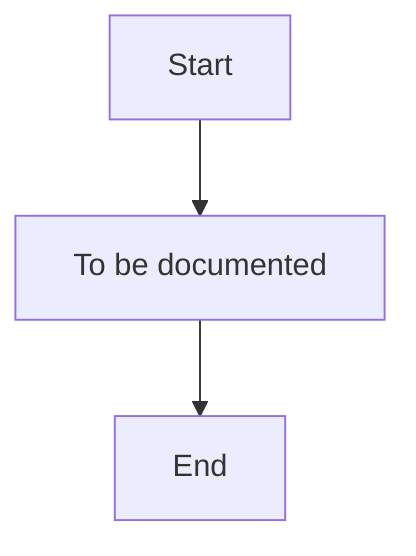

# As-Is Process Documentation: Client Onboarding

**Document Type:** Current State Process Analysis
**Business Unit:** All segments (BizBanking, MidCap, LargeCap)
**Region:** —
**Document Owner:** Markus
**Last Updated:** 2026-02-04
**Version:** 0.1

---

## Executive Summary

{{executive_summary_paragraph_1}}

{{executive_summary_paragraph_2}}

{{executive_summary_paragraph_3}}

### Key Metrics at a Glance

| Metric | Value |
|--------|-------|
| Process Steps | — |
| Exceptions Identified | — |
| Pain Points Captured | — |
| Control Points Mapped | — |
| Systems Involved | — |
| Overall Confidence | LOW |

---

## How to Read This Document

> This document captures the **current state (AS-IS)** of the Client Onboarding process. It provides a comprehensive overview with summary tables. For detailed analysis, see the linked companion documents.
>
> **Companion Documents:**
> - [Exception Details](./exceptions-detail.md) - Full exception analysis with root causes
> - [Pain Point Details](./pain-points-detail.md) - Detailed pain point analysis with improvement ideas
> - [Control Point Details](./control-points-detail.md) - Complete control mapping with compliance analysis
>
> **Confidence Indicators:** Each section includes an AI-assessed completeness confidence:
> - **[HIGH]** - Comprehensive coverage, validated by multiple sources
> - **[MEDIUM]** - Good coverage, some details may need validation
> - **[LOW]** - Preliminary capture, requires additional SME input

---

## 1. Process Overview

> **About this section:** Foundational context - what this process is, who owns it, and what business need it serves.

### 1.1 Process Identification

| Attribute | Value |
|-----------|-------|
| **Process Name** | Client Onboarding |
| **Process ID** | 001 |
| **Process Category** | — |
| **Scope** | All segments (BizBanking, MidCap, LargeCap) |
| **Process Owner** | — |

### 1.2 Purpose and Trigger

{{process_purpose}}

{{process_trigger}}

### 1.3 Operational Characteristics

{{process_frequency}}

{{process_volume}}

### 1.4 Key Stakeholders

{{stakeholders}}

> **Section Confidence:** LOW | **Basis:** Initial setup only

---

## 2. Process Steps

> **About this section:** The step-by-step flow of this process from start to finish.

### 2.1 Process Step Summary

| PS# | Step Name | Owner | System(s) | Rationale |
|-----|-----------|-------|-----------|-----------|

### 2.2 Process Flow Diagram

### 2.3 Step Details

{{process_steps_brief}}

> **Section Confidence:** LOW | **Basis:** Not yet documented

---

## 3. Exception Paths and Variations

> **About this section:** Summary of exceptions. For full details including root cause analysis and handling procedures, see [Exception Details](./exceptions-detail.md).

### 3.1 Exception Summary

{{exceptions_summary_paragraph}}

### 3.2 Exception Summary Table

| EX# | Exception | Trigger | Affected Steps | Frequency | Impact |
|-----|-----------|---------|----------------|-----------|--------|

### 3.3 Exception Statistics

| Metric | Value |
|--------|-------|
| Total Exceptions | — |
| High-Impact Exceptions | — |
| Frequently Occurring | — |

> **Full Analysis:** [View Exception Details](./exceptions-detail.md)
>
> **Section Confidence:** LOW | **Basis:** Not yet documented

---

## 4. Control Points and Compliance

> **About this section:** Summary of controls. For full regulatory mapping and effectiveness analysis, see [Control Point Details](./control-points-detail.md).

### 4.1 Control Summary

{{controls_summary_paragraph}}

### 4.2 Control Point Summary Table

| CP# | Control Name | Type | Regulation | Process Step | Effectiveness |
|-----|--------------|------|------------|--------------|---------------|

### 4.3 Regulatory Coverage

| Regulation | Controls Mapped | Coverage Status |
|------------|-----------------|-----------------|

### 4.4 Control Statistics

| Metric | Value |
|--------|-------|
| Total Control Points | — |
| Regulatory Controls | — |
| Internal Controls | — |
| Automated Controls | — |

> **Full Analysis:** [View Control Point Details](./control-points-detail.md)
>
> **Section Confidence:** LOW | **Basis:** Not yet documented

---

## 5. System Dependencies

> **About this section:** What technology supports this process?

### 5.1 System Summary

| SYS# | System Name | Purpose | Integration Points |
|------|-------------|---------|-------------------|

### 5.2 System Integration Overview

{{integrations_summary}}

### 5.3 Data Flow Summary

{{data_flows_summary}}

> **Section Confidence:** LOW | **Basis:** Not yet documented

---

## 6. Organizational Mapping

> **About this section:** Who does what? Roles and responsibilities.

### 6.1 RACI Matrix

{{raci_matrix}}

### 6.2 Team Responsibilities

{{team_responsibilities}}

> **Section Confidence:** LOW | **Basis:** Not yet documented

---

## 7. Existing Documentation References

> **About this section:** Related documents and metrics.

### 7.1 Related Documents

{{related_documents}}

### 7.2 KPIs and Metrics

{{kpis}}

### 7.3 DTPs (Detailed Task Procedures)

{{dtps}}

> **Section Confidence:** LOW | **Basis:** Not yet documented

---

## 8. Process Gaps and Issues

> **About this section:** Known gaps and inconsistencies.

### 8.1 Identified Gaps

{{identified_gaps}}

### 8.2 Missing Documentation

{{missing_documentation}}

### 8.3 Inconsistencies

{{inconsistencies}}

> **Section Confidence:** LOW | **Basis:** Not yet documented

---

## 9. Pain Points and Improvement Opportunities

> **About this section:** Summary of pain points. For full analysis including root causes and improvement ideas, see [Pain Point Details](./pain-points-detail.md).

### 9.1 Pain Points Summary

{{pain_points_summary_paragraph}}

### 9.2 Pain Point Summary Table

| PP# | Pain Point | Category | Affected Steps | Impact | Frequency | Priority |
|-----|------------|----------|----------------|--------|-----------|----------|

### 9.3 Pain Point Statistics

| Metric | Value |
|--------|-------|
| Total Pain Points | — |
| High-Impact | — |
| Client-Facing | — |
| Quick Win Opportunities | — |

### 9.4 Top Improvement Opportunities

{{top_improvement_opportunities}}

> **Full Analysis:** [View Pain Point Details](./pain-points-detail.md)
>
> **Section Confidence:** LOW | **Basis:** Not yet documented

---

## Document Metadata

**SME Contributors:** Markus (CEO)
**Interview Date(s):** 2026-02-04
**Documentation Method:** ProcessMiner guided elicitation

### Overall Document Confidence

| Section | Confidence | Key Gaps |
|---------|------------|----------|
| 1. Process Overview | LOW | All fields pending |
| 2. Process Steps | LOW | Not yet documented |
| 3. Exceptions | LOW | Not yet documented |
| 4. Controls | LOW | Not yet documented |
| 5. Systems | LOW | Not yet documented |
| 6. Organization | LOW | Not yet documented |
| 7. Documentation | LOW | Not yet documented |
| 8. Gaps & Issues | LOW | Not yet documented |
| 9. Pain Points | LOW | Not yet documented |

**Overall Confidence:** LOW

### Companion Documents

| Document | Purpose | Link |
|----------|---------|------|
| Exception Details | Full exception analysis | [exceptions-detail.md](./exceptions-detail.md) |
| Pain Point Details | Full pain point analysis | [pain-points-detail.md](./pain-points-detail.md) |
| Control Point Details | Full control analysis | [control-points-detail.md](./control-points-detail.md) |

---

## Change Log

| Date | Contributor | Role | Changes |
|------|-------------|------|---------|
| 2026-02-04 | Markus | CEO | Initial documentation |

---

## Glossary

{{glossary}}

---

_Generated by ProcessMiner Process Documentation Analyst_
_Document ID: 001-client-onboarding_
