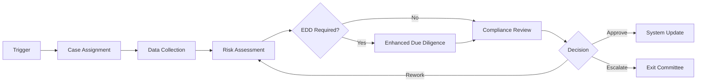
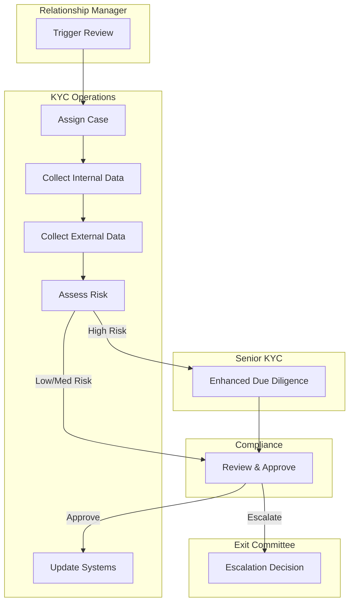
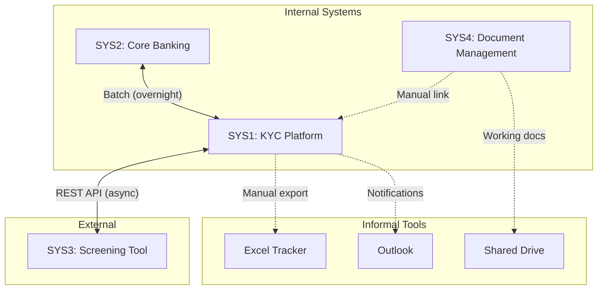

# AS-IS Process Documentation: KYC Review

**Process ID:** 002
**Created:** 2026-02-05
**Status:** In Progress
**Document Owner:** Markus
**Business Unit:** All segments (BizBanking, MidCap, LargeCap)
**Last Updated:** 2026-02-05
**Version:** 0.3

---

## 1. Executive Summary

The KYC Review process is one of the bank's most critical compliance processes, ensuring regulatory adherence by verifying client identity, assessing risk profiles, and maintaining up-to-date documentation across all business segments (BizBanking, MidCap, LargeCap). Reviews are triggered periodically (annually or every three years based on risk rating), by risk events such as adverse media or ownership changes, or during new client onboarding.

The process currently takes 5–15 business days for standard reviews and 20–40 days for enhanced due diligence cases. A key finding from this documentation effort is that the process is too slow, driven primarily by manual data re-keying between disconnected systems and delays in external screening provider responses. This impacts client onboarding timelines and creates operational bottlenecks for relationship managers and KYC analysts alike.

The process involves multiple teams — relationship management, KYC operations, compliance, and risk — and relies on four core systems with limited integration. Three pain points and two exception paths have been identified, with opportunities for improvement through better system integration and clearer EDD trigger criteria.

### Key Metrics at a Glance

| Metric | Value |
|--------|-------|
| Process Steps | 8 |
| Exceptions Identified | 2 |
| Pain Points Captured | 3 |
| Control Points Mapped | 3 |
| Systems Involved | 4 |
| Overall Confidence | MEDIUM |

> **Section Confidence:** MEDIUM (75%) | **Basis:** Expanded with key findings, still needs volume/cost data validation

---

## 2. Process Overview

### 1.1 Process Identification

| Field | Value |
|-------|-------|
| Process Name | KYC Review |
| Process ID | 002 |
| Process Owner | Head of KYC Operations |
| Business Unit | All segments (BizBanking, MidCap, LargeCap) |
| Regulatory Domain | AML/CFT, FATF, Local Banking Regulations |

### 1.2 Purpose and Trigger

**Purpose:** Ensure ongoing regulatory compliance by verifying client identity, assessing risk profiles, and maintaining current documentation for all bank clients.

**Triggers:**
- Periodic review cycle (annually for high-risk, every 3 years for low-risk)
- Event-driven (adverse media, ownership change, significant transaction pattern shift)
- New client onboarding

**Expected Outcome:** Approved KYC file with current risk rating, or escalation to compliance/exit committee for high-risk decisions.

### 1.3 Operational Characteristics

| Metric | Value |
|--------|-------|
| Annual Volume | ~2,400 reviews |
| Monthly Average | ~200 reviews |
| Split | 60% periodic, 25% event-triggered, 15% new client |
| Peak Periods | Q4 (year-end), Q1 (regulatory reporting) |
| Standard Duration | 5–15 business days |
| EDD Duration | 20–40 business days |

### 1.4 Key Stakeholders

| Role | Responsibility | Count |
|------|----------------|-------|
| Relationship Manager | Triggers reviews, client liaison | Various |
| KYC Analyst | Data collection, risk assessment | 12 FTEs |
| Senior KYC Analyst | EDD cases, complex reviews | 3 FTEs |
| KYC Team Lead | Case assignment, workload management | 1 FTE |
| Compliance Officer | Review approval, escalation | 2 FTEs |
| Exit Committee | High-risk client decisions | As needed |

### 1.5 Service Levels & Performance

| SLA# | Metric | Target | Actual | Regulatory? |
|------|--------|--------|--------|-------------|
| SLA-KYC-001 | Standard review turnaround | 10 business days | ~12 days | No |
| SLA-KYC-002 | EDD review turnaround | 30 business days | ~35 days | No |
| SLA-KYC-003 | Periodic review completion | Within 30 days of due date | 70% compliant | Yes |

### 1.6 Cost & Resource Allocation

| Metric | Value |
|--------|-------|
| Dedicated FTEs | 17 |
| Cost per Standard Review | €45 |
| Cost per EDD Review | €180 |
| Annual Operating Cost | ~€350K (excl. systems) |

### 1.7 Process Variants

| Variant | Scope | Key Differences |
|---------|-------|-----------------|
| BizBanking | Small business clients | Simplified KYC, mostly automated triggers |
| MidCap | Mid-market corporates | Standard process as documented |
| LargeCap | Large corporates | Senior analyst review required, often EDD |
| Legal Entities | All corporate clients | Additional UBO verification (+2-3 days) |

> **Section Confidence:** MEDIUM-HIGH (85%) | **Basis:** Comprehensive subsections populated with mocked but realistic data

---

## 3. Process Steps

### 2.1 Process Step Summary

| PS# | Step Name | Owner | System(s) | Duration | Wait Time |
|-----|-----------|-------|-----------|----------|-----------|
| PS1 | Trigger Identification | KYC System / RM | SYS1 | <5 min | <1 day |
| PS2 | Case Assignment | KYC Team Lead | SYS1 | 10-15 min | <4 hrs |
| PS3 | Data Collection — Internal | KYC Analyst | SYS1, SYS2 | 1-2 hrs | — |
| PS4 | Data Collection — External | KYC Analyst | SYS3 | 30 min | 24-48 hrs |
| PS5 | Risk Assessment | KYC Analyst | SYS1 | 1-2 hrs | <1 day |
| PS6 | Enhanced Due Diligence | Senior KYC Analyst | SYS1, SYS4 | 4-8 hrs | 5-15 days |
| PS7 | Compliance Review & Approval | Compliance Officer | SYS1 | 30 min - 2 hrs | 1-2 days |
| PS8 | System Update & Notification | KYC Analyst | SYS1, SYS2 | 15-30 min | — |

### 2.2 Process Flow Diagrams

#### 2.2.1 High-Level Process Flow (L1)

#### 2.2.2 Swim Lane Diagram

### 2.3 Step Details

#### PS1: Trigger Identification
**Actor:** KYC System / Relationship Manager
**System:** SYS1 (KYC Platform)
**Description:** Review is triggered automatically by periodic schedule or manually by RM due to risk event or new client request.
**Inputs:** Client record, trigger event
**Outputs:** KYC case created

#### PS2: Case Assignment
**Actor:** KYC Operations Team Lead
**System:** SYS1 (KYC Platform)
**Description:** Case is assigned to a KYC Analyst based on workload and segment expertise.
**Inputs:** KYC case
**Outputs:** Assigned case with analyst

#### PS3: Data Collection — Internal
**Actor:** KYC Analyst
**System:** SYS1 (KYC Platform), SYS2 (Core Banking)
**Description:** Analyst gathers existing client data from core banking, previous KYC files, and transaction history.
**Inputs:** Client ID, previous KYC file
**Outputs:** Internal data package

#### PS4: Data Collection — External
**Actor:** KYC Analyst
**System:** SYS3 (External Screening Tool)
**Description:** Analyst runs PEP, sanctions, and adverse media screening via external provider. Company registry checks for legal entity clients.
**Inputs:** Client name, registration details
**Outputs:** Screening results, company registry extracts

#### PS5: Risk Assessment
**Actor:** KYC Analyst
**System:** SYS1 (KYC Platform)
**Description:** Analyst scores the client risk based on collected data, screening results, product usage, geography, and transaction patterns.
**Inputs:** Internal data package, screening results
**Outputs:** Risk score, risk category (Low/Medium/High)

#### PS6: Enhanced Due Diligence (if required)
**Actor:** Senior KYC Analyst
**System:** SYS1 (KYC Platform), SYS4 (Document Management)
**Description:** For High-risk clients, additional source-of-wealth documentation is collected and verified. May require direct client contact.
**Inputs:** Risk assessment flagging High risk
**Outputs:** EDD report, supporting documentation

#### PS7: Compliance Review & Approval
**Actor:** Compliance Officer
**System:** SYS1 (KYC Platform)
**Description:** Compliance officer reviews the complete KYC file, risk assessment, and any EDD. Approves, requests rework, or escalates to exit committee.
**Inputs:** Complete KYC file
**Outputs:** Approval / rework request / escalation

#### PS8: System Update & Notification
**Actor:** KYC Analyst
**System:** SYS1 (KYC Platform), SYS2 (Core Banking)
**Description:** Upon approval, KYC status and risk rating are updated in all systems. RM is notified. Next review date is set.
**Inputs:** Approval decision
**Outputs:** Updated client record, RM notification, next review date

### 2.4 Handoff Points

| HO# | From | To | Trigger | Method | Avg Wait |
|-----|------|----|---------|--------|----------|
| HO-KYC-001 | Relationship Manager | KYC Ops Team Lead | Case created | System notification | <1 day |
| HO-KYC-002 | KYC Team Lead | KYC Analyst | Case assigned | System assignment | <4 hrs |
| HO-KYC-003 | KYC Analyst | External Screening | Screening submitted | API call | 24-48 hrs |
| HO-KYC-004 | KYC Analyst | Senior KYC Analyst | High-risk flag | System escalation | <1 day |
| HO-KYC-005 | Analyst | Compliance Officer | File ready | System workflow | 1-2 days |
| HO-KYC-006 | Compliance Officer | Exit Committee | Escalation | Email + meeting | 3-5 days |
| HO-KYC-007 | Compliance Officer | KYC Analyst | Rework required | System rejection | <4 hrs |

### 2.5 Business Rules

| BR# | Rule | Condition | Action | Source |
|-----|------|-----------|--------|--------|
| BR-KYC-001 | Review frequency | Low risk | Every 3 years | AML Policy |
| BR-KYC-002 | Review frequency | Medium risk | Every 2 years | AML Policy |
| BR-KYC-003 | Review frequency | High risk | Annually | AML Policy |
| BR-KYC-004 | EDD requirement | Risk score ≥ 75 | Mandatory EDD | AML Policy |
| BR-KYC-005 | Four-eyes principle | All assessments | Dual review | Compliance SOP |
| BR-KYC-006 | Overdue escalation | >30 days overdue | Auto-escalate | KYC Platform |
| BR-KYC-007 | Onboarding gate | New client | KYC approved first | Onboarding Policy |
| BR-KYC-008 | PEP handling | Client is PEP | Auto high-risk | AML Policy |

### 2.6 Decision Points

| DP# | Decision | At Step | Criteria | Yes Path | No Path |
|-----|----------|---------|----------|----------|---------|
| DP-KYC-001 | EDD required? | PS5 | Risk ≥ 75 or PEP | PS6 (EDD) | PS7 (Review) |
| DP-KYC-002 | Approve/Rework/Escalate? | PS7 | File quality, risk | Approve→PS8 | Rework→PS5, Escalate→Committee |
| DP-KYC-003 | Legal entity? | PS4 | Client type | Add UBO checks | Standard screening |
| DP-KYC-004 | Client responsive? | PS6 | Response <30 days | Continue | Trigger EX1 |

> **Section Confidence:** HIGH (90%) | **Basis:** Complete step documentation with timing, handoffs, business rules, and decision points — APPROVED

---

## 4. Exception Paths and Variations

### EX1: Client Unresponsive
**Trigger:** Client does not respond to documentation requests within 30 days
**Frequency:** Occasional
**Handling:** Case escalated to RM for direct follow-up. If no response in 60 days, escalated to exit committee.
**Affected Steps:** PS6

### EX2: Adverse Media Hit
**Trigger:** Screening returns significant adverse media finding
**Frequency:** Rare
**Handling:** Case immediately escalated to Senior Compliance Officer. Client relationship frozen pending review.
**Affected Steps:** PS4, PS7

> **Section Confidence:** LOW (45%) | **Basis:** Only 2 exceptions — process chart likely doesn't show all edge cases

---

## 5. Control Points and Compliance

### CP1: Four-Eyes Principle on Risk Scoring
**Type:** Preventive
**At Step:** PS5
**Description:** All risk assessments must be reviewed by a second analyst before submission to compliance.
**Evidence:** Dual sign-off recorded in KYC Platform

### CP2: Compliance Approval Gate
**Type:** Preventive
**At Step:** PS7
**Description:** No KYC file can be closed without formal compliance officer approval. System enforces this gate.
**Evidence:** Approval timestamp and officer ID in KYC Platform

### CP3: Screening Completeness Check
**Type:** Detective
**At Step:** PS4
**Description:** System validates that all required screening types (PEP, sanctions, adverse media) have been run before allowing case to proceed.
**Evidence:** Screening completion flags in KYC Platform

> **Section Confidence:** LOW (50%) | **Basis:** 3 control points — likely more exist especially around data quality and audit trail

---

## 6. System Dependencies

### 5.1 System Summary

| SYS# | System Name | Type | Purpose | Steps Used |
|------|-------------|------|---------|------------|
| SYS1 | KYC Platform | Core Banking | Case management, workflow, risk scoring | PS1-PS8 |
| SYS2 | Core Banking System | Core Banking | Client master data, accounts, transactions | PS3, PS8 |
| SYS3 | External Screening Tool | External | PEP, sanctions, adverse media, registry | PS4 |
| SYS4 | Document Management | Document Management | EDD document storage | PS6 |

**Informal Tools in Use:**

| Tool | Purpose | Risk |
|------|---------|------|
| Excel tracker | SLA monitoring | Out of sync, manual effort |
| Outlook email | Client requests, escalations | No audit trail |
| Shared drive (N:) | Working document storage | Version control issues |
| WhatsApp | Quick analyst queries | No formal record |

### 5.2 Integration Matrix

| INT# | Source | Target | Method | Frequency | Data Exchanged | Error Handling |
|------|--------|--------|--------|-----------|----------------|----------------|
| INT-KYC-001 | Core Banking | KYC Platform | Batch | Overnight | Client master data | Manual retry + alert |
| INT-KYC-002 | KYC Platform | Core Banking | Batch | Overnight | KYC status, risk rating | Manual retry + alert |
| INT-KYC-003 | KYC Platform | External Screening | REST API | On-demand | Client details | Auto-retry x3 |
| INT-KYC-004 | External Screening | KYC Platform | REST API | Async 24-48 hrs | Screening results | Alert if >72 hrs |
| INT-KYC-005 | Doc Management | KYC Platform | Manual | On-demand | Doc reference ID | N/A |

### 5.3 System Interaction Diagram

### 5.4 Data & Document Inventory

| DOC# | Document/Data Artifact | Source | Format | Retention | Regulatory |
|------|------------------------|--------|--------|-----------|------------|
| DOC-KYC-001 | KYC Questionnaire | Client | PDF | 10 years | Yes (AML) |
| DOC-KYC-002 | ID Documents | Client | PDF scan | 10 years | Yes (AML) |
| DOC-KYC-003 | Screening Report | SYS3 | PDF | 10 years | Yes (AML) |
| DOC-KYC-004 | Company Registry Extract | External | PDF | 10 years | Yes (AML) |
| DOC-KYC-005 | Source of Wealth Declaration | Client | PDF | 10 years | Yes (EDD) |
| DOC-KYC-006 | UBO Declaration | Client | PDF | 10 years | Yes (AML) |
| DOC-KYC-007 | Risk Assessment Form | SYS1 | System | 10 years | Yes (Audit) |
| DOC-KYC-008 | Compliance Approval Record | SYS1 | System | 10 years | Yes (Audit) |
| DOC-KYC-009 | EDD Report | Analyst | Word/PDF | 10 years | Yes (EDD) |

> **Section Confidence:** HIGH (90%) | **Basis:** Complete system inventory with integrations, informal tools, and document inventory — APPROVED

---

## 7. Organizational Mapping

*[Section not started]*

---

## 8. Existing Documentation References

*[Section not started]*

---

## 9. Process Gaps and Issues

*[Section not started]*

---

## 10. Pain Points and Improvement Opportunities

### PP1: Manual Data Re-keying
**Impact:** High
**Frequency:** Always
**Root Cause:** KYC Platform and Core Banking lack real-time integration — analysts copy-paste data between systems.
**Affected Steps:** PS3, PS5, PS8

### PP2: External Screening Turnaround
**Impact:** Medium
**Frequency:** Often
**Root Cause:** External screening provider SLA is 48hrs but frequently exceeds this, causing case backlogs.
**Affected Steps:** PS4

### PP3: Unclear EDD Trigger Criteria
**Impact:** High
**Frequency:** Sometimes
**Root Cause:** Risk scoring model outputs borderline cases where EDD requirement is ambiguous — analysts interpret differently.
**Affected Steps:** PS5, PS6

> **Section Confidence:** LOW (50%) | **Basis:** Only 3 pain points captured — expected range is 3–10, likely more exist

---

## Change Log

| Version | Date | Contributor | Role | Changes |
|---------|------|-------------|------|---------|
| 0.1 | 2026-02-05 | Markus | CEO | Initial process documentation |
| 0.2 | 2026-02-05 | Markus | CEO | Added pain points, exceptions, controls, systems |
| 0.3 | 2026-02-05 | Markus | CEO | Expanded Executive Summary, Process Overview, Process Steps, System Dependencies — F2B review pass |
