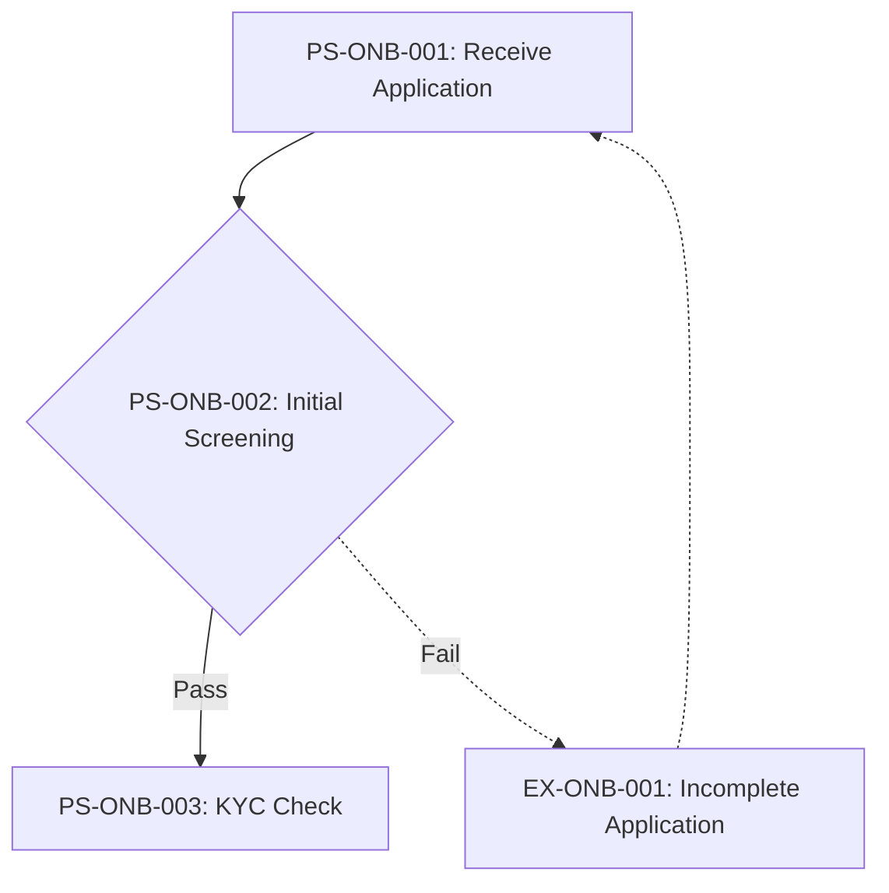

# As-Is Process Documentation: {{process_name}}

**Document Type:** Current State Process Analysis
**Status:** {{status}}
**Business Unit:** {{business_unit}}
**Region:** {{region}}
**Document Owner:** {{document_owner}}
**Last Updated:** {{date}}
**Version:** {{version}}
**Reviewed By:** {{reviewer_name}} | **Review Date:** {{review_date}}
**Approved By:** {{approver_name}} | **Approval Date:** {{approval_date}}

---

## Executive Summary

{{executive_summary_paragraph_1}}

{{executive_summary_paragraph_2}}

{{executive_summary_paragraph_3}}

### Key Metrics at a Glance

| Metric | Value |
|--------|-------|
| Process Steps | {{total_process_steps}} |
| Exceptions Identified | {{total_exceptions}} |
| Pain Points Captured | {{total_pain_points}} |
| Control Points Mapped | {{total_control_points}} |
| Systems Involved | {{total_systems}} |
| Overall Confidence | {{overall_confidence}} |

---

## How to Read This Document

> This document captures the **current state (AS-IS)** of the {{process_name}} process. It provides a comprehensive overview with summary tables. For detailed analysis, see the linked companion documents.
>
> **Companion Documents:**
> - [Exception Details](./exceptions-detail.md) - Full exception analysis with root causes
> - [Pain Point Details](./pain-points-detail.md) - Detailed pain point analysis with improvement ideas
> - [Control Point Details](./control-points-detail.md) - Complete control mapping with compliance analysis
> - [Client Touchpoint Details](./client-touchpoints-detail.md) - Client interaction analysis with CES scoring
>
> **Confidence Indicators:** Each section includes an AI-assessed completeness confidence:
> - **[HIGH]** (≥90%) - Comprehensive coverage, validated by multiple sources
> - **[MEDIUM]** (≥70%) - Good coverage, some details may need validation
> - **[LOW]** (≥40%) - Preliminary capture, requires additional SME input
> - **[STUB]** (<40%) - Section placeholder only, no substantive content captured yet
>
> **Versioning:** Documents follow semantic versioning (MAJOR.MINOR):
> - MAJOR: Significant process change or complete re-documentation
> - MINOR: Incremental additions, corrections, or confidence improvements
> - Example: v1.0 (initial), v1.1 (added 3 pain points), v2.0 (process redesigned)

---

## 1. Process Overview

> **About this section:** Foundational context - what this process is, who owns it, and what business need it serves.

### 1.1 Process Identification

| Attribute | Value |
|-----------|-------|
| **Process Name** | {{process_name}} |
| **Process ID** | {{process_id}} |
| **Process Category** | {{process_category}} |
| **Scope** | {{scope}} |
| **Process Owner** | {{process_owner}} |

### 1.2 Purpose and Trigger

{{process_purpose}}

{{process_trigger}}

### 1.3 Operational Characteristics

{{process_frequency}}

{{process_volume}}

### 1.4 Key Stakeholders

{{stakeholders}}

### 1.5 Service Levels & Performance Benchmarks

| SLA# | Metric | Current SLA | Actual Performance | Source | Regulatory? |
|------|--------|-------------|-------------------|--------|-------------|
{{sla_table}}

### 1.6 Cost & Resource Allocation

| Metric | Value |
|--------|-------|
| **FTE Allocation** | {{fte_allocation}} |
| **Cost per Transaction** | {{cost_per_transaction}} |
| **Annual Operating Cost** | {{annual_operating_cost}} |
| **Resource Utilization** | {{resource_utilization}} |

{{cost_resource_notes}}

### 1.7 Process Variants

| Variant | Scope | Key Differences | Shared Steps |
|---------|-------|-----------------|--------------|
{{process_variants_table}}

> **Section Confidence:** {{section_1_confidence}} ({{section_1_confidence_pct}}%) | **Basis:** {{section_1_confidence_basis}}
> **Evidence Sources:** {{section_1_evidence_sources}}

---

## 2. Process Steps

> **About this section:** The step-by-step flow of this process from start to finish.

### 2.1 Process Step Summary

| PS# | Step Name | Owner | System(s) | Duration | Wait Time | Rationale |
|-----|-----------|-------|-----------|----------|-----------|-----------|
{{process_steps_summary_table}}

### 2.2 Process Flow Diagrams

<!--
DIAGRAM CONVENTIONS:
- Use flowchart TD (top-down) for process flows
- Use flowchart LR (left-right) for swim lanes
- Node IDs should match PS# (e.g., PS1["Step 1: Receive Application"])
- Decision nodes use {rhombus} notation
- Exception paths use dotted lines (-.->)
- System interactions noted in parentheses
- Color coding: Green=happy path, Orange=exception, Red=failure

EXAMPLE:

-->

#### 2.2.1 High-Level Process Flow (L1)

> Overview showing major phases and key decision points

```mermaid
{{process_diagram_l1}}
```

#### 2.2.2 Detailed Process Flow (L2)

> Detailed flow showing all steps, exceptions, and system interactions

```mermaid
{{process_diagram_l2}}
```

#### 2.2.3 Swim Lane Diagram

> Role-based view showing handoffs between teams

```mermaid
{{process_diagram_swimlane}}
```

### 2.3 Step Details

{{#each process_steps}}

#### {{this.id}}: {{this.name}}

**Performer:** {{this.owner}}
**System(s):** {{this.systems}}
**Input:** {{this.input}}
**Output:** {{this.output}}
**Business Rules:** {{this.business_rules}}
**Duration:** {{this.duration}}
**Wait Time:** {{this.wait_time}}
**Channel:** {{this.channel}}
**Document Count:** {{this.document_count}}
**Interaction Count:** {{this.interaction_count}}

{{this.description}}

{{/each}}

### 2.4 Handoff Points

| HO# | From (Role/Team) | To (Role/Team) | Trigger | Method | Avg Wait |
|-----|------------------|----------------|---------|--------|----------|
{{handoff_points_table}}

### 2.5 Business Rules

| BR# | Rule | Condition | Action | Source |
|-----|------|-----------|--------|--------|
{{business_rules_table}}

### 2.6 Decision Points

| DP# | Decision | At Step | Criteria | Yes Path | No Path |
|-----|----------|---------|----------|----------|---------|
{{decision_points_table}}

> **Section Confidence:** {{section_2_confidence}} ({{section_2_confidence_pct}}%) | **Basis:** {{section_2_confidence_basis}}
> **Evidence Sources:** {{section_2_evidence_sources}}

---

## 3. Exception Paths and Variations

> **About this section:** Summary of exceptions. For full details including root cause analysis and handling procedures, see [Exception Details](./exceptions-detail.md).

### 3.1 Exception Summary

{{exceptions_summary_paragraph}}

### 3.2 Exception Summary Table

| EX# | Exception | Trigger | Affected Steps | Frequency | Impact | Handling Owner |
|-----|-----------|---------|----------------|-----------|--------|----------------|
{{exception_summary_table}}

### 3.3 Exception Statistics

| Metric | Value |
|--------|-------|
| Total Exceptions | {{total_exceptions}} |
| High-Impact Exceptions | {{high_impact_exceptions}} |
| Frequently Occurring | {{frequent_exceptions}} |

> **Full Analysis:** [View Exception Details](./exceptions-detail.md)
>
> **Section Confidence:** {{section_3_confidence}} ({{section_3_confidence_pct}}%) | **Basis:** {{section_3_confidence_basis}}
> **Evidence Sources:** {{section_3_evidence_sources}}

---

## 4. Control Points and Compliance

> **About this section:** Summary of controls. For full regulatory mapping and effectiveness analysis, see [Control Point Details](./control-points-detail.md).

### 4.1 Control Summary

{{controls_summary_paragraph}}

### 4.2 Control Point Summary Table

| CP# | Control Name | Type | Regulation | Process Step | Effectiveness | Risk Level |
|-----|--------------|------|------------|--------------|---------------|------------|
{{control_summary_table}}

### 4.3 Regulatory Coverage

| Regulation | Controls Mapped | Coverage Status |
|------------|-----------------|-----------------|
{{regulatory_coverage_summary}}

### 4.4 Control Statistics

| Metric | Value |
|--------|-------|
| Total Control Points | {{total_control_points}} |
| Regulatory Controls | {{regulatory_controls}} |
| Internal Controls | {{internal_controls}} |
| Automated Controls | {{automated_controls}} |

> **Full Analysis:** [View Control Point Details](./control-points-detail.md)
>
> **Section Confidence:** {{section_4_confidence}} ({{section_4_confidence_pct}}%) | **Basis:** {{section_4_confidence_basis}}
> **Evidence Sources:** {{section_4_evidence_sources}}

---

## 5. System Dependencies

> **About this section:** What technology supports this process?

### 5.1 System Summary

| SYS# | System Name | Purpose | Integration Points |
|------|-------------|---------|-------------------|
{{systems_summary_table}}

### 5.2 Integration Matrix

| INT# | Source System | Target System | Method | Frequency | Data Exchanged | Error Handling |
|------|--------------|---------------|--------|-----------|----------------|----------------|
{{integration_matrix_table}}

### 5.3 System Interaction Diagram

```mermaid
{{system_interaction_diagram}}
```

### 5.4 Data & Document Inventory

| DOC# | Document/Data Artifact | Source | Format | Retention | Regulatory Req |
|------|------------------------|--------|--------|-----------|----------------|
{{data_document_inventory_table}}

> **Section Confidence:** {{section_5_confidence}} ({{section_5_confidence_pct}}%) | **Basis:** {{section_5_confidence_basis}}
> **Evidence Sources:** {{section_5_evidence_sources}}

---

## 6. Organizational Mapping

> **About this section:** Who does what? Roles and responsibilities.

### 6.1 RACI Matrix

{{raci_matrix}}

### 6.2 Team Responsibilities

{{team_responsibilities}}

> **Section Confidence:** {{section_6_confidence}} ({{section_6_confidence_pct}}%) | **Basis:** {{section_6_confidence_basis}}
> **Evidence Sources:** {{section_6_evidence_sources}}

---

## 7. Existing Documentation References

> **About this section:** Related documents and metrics.

### 7.1 Related Documents

{{related_documents}}

### 7.2 KPIs and Metrics

{{kpis}}

### 7.3 DTPs (Detailed Task Procedures)

{{dtps}}

> **Section Confidence:** {{section_7_confidence}} ({{section_7_confidence_pct}}%) | **Basis:** {{section_7_confidence_basis}}
> **Evidence Sources:** {{section_7_evidence_sources}}

---

## 8. Process Gaps and Issues

> **About this section:** Known gaps, inconsistencies, and their impact on analysis confidence.
>
> **Gap Resolution Tracking:** [View Gap Resolution Log](./gap-resolution-log.md)

### 8.1 Identified Gaps

| PGAP# | Gap Description | Category | Section Affected | Severity | Impact on Analysis | Resolution Owner | Status |
|-------|-----------------|----------|------------------|----------|-------------------|-----------------|--------|
{{identified_gaps_table}}

**Gap Categories:** Documentation Gap · Knowledge Gap · Data Gap · System Gap · Compliance Gap

### 8.2 Documentation Assessment

| DOC# | Document | Status | Last Updated | Issue | Impact |
|------|----------|--------|--------------|-------|--------|
{{documentation_assessment_table}}

### 8.3 Inconsistencies

| PGAP# | Inconsistency | Sources | Impact | Resolution |
|-------|---------------|---------|--------|------------|
{{inconsistencies_table}}

### 8.4 Gap-to-Confidence Impact

| PGAP# | Affected Section | Current Confidence | Confidence if Resolved |
|-------|------------------|--------------------|----------------------|
{{gap_confidence_impact_table}}

> **Section Confidence:** {{section_8_confidence}} ({{section_8_confidence_pct}}%) | **Basis:** {{section_8_confidence_basis}}
> **Evidence Sources:** {{section_8_evidence_sources}}

---

## 9. Pain Points and Improvement Opportunities

> **About this section:** Summary of pain points. For full analysis including root causes and improvement ideas, see [Pain Point Details](./pain-points-detail.md).

### 9.1 Pain Points Summary

{{pain_points_summary_paragraph}}

### 9.2 Pain Point Summary Table

| PP# | Pain Point | Category | Affected Steps | Impact | Frequency | Priority | Quick Win? |
|-----|------------|----------|----------------|--------|-----------|----------|------------|
{{pain_point_summary_table}}

### 9.3 Pain Point Statistics

| Metric | Value |
|--------|-------|
| Total Pain Points | {{total_pain_points}} |
| High-Impact | {{high_impact_pain_points}} |
| Client-Facing | {{client_facing_pain_points}} |
| Quick Win Opportunities | {{quick_win_pain_points}} |

### 9.4 Top Improvement Opportunities

{{top_improvement_opportunities}}

> **Full Analysis:** [View Pain Point Details](./pain-points-detail.md)
>
> **Section Confidence:** {{section_9_confidence}} ({{section_9_confidence_pct}}%) | **Basis:** {{section_9_confidence_basis}}
> **Evidence Sources:** {{section_9_evidence_sources}}

---

## Document Metadata

**SME Contributors:** {{sme_contributors}}
**Interview Date(s):** {{interview_dates}}
**Documentation Method:** {{documentation_method}}

### Overall Document Confidence

| Section | Confidence | Score | Key Gaps |
|---------|------------|-------|----------|
| 1. Process Overview | {{section_1_confidence}} | {{section_1_confidence_pct}}% | {{section_1_gaps}} |
| 2. Process Steps | {{section_2_confidence}} | {{section_2_confidence_pct}}% | {{section_2_gaps}} |
| 3. Exceptions | {{section_3_confidence}} | {{section_3_confidence_pct}}% | {{section_3_gaps}} |
| 4. Controls | {{section_4_confidence}} | {{section_4_confidence_pct}}% | {{section_4_gaps}} |
| 5. Systems | {{section_5_confidence}} | {{section_5_confidence_pct}}% | {{section_5_gaps}} |
| 6. Organization | {{section_6_confidence}} | {{section_6_confidence_pct}}% | {{section_6_gaps}} |
| 7. Documentation | {{section_7_confidence}} | {{section_7_confidence_pct}}% | {{section_7_gaps}} |
| 8. Gaps & Issues | {{section_8_confidence}} | {{section_8_confidence_pct}}% | {{section_8_gaps}} |
| 9. Pain Points | {{section_9_confidence}} | {{section_9_confidence_pct}}% | {{section_9_gaps}} |

**Overall Confidence:** {{overall_confidence}} ({{overall_confidence_pct}}%)

### Companion Documents

| Document | Purpose | Link |
|----------|---------|------|
| Exception Details | Full exception analysis | [exceptions-detail.md](./exceptions-detail.md) |
| Pain Point Details | Full pain point analysis | [pain-points-detail.md](./pain-points-detail.md) |
| Control Point Details | Full control analysis | [control-points-detail.md](./control-points-detail.md) |
| Client Touchpoint Details | Client interaction & CES analysis | [client-touchpoints-detail.md](./client-touchpoints-detail.md) |

---

## Related Specialist Analyses

> Documents produced by downstream specialist agents that reference this AS-IS documentation.

| Document | Agent | Relationship |
|----------|-------|-------------|
| [Compliance Control Assessment](./compliance-control-assessment.md) | Control Analyst | Uses CP#, REG# from Sections 4, 5 |
| [CX Journey Documentation](./cx-journey-documentation.md) | CX Journey Analyst | Maps JT# to PS# from Section 2 |
| [Innovation Analysis](./innovation-analysis-documentation.md) | Innovation Analyst | References PP#, SYS# from Sections 5, 9 |
| [Target State Documentation](./target-state-documentation.md) | Transformation Agent | Reconciles all AS-IS IDs to TO-BE design |
| [Gap Resolution Log](./gap-resolution-log.md) | All Agents | Tracks PGAP# resolution from Section 8 |

---

## Change Log

| Version | Date | Contributor | Role | Changes |
|---------|------|-------------|------|---------|
| {{version}} | {{date}} | {{contributor_name}} | {{contributor_role}} | Initial documentation |

---

## Glossary

{{glossary}}

---

_Generated by ProcessMiner Process Documentation Analyst_
_Document ID: {{document_id}}_
