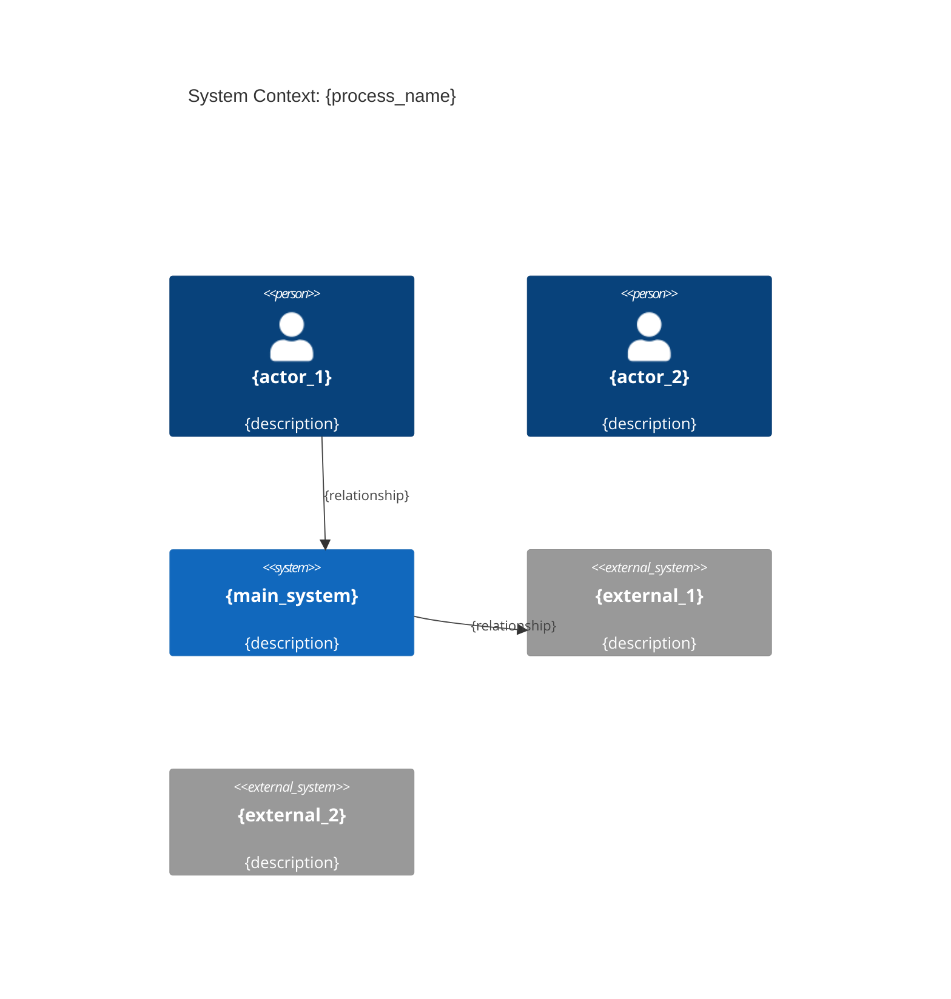
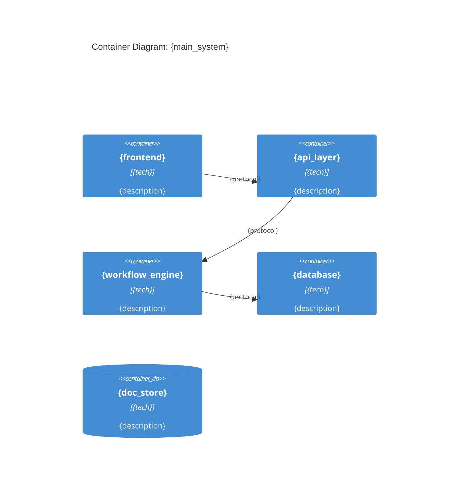

# Step 2: Design Target State

## STEP GOAL:

Design the target architecture with C4 diagrams and component definitions.

## MANDATORY EXECUTION RULES (READ FIRST):

### Universal Rules:

- 🛑 NEVER skip C4 diagrams
- 📖 CRITICAL: Read the complete step file before taking any action
- 📋 YOU ARE A FACILITATOR designing architecture

### Step-Specific Rules:

- 🎯 Focus on clear architecture design
- 🚫 FORBIDDEN to create specifications yet
- 💬 Approach: Design, diagram, validate

## MANDATORY SEQUENCE

### 1. Define Design Principles

"**Design Principles for Target Architecture:**

1. {principle_1} — {rationale}
2. {principle_2} — {rationale}
3. {principle_3} — {rationale}
4. {principle_4} — {rationale}"

### 2. Generate C4 Context Diagram

### 3. Generate C4 Container Diagram

### 4. Define Key Components

"**Key Architecture Components:**

| Component | Purpose | Technology | New/Existing |
|-----------|---------|------------|--------------|
| {component_1} | {purpose} | {tech} | New |
| {component_2} | {purpose} | {tech} | Existing |
..."

### 5. Present Design Summary

"**Target Architecture Summary:**

**New Components:** {count}
**Modified Components:** {count}
**Integration Points:** {count}

**Key Changes:**
1. {change_1}
2. {change_2}
3. {change_3}"

### 6. Present MENU OPTIONS

Display: "**Ready to create specifications?** [C] Continue [E] Edit design"

#### Menu Handling Logic:

- IF C: Store design, load, read entire file, then execute {nextStepFile}
- IF E: Allow design modifications

#### EXECUTION RULES:

- ALWAYS halt and wait for user input
- ONLY proceed when user selects 'C'

---

## 🚨 SYSTEM SUCCESS/FAILURE METRICS

### ✅ SUCCESS:

- Design principles defined
- C4 Context diagram created
- C4 Container diagram created
- Components defined
- Design validated

### ❌ SYSTEM FAILURE:

- Missing C4 diagrams
- Vague component definitions
- Creating specifications in this step
